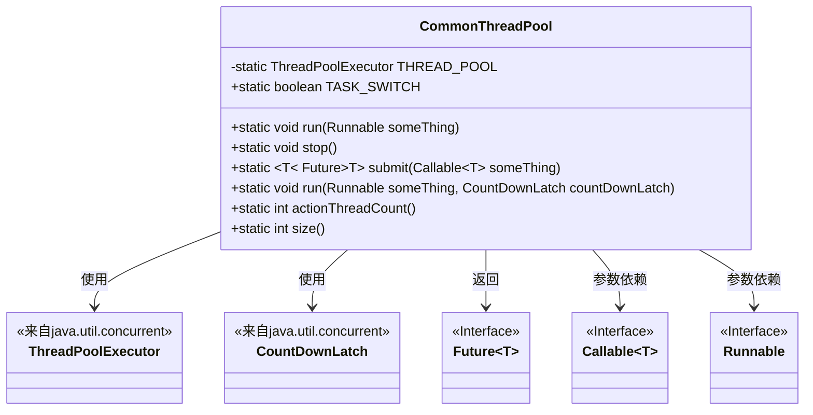
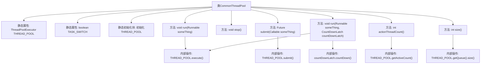

# 基础信息

|      |      |
|------|------|
| 名称 | CommonThreadPool |
| 编码语言 | .java |
| 代码路径 | WeFe/common/java/common-lang/src/main/java/com/welab/wefe/common/CommonThreadPool.java |
| 包名 | com.welab.wefe.common |
| 依赖项 | ['java.util.concurrent'] |
| 概述说明 | CommonThreadPool类提供静态线程池管理，支持任务执行、提交、停止及状态查询，使用LinkedBlockingQueue和CountDownLatch实现异步任务控制。 |

# 说明

该类实现了一个通用的线程池管理工具，包含静态线程池实例和任务开关标志。线程池初始化时根据处理器核心数设置最小线程数，最大100线程，使用100毫秒保活时间和无界阻塞队列。提供执行Runnable任务、提交Callable任务的功能，支持带CountDownLatch的异步任务执行（任务完成后自动计数减一）。包含获取活动线程数和队列大小的查询方法。停止功能通过修改任务开关标志实现，原线程池关闭逻辑被注释。

# 类列表 Class Summary

| 名称   | 类型  | 说明 |
|-------|------|-------------|
| CommonThreadPool | class | CommonThreadPool类提供静态线程池管理，支持任务执行、提交、停止及状态查询，核心线程数为CPU数，最大100线程，使用LinkedBlockingQueue。 |

## 类 CommonThreadPool

|      |      |
|------|------|
| 访问范围 | public |
| 类型 | class |
| 名称 | CommonThreadPool |
| 说明 | CommonThreadPool类提供静态线程池管理，支持任务执行、提交、停止及状态查询，核心线程数为CPU数，最大100线程，使用LinkedBlockingQueue。 |

### UML类图

这段代码展示了一个通用的线程池管理类CommonThreadPool，它封装了ThreadPoolExecutor的功能。该类提供了静态方法来执行Runnable任务、提交Callable任务、控制任务开关、获取活跃线程数和队列大小等。通过静态初始化块创建默认配置的线程池，核心线程数等于CPU核心数，最大线程数100，使用无界队列。特别值得注意的是它支持带CountDownLatch的任务执行，确保任务完成后能通知计数器。类图中清晰地展示了与Java并发包中关键接口/类的关系，包括ThreadPoolExecutor、Future、Callable等。

### 内部方法调用关系图

这段代码实现了一个通用的线程池管理类CommonThreadPool，通过静态方法和属性提供线程任务执行、停止控制、任务提交等功能。流程图展示了类结构、静态初始化过程以及各方法间的调用关系，包括线程池执行任务、提交异步任务、获取活跃线程数等核心操作。注释中被屏蔽的代码表明存在可配置的线程池参数调整能力，当前使用处理器核心数作为基础线程数。

### 字段列表 Field List

| 名称  | 类型  | 说明 |
|-------|-------|------|
| TASK_SWITCH = true | boolean | 静态布尔变量TASK_SWITCH，默认值为true，用于控制任务开关状态。 |
| THREAD_POOL | ThreadPoolExecutor | 私有静态线程池执行器THREAD_POOL。 |

### 方法列表

| 名称  | 类型  | 说明 |
|-------|-------|------|
| submit | Future<T> | Java方法：使用线程池提交Callable任务并返回Future对象。 |
| stop | void | 停止线程池任务，关闭任务开关，注释显示原有关闭线程池和重建线程池的代码。 |
| run | void | 该方法使用线程池执行传入的Runnable任务。 |
| run | void | 多线程工具方法：使用线程池执行任务，完成后自动减少计数锁。确保任务执行和锁释放。 |
| actionThreadCount | int | 该方法返回线程池中当前活跃线程的数量。 |
| size | int | 获取线程池队列当前任务数量。 |

