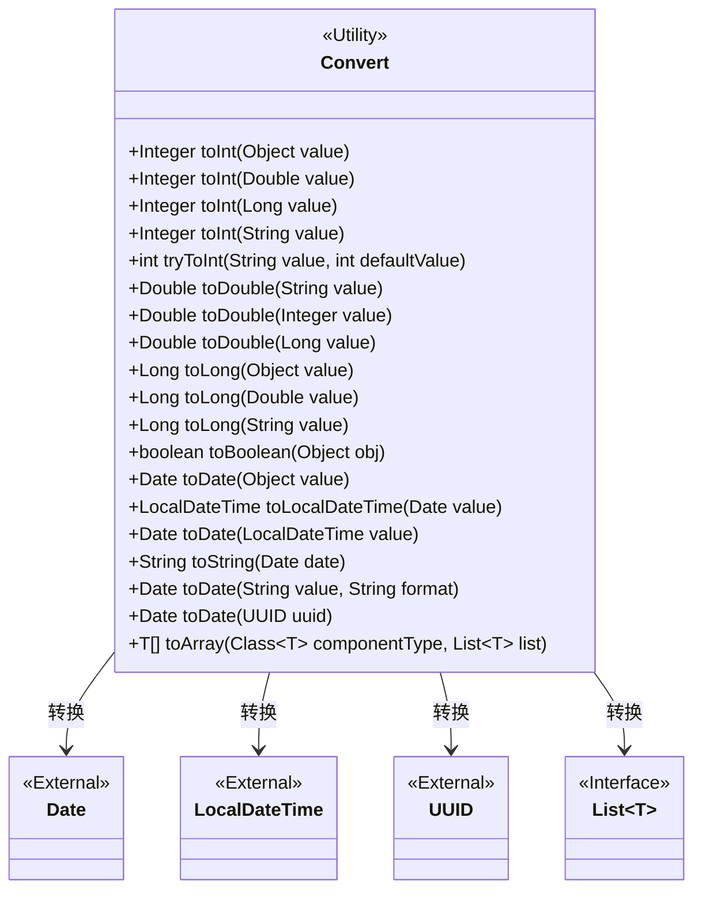

# 基础信息

|      |      |
|------|------|
| 名称 | Convert |
| 编码语言 | .java |
| 代码路径 | WeFe/common/java/common-lang/src/main/java/com/welab/wefe/common/Convert.java |
| 包名 | com.welab.wefe.common |
| 依赖项 | ['com.welab.wefe.common.util.DateUtil', 'com.welab.wefe.common.util.StringUtil', 'java.lang.reflect.Array', 'java.math.BigInteger', 'java.text.ParseException', 'java.text.SimpleDateFormat', 'java.time.LocalDateTime', 'java.time.ZoneId', 'java.util.Date', 'java.util.List', 'java.util.UUID'] |
| 概述说明 | Convert类提供多种类型转换方法：处理null值，支持Integer、Double、Long、Boolean、Date等类型互转，含异常处理和默认值设置。 |

# 说明

Convert类提供多种数据类型转换方法。包含整数、浮点数、布尔值、日期时间、数组等类型的相互转换。整数转换支持从对象、双精度、长整型和字符串转换，处理空值并包含安全转换方法。浮点数转换支持字符串、整数和长整型输入。日期时间转换支持Date、LocalDateTime和字符串互转，处理多种格式。数组转换支持列表转数组。所有方法都包含空值检查，确保转换安全可靠。

# 类列表 Class Summary

| 名称   | 类型  | 说明 |
|-------|------|-------------|
| Convert | class | Convert类提供多种类型转换方法，包括Int、Double、Long、Boolean、Date、LocalDateTime和Array的相互转换，处理null值并提供异常处理。 |

## 类 Convert

|      |      |
|------|------|
| 访问范围 | public |
| 类型 | class |
| 名称 | Convert |
| 说明 | Convert类提供多种类型转换方法，包括Int、Double、Long、Boolean、Date、LocalDateTime和Array的相互转换，处理null值并提供异常处理。 |

### UML类图

该类图展示了Convert工具类，它提供了多种数据类型之间的转换方法，包括整型、浮点型、长整型、布尔型、日期时间、UUID和数组等。Convert类不维护状态，所有方法均为静态方法，通过依赖外部类如Date、LocalDateTime等完成类型转换功能。类图中清晰展示了Convert类与各外部类型之间的转换关系。

### 内部方法调用关系图

```mermaid
graph TD
    A["类Convert"]
    B["方法: Integer toInt(Object value)"]
    C["方法: Integer toInt(Double value)"]
    D["方法: Integer toInt(Long value)"]
    E["方法: Integer toInt(String value)"]
    F["方法: int tryToInt(String value, int defaultValue)"]
    G["方法: Double toDouble(String value)"]
    H["方法: Double toDouble(Integer value)"]
    I["方法: Double toDouble(Long value)"]
    J["方法: Long toLong(Object value)"]
    K["方法: Long toLong(Double value)"]
    L["方法: Long toLong(String value)"]
    M["方法: boolean toBoolean(Object obj)"]
    N["方法: Date toDate(Object value)"]
    O["方法: LocalDateTime toLocalDateTime(Date value)"]
    P["方法: Date toDate(LocalDateTime value)"]
    Q["方法: String toString(Date date)"]
    R["方法: Date toDate(String value, String format)"]
    S["方法: Date toDate(UUID uuid)"]
    T["方法: T[] toArray(Class<T> componentType, List<T> list)"]

    A --> B
    B --> C
    B --> D
    B --> E
    B --> F
    A --> G
    A --> H
    A --> I
    A --> J
    J --> K
    J --> L
    A --> M
    A --> N
    A --> O
    A --> P
    A --> Q
    A --> R
    A --> S
    A --> T
```

这段代码是一个多功能类型转换工具类Convert，提供了各种数据类型之间的转换方法。主要功能包括：将不同对象类型转换为Integer/Double/Long等数值类型，布尔值转换，日期时间与字符串互转，数组与列表互转等。所有方法均为静态方法，支持null值处理，部分方法提供异常捕获和默认值返回机制。代码结构清晰，按数据类型划分区域，包含详细的参数校验和类型判断逻辑。

### 字段列表 Field List

| 名称  | 类型  | 说明 |
|-------|-------|------|

### 方法列表

| 名称  | 类型  | 说明 |
|-------|-------|------|
| toDouble | Double | 静态方法将字符串转为Double，若输入为null则返回null，否则解析为双精度浮点数。 |
| toLong | Long | 该方法将字符串转为Long类型，若输入为null则返回null，否则截取小数点前的部分转为Long。 |
| toLong | Long | 将Double转为Long，若输入为null则返回null，否则返回其长整型值。 |
| tryToInt | int | 该方法将字符串转为整数，若转换失败则返回默认值。先尝试转为双精度浮点数再转整数，捕获异常时返回预设默认值。 |
| toDouble | Double | 静态方法将Integer转为Double，若输入为null则返回null，否则返回对应Double值。 |
| toLocalDateTime | LocalDateTime | 将Date对象转换为系统默认时区的LocalDateTime。 |
| toDouble | Double | 将Long类型转换为Double类型，若输入为null则返回null。 |
| toBoolean | boolean | 静态方法toBoolean将对象转为布尔值，调用其toString后解析为布尔类型返回。 |
| toInt | Integer | 将对象转为整数，处理null、Integer、Double、Long类型，其他转为字符串再处理。 |
| toLong | Long | 将对象转换为Long类型，处理null、Long、BigInteger、Double及字符串输入。 |
| toDate | Date | 静态方法将对象转为日期，空值返回null，使用Hutool工具转换。 |
| toInt | Integer | 将字符串转换为整数，若输入为空则返回空，否则先转为双精度再转整数。 |
| toInt | Integer | 将Double转为Integer，若输入为null则返回null，否则返回整数值部分。 |
| toDate | Date | 将LocalDateTime转换为Date类型，使用系统默认时区。 |
| toString | String | 这是一个Java静态方法，将Date对象转换为指定格式的字符串，格式为YYYY-MM-DDTHH:MM:SS.SSSZ。 |
| toDate | Date | 将字符串按指定格式转为日期，空值或解析失败返回null。 |
| toDate | Date | 将UUID的时间戳转换为Date对象，通过减去固定偏移并除以10000得到毫秒时间。 |
| toArray | T[] | 将List转为指定类型的数组，若List为null则返回null。使用Array.newInstance创建数组并填充数据。 |
| toInt | Integer | 静态方法将Long转为Integer，若输入为null则返回null，否则调用Math.toIntExact转换。 |

