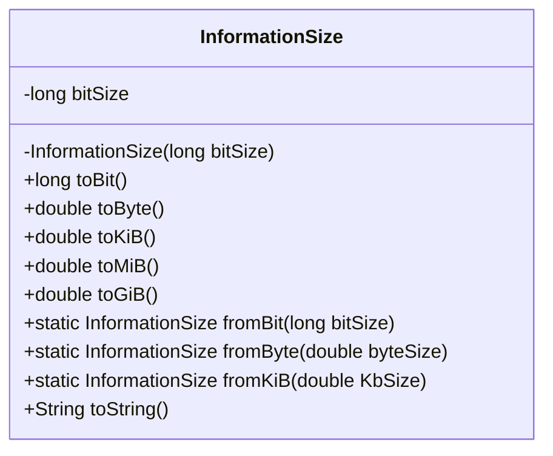
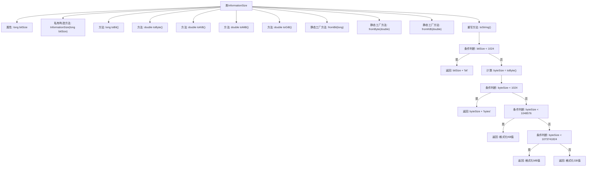

# 基础信息

|      |      |
|------|------|
| 名称 | InformationSize |
| 编码语言 | .java |
| 代码路径 | WeFe/common/java/common-lang/src/main/java/com/welab/wefe/common/InformationSize.java |
| 包名 | com.welab.wefe.common |
| 依赖项 | ['java.math.BigDecimal', 'java.math.RoundingMode'] |
| 概述说明 | InformationSize类封装比特大小，提供比特、字节、KiB、MiB、GiB的转换方法，支持静态创建和格式化输出。 |

# 说明

这是一个用于表示和转换信息大小的Java类。类名为InformationSize，核心属性为bitSize，存储以比特为单位的大小。提供多种单位转换方法：toBit返回比特值，toByte返回字节值，toKiB/toMiB/toGiB分别返回千字节/兆字节/吉字节值。支持从不同单位创建对象：fromBit/fromByte/fromKiB。toString方法根据大小自动选择合适单位输出，格式为数值加单位后缀。所有转换计算均使用BigDecimal确保精度，结果保留两位小数并向下取整。

# 类列表 Class Summary

| 名称   | 类型  | 说明 |
|-------|------|-------------|
| InformationSize | class | InformationSize类封装比特大小，提供比特、字节、KiB、MiB、GiB的转换方法，支持静态创建和格式化输出。 |

## 类 InformationSize

|      |      |
|------|------|
| 访问范围 | public |
| 类型 | class |
| 名称 | InformationSize |
| 说明 | InformationSize类封装比特大小，提供比特、字节、KiB、MiB、GiB的转换方法，支持静态创建和格式化输出。 |

### UML类图

这段代码定义了一个`InformationSize`类，用于处理不同单位的数据大小转换和表示。该类封装了以bit为基准的存储大小，并提供多种单位转换方法（bit/byte/KiB/MiB/GiB），包含静态工厂方法创建实例。toString()方法能智能选择最合适的单位进行格式化输出，处理了从bit到GB的各级单位转换，并确保数值精度和舍入方式符合预期。所有转换计算都基于BigDecimal保证精度，避免浮点运算误差。

### 内部方法调用关系图

这段代码是用于处理信息大小转换的工具类，支持比特(bit)、字节(bytes)、千字节(KB)、兆字节(MB)和吉字节(GB)之间的相互转换。类中包含私有构造方法和多个静态工厂方法用于创建对象，以及将比特转换为不同单位的方法。toString()方法根据数值大小自动选择最合适的单位进行格式化输出，确保输出的可读性。所有转换计算都使用BigDecimal保证精度，并采用FLOOR舍入模式保留两位小数。

### 字段列表 Field List

| 名称  | 类型  | 说明 |
|-------|-------|------|
| bitSize | long | 私有长整型变量bitSize，用于存储比特大小。 |

### 方法列表

| 名称  | 类型  | 说明 |
|-------|-------|------|
| fromKiB | InformationSize | 该方法将输入的千字节大小转换为字节大小，并调用fromByte方法生成InformationSize对象。 |
| toMiB | double | 将比特数转换为MiB，保留两位小数并向下舍入。 |
| toByte | double | 该方法将比特数转换为字节数，保留两位小数并向下取整。 |
| fromByte | InformationSize | 静态方法fromByte接收双精度字节数，乘以8转为比特数后创建InformationSize对象返回。 |
| toKiB | double | 该方法将比特数转换为KiB单位，除以8和1024后保留两位小数并向下取整。 |
| fromBit | InformationSize | 该方法接收一个表示比特大小的长整型参数，返回一个包含该比特大小的InformationSize对象实例。 |
| toGiB | double | 该方法将比特大小转换为吉字节（GiB），通过除以8×1024³并保留两位小数，结果向下取整。 |
| toString | String | 该方法根据数据大小自动转换为合适的单位显示：小于1024bit显示bit，小于1024bytes显示bytes，小于1MB显示KB，小于1GB显示MB，否则显示GB，保留两位小数。 |
| toBit | long | 方法toBit返回bitSize的值，类型为long。 |

