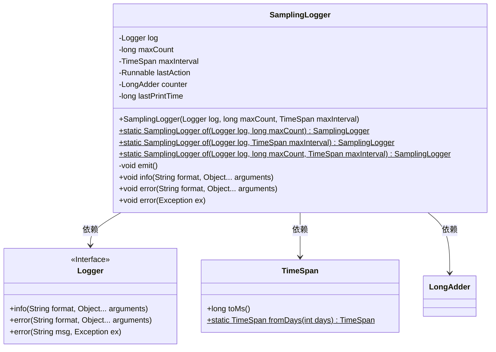
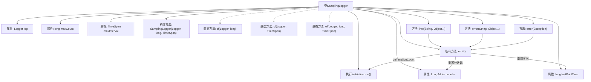

# 基础信息

|      |      |
|------|------|
| 名称 | SamplingLogger |
| 编码语言 | .java |
| 代码路径 | WeFe/common/java/common-lang/src/main/java/com/welab/wefe/common/SamplingLogger.java |
| 包名 | com.welab.wefe.common |
| 依赖项 | ['org.slf4j.Logger', 'java.util.concurrent.atomic.LongAdder'] |
| 概述说明 | SamplingLogger类用于按数量或时间间隔采样日志，支持info和error方法，满足条件时触发日志打印。 |

# 说明

SamplingLogger是一个采样日志记录类，用于控制日志输出频率。它通过maxCount限制最大日志数量，通过maxInterval限制最大时间间隔。类提供三个静态工厂方法，支持单独设置数量或时间间隔，或同时设置两者。核心emit方法根据计数或时间条件触发日志输出，并重置计数器。类提供info和error方法记录不同级别日志，error方法支持异常处理。内部使用LongAdder计数，确保线程安全。

# 类列表 Class Summary

| 名称   | 类型  | 说明 |
|-------|------|-------------|
| SamplingLogger | class | SamplingLogger类实现基于数量或时间间隔的日志采样功能，支持info和error级别日志记录，满足条件时触发日志输出。 |

## 类 SamplingLogger

|      |      |
|------|------|
| 访问范围 | public |
| 类型 | class |
| 名称 | SamplingLogger |
| 说明 | SamplingLogger类实现基于数量或时间间隔的日志采样功能，支持info和error级别日志记录，满足条件时触发日志输出。 |

### UML类图

这段代码展示了一个采样日志记录器(SamplingLogger)的设计，它通过组合Logger接口实现智能日志采样功能。该类通过maxCount(最大计数)和maxInterval(最大时间间隔)两个维度控制日志输出频率，避免日志洪泛。核心机制是当达到任一阈值时执行lastAction并重置计数器。类图中清晰展示了与Logger接口、TimeSpan工具类和LongAdder计数器的依赖关系，体现了控制反转的设计思想。

### 内部方法调用关系图

这段代码展示了一个采样日志记录器(SamplingLogger)的实现，它通过时间间隔(maxInterval)和数量阈值(maxCount)来控制日志输出频率。核心机制是：当达到时间间隔或日志计数阈值时，才会执行实际的日志记录操作(lastAction.run())，并重置时间戳和计数器。类提供了三种静态工厂方法(of)来创建不同配置的实例，以及info/error两种日志级别的方法，其中error方法支持异常对象处理。emit()方法作为内部触发器，实现了采样逻辑的判断和执行。

### 字段列表 Field List

| 名称  | 类型  | 说明 |
|-------|-------|------|
| lastPrintTime = 0 | long | 定义长整型变量lastPrintTime，初始值为0，用于记录上次打印时间。 |
| counter = new LongAdder() | LongAdder | 声明一个线程安全的计数器变量counter，使用LongAdder类实现高效累加。 |
| maxCount | long | 私有长整型变量maxCount，用于存储最大计数值。 |
| maxInterval | TimeSpan | 私有时间间隔变量maxInterval |
| lastAction | Runnable | 私有Runnable类型变量lastAction，用于存储最后执行的操作。 |
| log | Logger | 私有日志记录器实例。 |

### 方法列表

| 名称  | 类型  | 说明 |
|-------|-------|------|
| of | SamplingLogger | 静态方法`of`创建采样日志器，参数为日志对象和最大间隔时间，内部调用构造器并设置最大采样数为`Long.MAX_VALUE`。 |
| of | SamplingLogger | 创建采样日志器，指定日志对象、最大记录数和时间间隔。 |
| of | SamplingLogger | 创建采样日志器，使用指定日志器和最大计数，默认时间跨度为1天。 |
| emit | void | emit方法在满足时间间隔或计数条件时执行lastAction并重置计时器和计数器。 |
| info | void | Java方法：记录info日志，更新计数器并触发emit。参数为格式化字符串和可变参数。 |
| error | void | Java方法：记录错误日志并计数，触发后续操作。参数：格式字符串和可变参数。 |
| error | void | 该方法在异常发生时记录错误信息，更新计数器并触发后续操作。关键步骤包括：记录异常类名和消息，递增计数器，调用emit方法。 |

