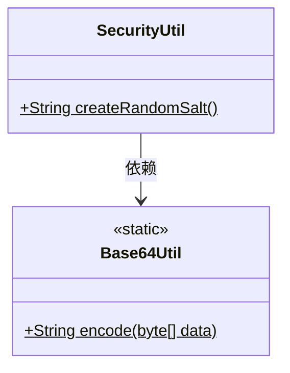
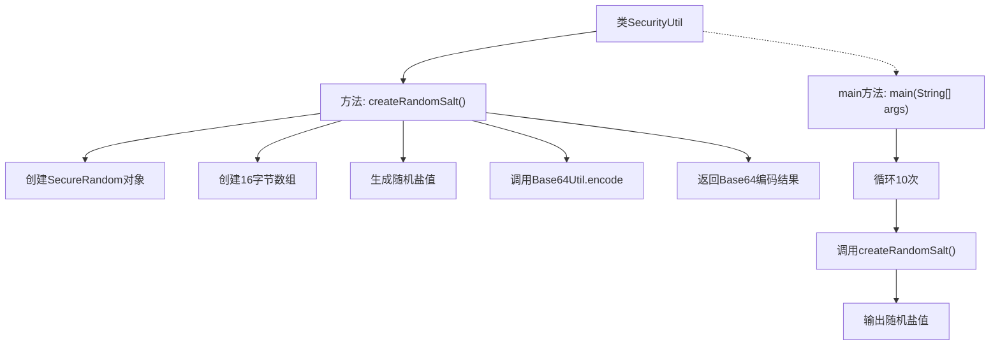

# 基础信息

|      |      |
|------|------|
| 名称 | SecurityUtil |
| 编码语言 | .java |
| 代码路径 | WeFe/common/java/common-lang/src/main/java/com/welab/wefe/common/SecurityUtil.java |
| 包名 | com.welab.wefe.common |
| 依赖项 | ['com.welab.wefe.common.util.Base64Util', 'java.security.SecureRandom', 'java.util.Random'] |
| 概述说明 | SecurityUtil类提供生成随机盐的方法createRandomSalt，使用SecureRandom生成16字节随机数并Base64编码。main方法演示生成10个盐值。 |

# 说明

SecurityUtil类包含一个静态方法createRandomSalt，用于生成16字节的随机盐值。该方法使用SecureRandom确保加密强度，通过Base64Util将二进制盐值编码为字符串。main方法演示了生成10个随机盐值的示例。整个实现专注于安全随机数的生成和编码转换。

# 类列表 Class Summary

| 名称   | 类型  | 说明 |
|-------|------|-------------|
| SecurityUtil | class | SecurityUtil类提供生成随机盐的方法createRandomSalt，使用SecureRandom生成16字节盐并Base64编码。main方法演示生成10个盐值。 |

## 类 SecurityUtil

|      |      |
|------|------|
| 访问范围 | public |
| 类型 | class |
| 名称 | SecurityUtil |
| 说明 | SecurityUtil类提供生成随机盐的方法createRandomSalt，使用SecureRandom生成16字节盐并Base64编码。main方法演示生成10个盐值。 |

### UML类图

这段代码展示了一个安全工具类SecurityUtil，主要用于生成随机盐值。该类包含一个静态方法createRandomSalt()，使用SecureRandom生成16字节的随机数，并通过Base64Util进行编码后返回。Base64Util是一个工具类，提供静态编码方法。SecurityUtil在main方法中演示了生成10个随机盐值的过程。整个设计简洁高效，适用于密码学安全场景下的随机数生成需求。

### 内部方法调用关系图

这段代码流程图展示了SecurityUtil类的核心功能。主要流程从createRandomSalt()方法开始，通过SecureRandom生成16字节随机数，经Base64编码后返回；main方法则循环10次调用该方法并输出结果。整个流程体现了安全的随机盐生成机制，包含密码学安全随机数生成、字节数组处理和Base64编码转换三个关键环节，最终输出可用于密码存储等安全场景的随机盐值。

### 字段列表 Field List

| 名称  | 类型  | 说明 |
|-------|-------|------|

### 方法列表

| 名称  | 类型  | 说明 |
|-------|-------|------|
| main | void | Java主方法循环10次，每次调用createRandomSalt()并打印结果。 |
| createRandomSalt | String | 生成16字节随机盐值并用Base64编码返回。 |

