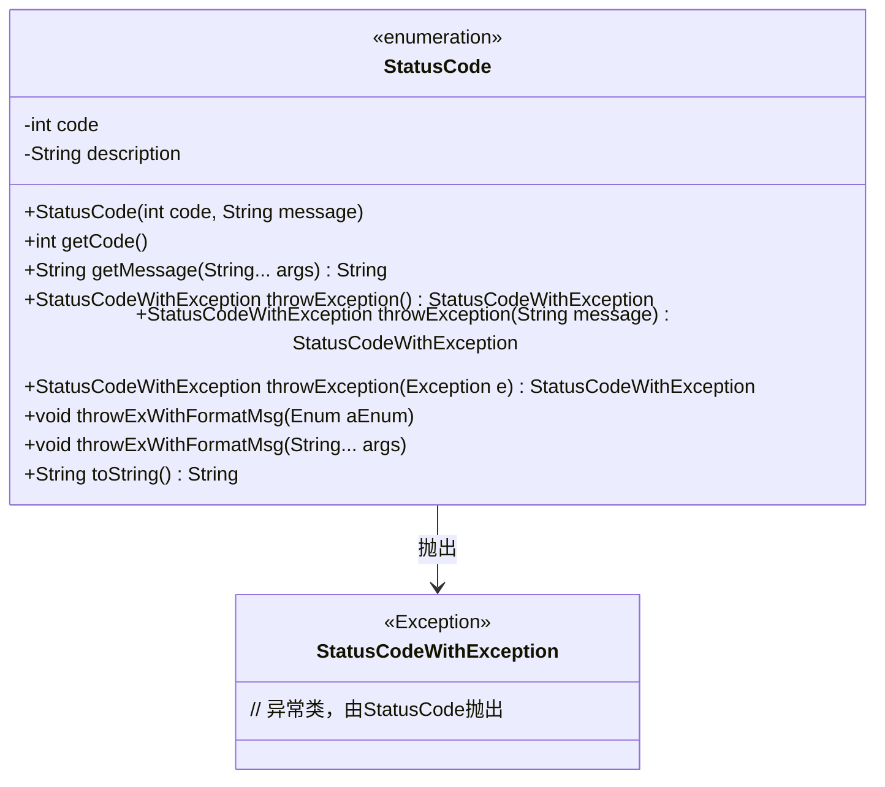
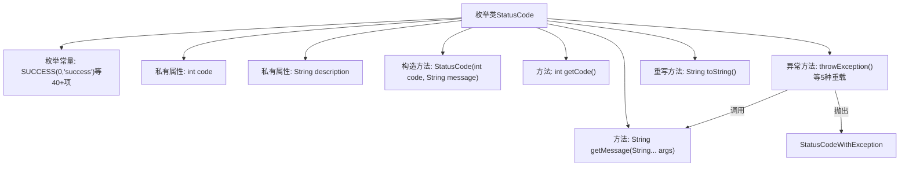

# 基础信息

|      |      |
|------|------|
| 名称 | StatusCode |
| 编码语言 | .java |
| 代码路径 | WeFe/common/java/common-lang/src/main/java/com/welab/wefe/common/StatusCode.java |
| 包名 | com.welab.wefe.common |
| 依赖项 | ['com.welab.wefe.common.exception.StatusCodeWithException'] |
| 概述说明 | 状态码枚举类，包含系统、数据库、服务等错误码及描述，支持异常抛出和格式化消息。 |

# 说明

这是一个枚举类StatusCode，定义了系统状态码及其描述信息。状态码分为系统级别错误（10000-10051）、数据库相关错误（10300-10400）、服务级别状态码（20001）以及特定模块错误（30001-30002、40001-40003）。每个状态码包含一个整型code和字符串description，支持通过getMessage方法格式化描述信息，并提供多种抛出异常的方法。状态码覆盖了系统初始化、权限、参数校验、数据操作、文件IO、数据库连接等常见错误场景。

# 类列表 Class Summary

| 名称   | 类型  | 说明 |
|-------|------|-------------|
| StatusCode | enum | 状态码枚举类，包含系统、数据库、服务等错误码，如成功(0)、系统错误(10001)、数据库连接失败(10300)、数据已存在(20001)等，提供异常抛出和格式化消息功能。 |

## 类 StatusCode

|      |      |
|------|------|
| 访问范围 | public |
| 类型 | enum |
| 名称 | StatusCode |
| 说明 | 状态码枚举类，包含系统、数据库、服务等错误码，如成功(0)、系统错误(10001)、数据库连接失败(10300)、数据已存在(20001)等，提供异常抛出和格式化消息功能。 |

### UML类图

这段代码定义了一个枚举类StatusCode，用于表示系统状态码及其描述信息。该类包含多个预定义的错误状态（如系统错误、数据库错误等），每个状态都有对应的错误码和描述信息。主要功能包括：获取错误码和格式化描述信息，以及抛出封装了状态码的自定义异常StatusCodeWithException。通过throwException()系列方法，可以方便地抛出携带状态信息的异常，支持直接抛出、自定义消息抛出和基于其他异常抛出三种方式。

### 内部方法调用关系图

该流程图展示了StatusCode枚举类的完整结构，包含40多个预定义状态码常量、两个私有属性、构造方法和核心功能方法。重点突出了5种异常抛出方法的调用关系，其中throwException()系列方法会调用getMessage()进行消息格式化，最终抛出StatusCodeWithException异常。toString()方法被重写为直接返回状态码字符串。整个设计用于统一管理系统错误码和异常消息格式。

### 字段列表 Field List

| 名称  | 类型  | 说明 |
|-------|-------|------|

### 方法列表

| 名称  | 类型  | 说明 |
|-------|-------|------|

