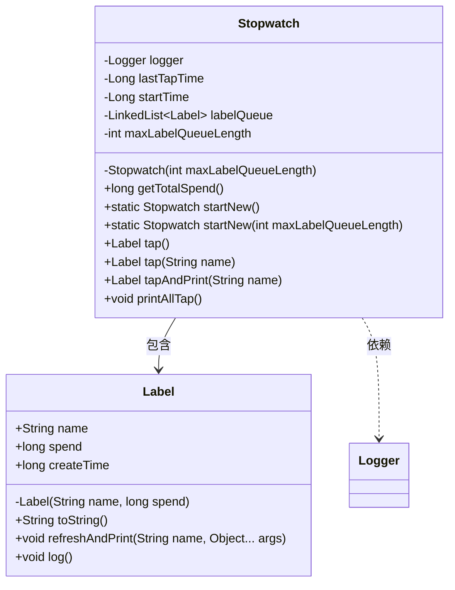
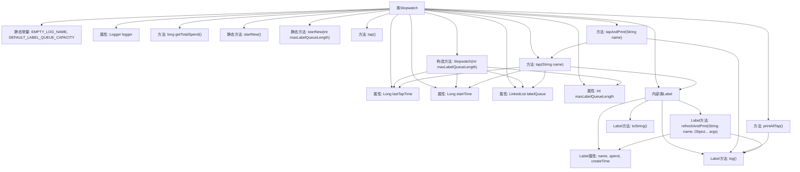

# 基础信息

|      |      |
|------|------|
| 名称 | Stopwatch |
| 编码语言 | .java |
| 代码路径 | WeFe/common/java/common-lang/src/main/java/com/welab/wefe/common/Stopwatch.java |
| 包名 | com.welab.wefe.common |
| 依赖项 | ['org.apache.commons.lang3.StringUtils', 'org.slf4j.Logger', 'org.slf4j.LoggerFactory', 'java.util.LinkedList'] |
| 概述说明 | Stopwatch类用于记录代码执行时间，支持创建标签、计算时间间隔、打印日志等功能。包含Label内部类记录时间点和耗时，可设置队列容量限制。 |

# 说明

Stopwatch类是一个用于记录代码执行时间的工具。它通过startNew方法创建实例，支持设置标签队列最大长度。核心功能包括tap方法记录时间戳并计算与上次记录的时间间隔，tapAndPrint方法记录并打印时间间隔，printAllTap方法打印所有记录。内部类Label存储每次记录的名称、耗时和创建时间，提供toString格式化输出和refreshAndPrint重新计算耗时的方法。类使用同步机制确保线程安全，并维护一个固定大小的标签队列。

# 类列表 Class Summary

| 名称   | 类型  | 说明 |
|-------|------|-------------|
| Stopwatch | class | Stopwatch类用于记录代码执行时间，支持标记时间点、计算时间间隔、打印日志，可设置最大记录数。内部Label类存储时间点和耗时信息。 |

## 类 Stopwatch

|      |      |
|------|------|
| 访问范围 | public |
| 类型 | class |
| 名称 | Stopwatch |
| 说明 | Stopwatch类用于记录代码执行时间，支持标记时间点、计算时间间隔、打印日志，可设置最大记录数。内部Label类存储时间点和耗时信息。 |

### UML类图

这段代码展示了一个计时器类(Stopwatch)及其内部标签类(Label)的设计。Stopwatch类用于记录代码执行时间，包含开始时间、最后点击时间等状态，提供了打点记录(tap)、打印时间间隔等方法。Label类作为计时标签，存储每次打点的名称、耗时和创建时间，提供刷新时间、日志打印等功能。类图清晰地展示了Stopwatch与Label的包含关系，以及Stopwatch对Logger的依赖关系，体现了计时功能的完整实现结构。

### 内部方法调用关系图

这段代码实现了一个计时器功能，主要包含Stopwatch类和其内部Label类。Stopwatch用于记录代码执行时间，通过startNew()创建实例，tap()记录时间点，getTotalSpend()获取总耗时。Label类存储每个时间点的名称和耗时，提供日志输出功能。流程图展示了类结构、属性、方法调用关系，包括静态方法、实例方法和内部类的交互逻辑。

### 字段列表 Field List

| 名称  | 类型  | 说明 |
|-------|-------|------|
| labelQueue | LinkedList<Label> | 私有链表变量labelQueue，存储Label类型元素。 |
| maxLabelQueueLength | int | 私有整型变量，用于存储最大标签队列长度。 |
| startTime | Long | 私有长整型变量startTime，用于记录起始时间。 |
| lastTapTime | Long | 私有长整型变量，记录最后一次点击时间。 |
| EMPTY_LOG_NAME = "" | String | 空日志名称常量定义为空字符串。 |
| logger = LoggerFactory.getLogger(Stopwatch.class) | Logger | 定义Stopwatch类的私有日志记录器实例。 |
| DEFAULT_LABEL_QUEUE_CAPACITY = 100 | int | 私有静态常量DEFAULT_LABEL_QUEUE_CAPACITY默认值为100。 |

### 方法列表

| 名称  | 类型  | 说明 |
|-------|-------|------|
| startNew | Stopwatch | 静态方法startNew创建一个带默认队列容量的Stopwatch实例。 |
| tap | Label | 方法tap接收名称参数，同步更新标签队列，记录时间间隔并返回新标签对象。若队列超限则移除最早项。 |
| getTotalSpend | long | 该方法返回当前时间与startTime的毫秒差，用于计算总耗时。 |
| printAllTap | void | 该方法遍历labelQueue中的每个Label对象并调用其log()方法。 |
| tapAndPrint | Label | 方法tapAndPrint点击指定名称的标签，记录日志并返回该标签对象。 |
| tap | Label | 方法tap()调用tap(EMPTY_LOG_NAME)并返回Label对象。 |
| startNew | Stopwatch | 静态方法startNew创建并返回一个Stopwatch实例，参数maxLabelQueueLength指定标签队列最大长度。 |

