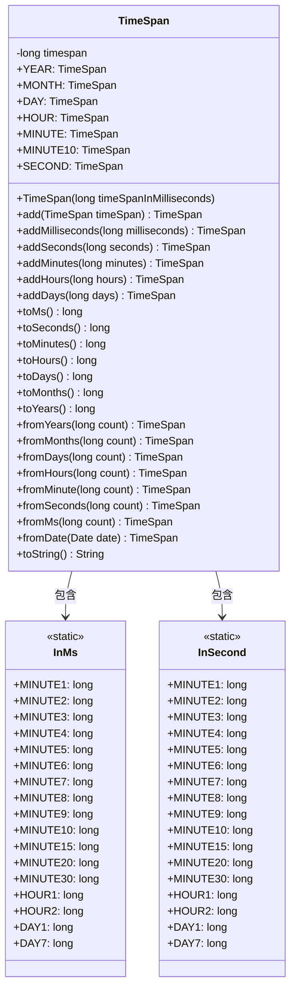

# 基础信息

|      |      |
|------|------|
| 名称 | TimeSpan |
| 编码语言 | .java |
| 代码路径 | WeFe/common/java/common-lang/src/main/java/com/welab/wefe/common/TimeSpan.java |
| 包名 | com.welab.wefe.common |
| 依赖项 | ['com.welab.wefe.common.util.StringUtil', 'java.util.Date'] |
| 概述说明 | TimeSpan类用于处理时间间隔，提供创建、加减和转换时间单位的功能，支持毫秒到年的转换，包含常用时间常量。 |

# 说明

该代码定义了一个TimeSpan类，用于表示时间间隔。类中包含静态常量表示常见时间单位（年、月、日、小时、分钟、秒），并提供多种构造方法从不同时间单位创建实例。核心功能包括时间间隔的加减运算（毫秒、秒、分钟、小时、天），以及将时间间隔转换为不同单位的方法（毫秒、秒、分钟、小时、天、月、年）。此外，还包含两个嵌套类InMs和InSecond，定义了常见时间段的毫秒和秒数值。toString方法将时间间隔格式化为易读的字符串（如"X天X小时X分钟X秒"）。整个类设计用于高效处理时间间隔的计算和转换。

# 类列表 Class Summary

| 名称   | 类型  | 说明 |
|-------|------|-------------|
| TimeSpan | class | TimeSpan类封装时间间隔操作，提供年、月、日等常量，支持时间加减及单位转换，包含毫秒和秒的常用时长定义。 |

## 类 TimeSpan

|      |      |
|------|------|
| 访问范围 | public |
| 类型 | class |
| 名称 | TimeSpan |
| 说明 | TimeSpan类封装时间间隔操作，提供年、月、日等常量，支持时间加减及单位转换，包含毫秒和秒的常用时长定义。 |

### UML类图

这段代码定义了一个TimeSpan类，用于表示时间间隔，并提供了一系列静态方法和常量来创建和操作时间间隔。类中包含两个静态内部类InMs和InSecond，分别定义了以毫秒和秒为单位的常见时间间隔常量。TimeSpan类提供了从不同时间单位创建时间间隔的静态工厂方法，以及进行时间加减和转换的方法，最后通过toString方法将时间间隔格式化为易读的字符串。整体设计简洁高效，适合处理各种时间计算场景。

### 内部方法调用关系图

```mermaid
graph TD
    A["类TimeSpan"]
    B["静态常量: YEAR/MONTH/DAY/HOUR/MINUTE/MINUTE10/SECOND"]
    C["私有属性: long timespan"]
    D["构造方法: TimeSpan(long timeSpanInMilliseconds)"]
    E["方法组: add系列(add/addMilliseconds/addSeconds/addMinutes/addHours/addDays)"]
    F["方法组: to系列(toMs/toSeconds/toMinutes/toHours/toDays/toMonths/toYears)"]
    G["方法组: from系列(fromYears/fromMonths/fromDays/fromHours/fromMinute/fromSeconds/fromMs/fromDate)"]
    H["重写方法: toString()"]
    I["内部类: InMs"]
    J["内部类: InSecond"]

    A --> B
    A --> C
    A --> D
    A --> E
    A --> F
    A --> G
    A --> H
    A --> I
    A --> J
```

这段代码定义了一个TimeSpan类，用于表示时间间隔并提供各种时间单位转换功能。类中包含三个主要部分：1) 静态常量定义常见时间单位；2) 核心方法包括时间加减(add系列)、时间单位转换(to系列)和静态构造方法(from系列)；3) 两个内部类InMs和InSecond提供常见时间间隔的常量值。toString()方法实现了将时间间隔格式化为易读的字符串。整体设计采用链式调用风格，支持从年到毫秒的多级时间单位转换，并考虑了各种时间计算场景的需求。

### 字段列表 Field List

| 名称  | 类型  | 说明 |
|-------|-------|------|
| timespan | long | 私有长整型变量timespan，用于存储时间跨度。 |
| DAY = TimeSpan.fromDays(1) | TimeSpan | 定义常量DAY，值为1天的TimeSpan对象。 |
| YEAR = TimeSpan.fromYears(1) | TimeSpan | 定义常量YEAR，表示1年的时间跨度。 |
| MONTH = TimeSpan.fromMonths(1) | TimeSpan | 定义了一个公共静态常量MONTH，表示1个月的时间跨度。 |
| SECOND = TimeSpan.fromSeconds(1) | TimeSpan | 定义常量SECOND，表示1秒的时间跨度。 |
| MINUTE10 = TimeSpan.fromMinute(10) | TimeSpan | 定义10分钟时间常量的静态不可变字段。 |
| HOUR = TimeSpan.fromHours(1) | TimeSpan | 定义静态常量HOUR，表示1小时的时间跨度。 |
| MINUTE = TimeSpan.fromMinute(1) | TimeSpan | 定义静态常量MINUTE，值为1分钟的TimeSpan对象。 |

### 方法列表

| 名称  | 类型  | 说明 |
|-------|-------|------|
| toHours | long | 该方法将分钟数转换为小时数，通过除以60实现。 |
| fromHours | TimeSpan | 静态方法fromHours将小时数转为TimeSpan，内部调用fromMinute实现，参数count乘以60转换为分钟。 |
| fromDays | TimeSpan | 静态方法fromDays接收长整型参数count，返回TimeSpan对象，通过将count乘以24转换为小时数调用fromHours方法实现。 |
| addDays | TimeSpan | 方法addDays接收长整型days参数，将其转为小时数并调用addHours方法，最后返回当前对象。 |
| toMonths | long | 将天数转换为月数，按30天为1个月计算。 |
| fromYears | TimeSpan | 静态方法fromYears将年数转为天数再生成TimeSpan对象。 |
| toSeconds | long | 将毫秒转换为秒的方法，返回timespan除以1000的结果。 |
| toMinutes | long | 将秒数转换为分钟数，返回值为长整型。 |
| fromSeconds | TimeSpan | 静态方法fromSeconds接收长整型参数count，返回TimeSpan对象，值为count乘以1000毫秒。 |
| add | TimeSpan | 方法add接收TimeSpan参数，将其毫秒值累加到当前对象并返回自身。 |
| toDays | long | 方法toDays将小时数转换为天数，返回this.toHours()除以24的结果。 |
| fromMs | TimeSpan | 静态方法fromMs接收长整型参数count，返回基于count的TimeSpan对象。 |
| fromDate | TimeSpan | 静态方法fromDate接收Date对象，返回当前时间与给定日期的毫秒差转换的TimeSpan。 |
| toString | String | 将毫秒转换为天、小时、分钟、秒的字符串表示，不足一天时显示秒，无值则返回毫秒。 |
| toYears | long | 将月份数转换为年数，方法为月份除以12。 |
| addMinutes | TimeSpan | 方法addMinutes接收分钟数，转换为秒后调用addSeconds，返回当前对象。 |
| addSeconds | TimeSpan | 方法addSeconds接收长整型秒数，将其转为毫秒后调用addMilliseconds，最后返回当前对象实例。 |
| fromMinute | TimeSpan | 静态方法fromMinute将分钟数转为秒数并生成TimeSpan对象。 |
| addMilliseconds | TimeSpan | 该方法将输入的毫秒数累加到当前时间间隔对象中，并返回更新后的对象自身。 |
| fromMonths | TimeSpan | 静态方法fromMonths将月份数转为天数（乘以30）再调用fromDays生成TimeSpan。 |
| toMs | long | 方法toMs返回当前对象的timespan值，类型为long。 |
| addHours | TimeSpan | 方法addHours接收长整型参数hours，将其转换为分钟并调用addMinutes方法，最后返回当前对象。 |

