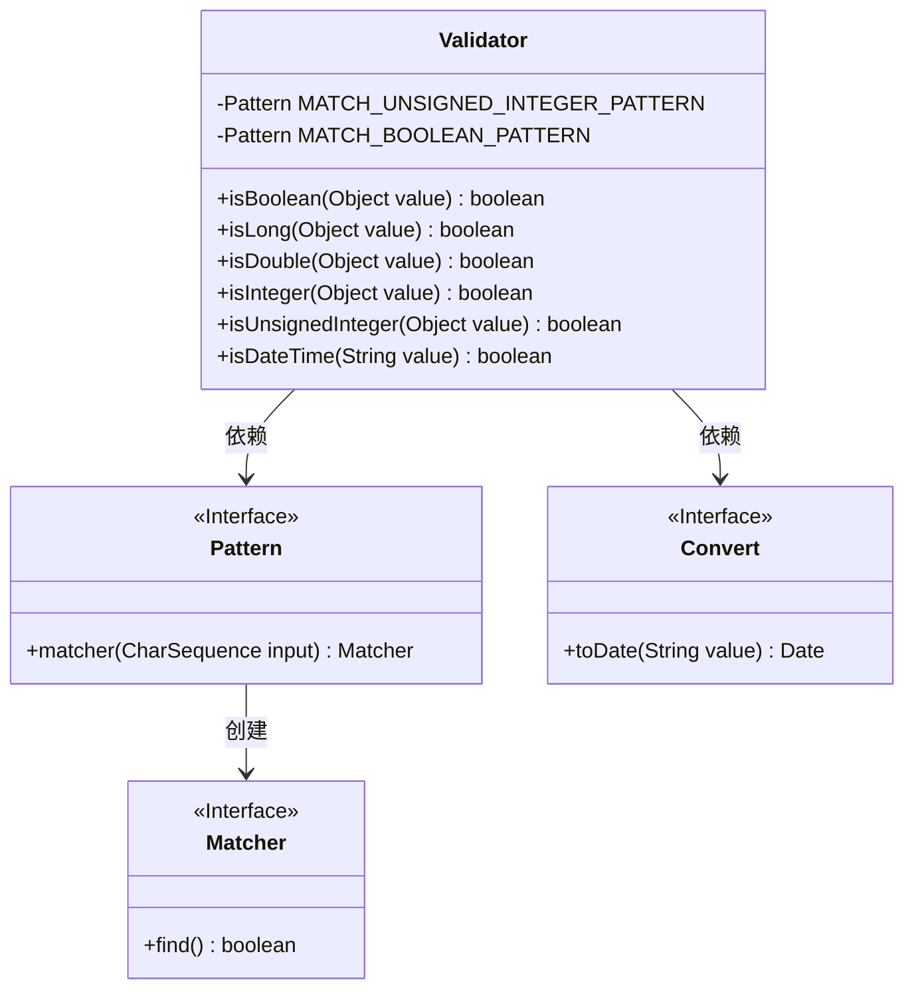

# 基础信息

|      |      |
|------|------|
| 名称 | Validator |
| 编码语言 | .java |
| 代码路径 | WeFe/common/java/common-lang/src/main/java/com/welab/wefe/common/Validator.java |
| 包名 | com.welab.wefe.common |
| 依赖项 | ['java.util.regex.Pattern'] |
| 概述说明 | Validator类提供静态方法验证数据类型：检查布尔值（true/false/0/1）、长整型、双精度型、整型、无符号整型（仅数字）及日期时间格式（通过Convert.toDate转换）。 |

# 说明

Validator类提供了一系列静态方法用于验证不同类型的数据。包含验证布尔值的方法isBoolean，通过正则匹配true/false/0/1（不区分大小写）。验证数字类型的方法isLong、isDouble和isInteger，分别检查能否转换为对应类型。isUnsignedInteger方法验证无符号整数，使用正则匹配纯数字字符串或非负Integer。isDateTime方法验证字符串是否为合法日期时间格式，通过尝试转换为日期对象判断。所有方法都优先检查参数是否为对应类型的实例，再进行字符串转换验证。

# 类列表 Class Summary

| 名称   | 类型  | 说明 |
|-------|------|-------------|
| Validator | class | Validator类提供静态方法验证数据类型，包括布尔值、长整型、双精度、整数、无符号整数及日期时间格式。 |

## 类 Validator

|      |      |
|------|------|
| 访问范围 | public |
| 类型 | class |
| 名称 | Validator |
| 说明 | Validator类提供静态方法验证数据类型，包括布尔值、长整型、双精度、整数、无符号整数及日期时间格式。 |

### UML类图

这段代码展示了一个`Validator`工具类，主要用于验证不同类型的数据格式。它包含多个静态方法，用于检查对象是否为布尔值、长整型、双精度浮点数、整数、无符号整数或日期时间格式。类中使用了正则表达式模式匹配和类型转换，通过`Pattern`和`Convert`类实现功能。所有方法均为静态，可直接调用无需实例化。

### 内部方法调用关系图

```mermaid
graph TD
    A["类Validator"]
    B["静态常量: MATCH_UNSIGNED_INTEGER_PATTERN"]
    C["静态常量: MATCH_BOOLEAN_PATTERN"]
    D["静态方法: isBoolean(Object value)"]
    E["静态方法: isLong(Object value)"]
    F["静态方法: isDouble(Object value)"]
    G["静态方法: isInteger(Object value)"]
    H["静态方法: isUnsignedInteger(Object value)"]
    I["静态方法: isDateTime(String value)"]
    J["实例检查: value instanceof Boolean"]
    K["正则匹配: MATCH_BOOLEAN_PATTERN.matcher"]
    L["实例检查: value instanceof Long"]
    M["数值转换: Long.valueOf"]
    N["异常捕获: NumberFormatException"]
    O["实例检查: value instanceof Double"]
    P["数值转换: Double.valueOf"]
    Q["实例检查: value instanceof Integer"]
    R["数值转换: Integer.valueOf"]
    S["正则匹配: MATCH_UNSIGNED_INTEGER_PATTERN.matcher"]
    T["日期转换: Convert.toDate"]
    U["异常捕获: Exception"]

    A --> B
    A --> C
    A --> D
    A --> E
    A --> F
    A --> G
    A --> H
    A --> I
    D --> J
    D --> K
    E --> L
    E --> M
    E --> N
    F --> O
    F --> P
    F --> N
    G --> Q
    G --> R
    G --> N
    H --> Q
    H --> S
    I --> T
    I --> U
```

这段代码定义了一个Validator类，包含多个静态方法用于验证不同类型的数据。主要功能包括：通过正则表达式验证布尔值和无符号整数，通过类型检查和数值转换验证Long、Double、Integer类型，以及通过日期转换验证DateTime格式。每个验证方法都考虑了类型检查和异常处理，确保验证过程的健壮性。流程图清晰地展示了类结构与各方法间的调用关系，包括正则匹配、类型转换和异常处理等关键步骤。

### 字段列表 Field List

| 名称  | 类型  | 说明 |
|-------|-------|------|
| MATCH_UNSIGNED_INTEGER_PATTERN = Pattern.compile("^\\d+$") | Pattern | 定义静态常量正则表达式，用于匹配无符号整数字符串。 |
| MATCH_BOOLEAN_PATTERN = Pattern.compile("^true$|^false$|^0$|^1$", Pattern.CASE_INSENSITIVE) | Pattern | 定义静态布尔匹配正则，忽略大小写，匹配true/false/0/1。 |

### 方法列表

| 名称  | 类型  | 说明 |
|-------|-------|------|
| isBoolean | boolean | 检查对象是否为布尔类型或字符串匹配布尔模式。 |
| isLong | boolean | 检查对象是否为Long类型或可转为Long。是则返回true，否则false。 |
| isDouble | boolean | 检查对象是否为Double类型或可转换为Double，返回布尔值。 |
| isInteger | boolean | 检查对象是否为整数：若为Integer实例直接返回true，否则尝试转为字符串解析为整数，成功则返回true，失败返回false。 |
| isUnsignedInteger | boolean | 检查对象是否为无符号整数：若为Integer类型且非负则返回true，否则用正则匹配字符串判断是否为无符号整数。 |
| isDateTime | boolean | 检查字符串是否为有效日期时间，成功转换返回true，失败返回false。 |

