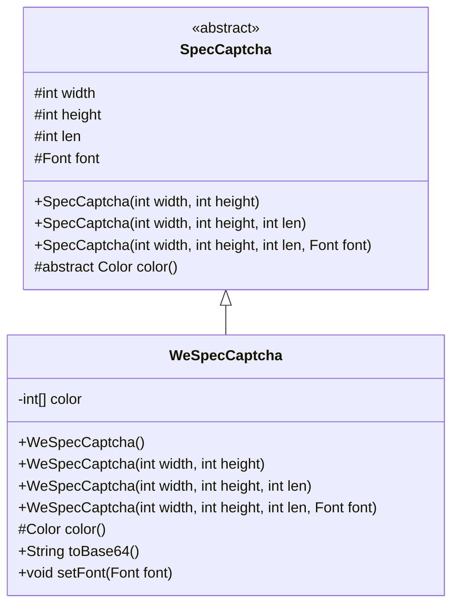
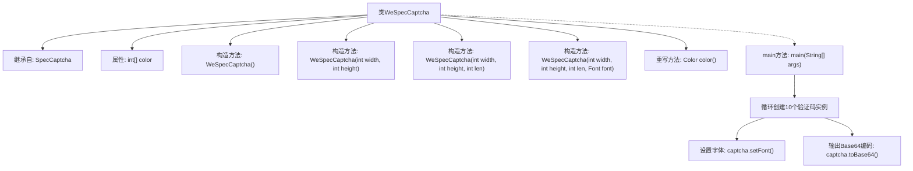

# 基础信息

|      |      |
|------|------|
| 名称 | WeSpecCaptcha |
| 编码语言 | .java |
| 代码路径 | WeFe/common/java/common-lang/src/main/java/com/welab/wefe/common/WeSpecCaptcha.java |
| 包名 | com.welab.wefe.common |
| 依赖项 | ['com.wf.captcha.SpecCaptcha', 'java.awt'] |
| 概述说明 | WeSpecCaptcha类继承SpecCaptcha，提供多种构造方法，重写color方法确保验证码颜色统一以增强安全性，示例代码生成10个Base64格式验证码。 |

# 说明

WeSpecCaptcha类继承自SpecCaptcha，用于生成验证码。它包含一个颜色数组color，并通过重写color方法确保验证码字符使用单一颜色，提升安全性。类提供多个构造方法，支持自定义宽度、高度、长度和字体。main方法演示了生成10个Base64格式验证码的示例，使用楷体24号字体，尺寸为85x35，长度为5个字符。

# 类列表 Class Summary

| 名称   | 类型  | 说明 |
|-------|------|-------------|
| WeSpecCaptcha | class | WeSpecCaptcha类继承SpecCaptcha，控制验证码颜色为单一颜色增强安全性，提供多种构造方法，支持设置字体和生成Base64验证码。 |

## 类 WeSpecCaptcha

|      |      |
|------|------|
| 访问范围 | public |
| 类型 | class |
| 名称 | WeSpecCaptcha |
| 说明 | WeSpecCaptcha类继承SpecCaptcha，控制验证码颜色为单一颜色增强安全性，提供多种构造方法，支持设置字体和生成Base64验证码。 |

### UML类图

类图描述：
WeSpecCaptcha类继承自抽象类SpecCaptcha，主要用于生成特定样式的验证码。它通过重写color()方法实现了单色画笔控制，取代了父类的随机颜色方案，增强了安全性。类中包含4个重载构造函数，分别对应不同的验证码参数配置（宽度、高度、长度、字体）。通过setFont()可自定义字体，toBase64()将验证码输出为Base64格式。私有字段color缓存颜色值避免重复计算。

### 内部方法调用关系图

该流程图展示了WeSpecCaptcha类的结构，这是一个继承自SpecCaptcha的验证码生成类。主要包含4个重载构造方法、一个控制验证码颜色的重写方法color()，以及生成10个带特定字体验证码并输出Base64编码的main方法。关键设计是通过color()方法统一验证码字符颜色，增强安全性，与父类随机颜色方案形成对比。main方法演示了批量生成验证码的典型用法流程。

### 字段列表 Field List

| 名称  | 类型  | 说明 |
|-------|-------|------|
| color = null | int[] | 声明一个私有整型数组color，初始值为null。 |

### 方法列表

| 名称  | 类型  | 说明 |
|-------|-------|------|
| main | void | Java代码示例：循环10次生成验证码，设置字体为楷体24号，输出Base64编码结果。 |
| color | Color | 该方法重写父类color()，若color为空则从COLOR数组随机选取一个RGB值，返回新Color对象。 |

