# 基础信息

|      |      |
|------|------|
| 名称 | common |
| 编码语言 | .java |
| 代码路径 | WeFe/common/java/common-lang/src/main/java/com/welab/wefe/common |
| 包名 | docs.common.java.common-lang.src.main.java.com.welab.wefe.common |
| 概述说明 | Java配置管理工具集，统一管理配置并提供类型安全接口。支持多环境配置加载和类型转换，依赖Log4j。数据处理工具集含Excel解析和文本批处理，支持ETL和日志分析。字段验证平台实现敏感数据脱敏和格式校验。基础常量模块定义密钥类型和压缩格式。通用工具库涵盖加密、集合操作等。HTTP通信模块管理文件下载和请求处理。压缩解压模块支持多格式处理。函数式接口支持Lambda操作。线程池管理工具提供任务执行功能。验证类检查数据类型合法性。状态码枚举定义系统错误码。安全工具生成随机盐值。时间间隔类处理时间计算。批量消费类实现数据批量处理。验证码生成类创建Base64验证码。信息大小类转换存储单位。数据类型转换类处理多种格式转换。采样日志类控制日志频率。计时工具类记录代码执行时间。 |

# 说明

## 概述  
该模块是Java基础工具与功能组件的综合库，核心职责包括配置管理、数据处理、字段验证、HTTP通信等基础服务支持。采用静态工具类设计模式，提供类型安全接口和函数式编程支持。关键数据结构涵盖CompositeConfiguration（组合配置）、Excel工作表/单元格、正则规则库、枚举常量等。外部依赖包括Log4j、Apache HttpClient、BouncyCastle等，例如配置模块依赖Log4j，加密模块使用BouncyCastle实现国密算法。  

模块实现多领域功能集成，类似基础设施中间件。例如Configurations类管理多环境配置，ExcelReader轻量封装POI操作，FieldValidateUtil完成敏感数据脱敏。技术特征包含注解驱动（如@Check）、策略枚举（如SecretKeyType）和流式处理（如BatchConsumer）。所有组件均遵循"开箱即用"原则，如SecurityUtil生成加密盐值，TimeSpan处理时间间隔计算。  

## 主要业务场景  
典型应用形成三大闭环：1) 配置与安全闭环，通过ConfigurationManager加载配置→FieldValidateUtil校验→SecurityUtil加密，例如读取数据库连接参数并校验敏感字段；2) 数据处理闭环，组合ExcelReader解析→BatchConsumer批量处理→File压缩存储，类似ETL流水线；3) 通信与调度闭环，HttpClient调用API→CommonThreadPool异步执行→Stopwatch监控性能。  

统一交互模式为链式调用与注解驱动结合。例如Excel模块采用"加载-遍历-关闭"流程，校验模块通过@Check注解触发规则。功能完整性体现在覆盖国密算法（SM2/SM4）、多协议支持（HTTP/ZIP）、全生命周期管理（如配置加载→使用→监控）。典型场景包括：金融级数据校验（身份证/手机号）、高并发文件处理（分片压缩/下载）、安全通信（HTTPS+签名验签）。例如HttpRequest自动处理302跳转，Validator验证日期时间格式。

### 包内部结构视图

```mermaid
graph TD
    common --> configuration
    common --> fastjson
    common --> enums
    common --> io
    common --> fieldvalidate
    common --> constant
    common --> util
    common --> exception
    common --> http
    common --> file
    common --> function
    common --> CommonThreadPool.java
    common --> Validator.java
    common --> StatusCode.java
    common --> SecurityUtil.java
    common --> TimeSpan.java
    common --> BatchConsumer.java
    common --> WeSpecCaptcha.java
    common --> InformationSize.java
    common --> Convert.java
    common --> SamplingLogger.java
    common --> Stopwatch.java
    
    configuration --> Configurations.java
    configuration --> ConfigurationManager.java
    
    fastjson --> LoggerValueFilter.java
    
    enums --> FilePublicLevel.java
    
    io --> excel
    io --> text
    excel --> ExcelReader.java
    text --> writer
    text --> reader
    writer --> delegate
    writer --> LocalTextFileWriter.java
    writer --> AbstractTextWriter.java
    delegate --> RecordToStringFunction.java
    delegate --> FileNameFunction.java
    reader --> TextFileIterator.java
    reader --> LocalTextFileReader.java
    reader --> AbstractTextReader.java
    
    fieldvalidate --> secret
    fieldvalidate --> annotation
    fieldvalidate --> StandardFieldType.java
    fieldvalidate --> FieldValidateUtil.java
    fieldvalidate --> FieldAssert.java
    fieldvalidate --> ReactionaryKeywords.java
    fieldvalidate --> AbstractCheckModel.java
    secret --> SecretValueFilter.java
    secret --> SecretUtil.java
    secret --> Secret.java
    secret --> MaskStrategy.java
    annotation --> Check.java
    
    constant --> SecretKeyType.java
    constant --> ZipType.java
    constant --> Constant.java
    
    util --> enums
    util --> MapUtil.java
    util --> ReflectionsUtil.java
    util --> IpAddressUtil.java
    util --> Sha1.java
    util --> ListUtil.java
    util --> StringUtil.java
    util --> EncryptUtils.java
    util --> SignUtil.java
    util --> UrlUtil.java
    util --> DateUtil.java
    util --> SM2Util.java
    util --> SM4Util.java
    util --> ClassUtils.java
    util --> JObject.java
    util --> Masker.java
    util --> OS.java
    util --> Base64Util.java
    util --> ZipUtil.java
    util --> Md5.java
    util --> ImageUtil.java
    util --> FileUtil.java
    util --> XmlUtil.java
    util --> CommentedProperties.java
    util --> AESUtil.java
    util --> RandomUtil.java
    util --> FileType.java
    util --> ThreadUtil.java
    util --> CopyUtil.java
    util --> GzipUtil.java
    util --> HostUtil.java
    util --> AsymmetricCryptoUtil.java
    util --> RSAUtil.java
    enums --> ContentType.java
    
    exception --> StatusCodeWithException.java
    
    http --> download
    http --> MyRedirectStrategy.java
    http --> HttpContentType.java
    http --> HttpMethod.java
    http --> HttpResponse.java
    http --> HttpRequest.java
    download --> DownloadResult.java
    download --> HttpDownloader.java
    download --> DownloadStatus.java
    
    file --> compression
    file --> decompression
    compression --> impl
    compression --> CompressionType.java
    compression --> AbstractCompression.java
    impl --> Zip.java
    impl --> Tgz.java
    decompression --> impl
    decompression --> dto
    decompression --> SuperDecompressor.java
    decompression --> AbstractDecompression.java
    impl --> Zip.java
    impl --> SevenZip.java
    impl --> Tgz.java
    dto --> DecompressionResult.java
    
    function --> CharFunction.java
    function --> ConsumerWithException.java
    function --> ToBooleanFunction.java
```

该流程图展示了WeFe项目中common模块的完整目录结构，从顶层common节点开始，逐级展开到各个子模块和具体文件。图中包含12个一级目录（如configuration、fastjson等），每个目录下又细分出二级、三级子目录和具体实现类，完整呈现了项目工具类库的组织架构。特别值得注意的是io、fieldvalidate和util等模块具有较深的层级关系，其中io/text模块下细分了reader/writer等子模块，体现了复杂的文件操作功能设计。

# 文件列表

| 名称   | 类型  | 说明 |
|-------|------|-------------|
| [CommonThreadPool.java](CommonThreadPool.md) | file | CommonThreadPool类提供静态线程池管理，支持任务执行、提交、停止及状态查询，使用LinkedBlockingQueue和CountDownLatch实现异步任务控制。 |
| [Validator.java](Validator.md) | file | Validator类提供静态方法验证数据类型：检查布尔值（true/false/0/1）、长整型、双精度型、整型、无符号整型（仅数字）及日期时间格式（通过Convert.toDate转换）。 |
| [StatusCode.java](StatusCode.md) | file | 状态码枚举类，包含系统、数据库、服务等错误码及描述，支持异常抛出和格式化消息。 |
| [SecurityUtil.java](SecurityUtil.md) | file | SecurityUtil类提供生成随机盐的方法createRandomSalt，使用SecureRandom生成16字节随机数并Base64编码。main方法演示生成10个盐值。 |
| [TimeSpan.java](TimeSpan.md) | file | TimeSpan类用于处理时间间隔，提供创建、加减和转换时间单位的功能，支持毫秒到年的转换，包含常用时间常量。 |
| [BatchConsumer.java](BatchConsumer.md) | file | BatchConsumer是一个批量消费队列数据的工具类，支持设置最大批量和延迟，线程安全，可自动关闭。 |
| [WeSpecCaptcha.java](WeSpecCaptcha.md) | file | WeSpecCaptcha类继承SpecCaptcha，提供多种构造方法，重写color方法确保验证码颜色统一以增强安全性，示例代码生成10个Base64格式验证码。 |
| [InformationSize.java](InformationSize.md) | file | InformationSize类封装比特大小，提供比特、字节、KiB、MiB、GiB的转换方法，支持静态创建和格式化输出。 |
| [Convert.java](Convert.md) | file | Convert类提供多种类型转换方法：处理null值，支持Integer、Double、Long、Boolean、Date等类型互转，含异常处理和默认值设置。 |
| [SamplingLogger.java](SamplingLogger.md) | file | SamplingLogger类用于按数量或时间间隔采样日志，支持info和error方法，满足条件时触发日志打印。 |
| [Stopwatch.java](Stopwatch.md) | file | Stopwatch类用于记录代码执行时间，支持创建标签、计算时间间隔、打印日志等功能。包含Label内部类记录时间点和耗时，可设置队列容量限制。 |
| [function](function/_module.md) | package | CharFunction接口处理字符输入返回泛型结果。ConsumerWithException接口处理带异常的消费者行为。ToBooleanFunction接口将任意类型转换为布尔值。 |
| [exception](exception/_module.md) | package | StatusCodeWithException类继承Exception，封装状态码和消息，提供静态工厂方法创建异常实例，支持获取状态码和格式化输出。 |
| [file](file/_module.md) | package | 该模块实现多格式文件压缩和解压功能，支持ZIP/TAR.GZ/7z等格式，采用抽象类和工厂模式设计，依赖Apache Commons等库，适用于日志打包、文件传输等场景，提供同步API和命令行工具。 |
| [http](http/_module.md) | package | HTTP下载模块支持多线程分块下载，含状态管理和断点续传。包含HttpDownloader、DownloadResult等核心类，依赖Apache HttpClient。配套工具含重定向策略、HTTP方法枚举、内容类型常量及请求响应封装类，支持HTTPS和连接池。 |
| [util](util/_module.md) | package | 多个Java工具类集合，包括文件类型处理、集合统计、反射扫描、IP地址操作、加密解密、日期处理、字符串操作、XML转换、线程休眠等实用功能，覆盖常见开发需求。 |
| [constant](constant/_module.md) | package | 定义了三种常量类：SecretKeyType枚举含RSA和SM2密钥类型及获取方法；ZipType类含ZIP和GZIP压缩格式常量；Constant类含编码、日期时间等全局常量。 |
| [fieldvalidate](fieldvalidate/_module.md) | package | 该模块实现数据脱敏与字段校验，包含注解标记、策略执行和反射处理。支持手机号、邮箱等字段的标准化与验证，集成XSS防护、反动词过滤。工具类提供正则校验、非空检查，抽象类实现递归校验。 |
| [io](io/_module.md) | package | ExcelReader是Java类，支持读取Excel数据，提供多种初始化方式及数据遍历功能。文本处理模块支持数据序列化、分片存储和逐行读取，适用于ETL和高吞吐日志处理。 |
| [enums](enums/_module.md) | package | 文件公开级别枚举：Private（私有）、Public（公开）、PublicWithMemberList（指定成员可见）。 |
| [fastjson](fastjson/_module.md) | package | LoggerValueFilter类用于日志中过长的值截断，默认限制1024字符，支持字符串、文件、字节数组等类型处理，避免日志过大和调试不便。 |
| [configuration](configuration/_module.md) | package | Configurations类管理配置信息，提供静态方法检查键、获取各类配置值及列表，支持默认值。ConfigurationManager管理配置文件，支持文件或类路径加载，含缓存和动态环境配置功能。 |

