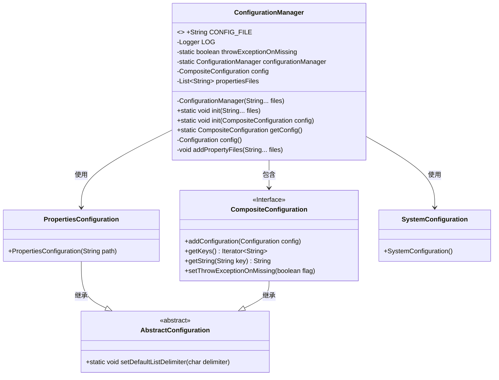
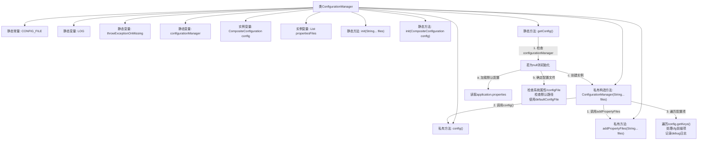
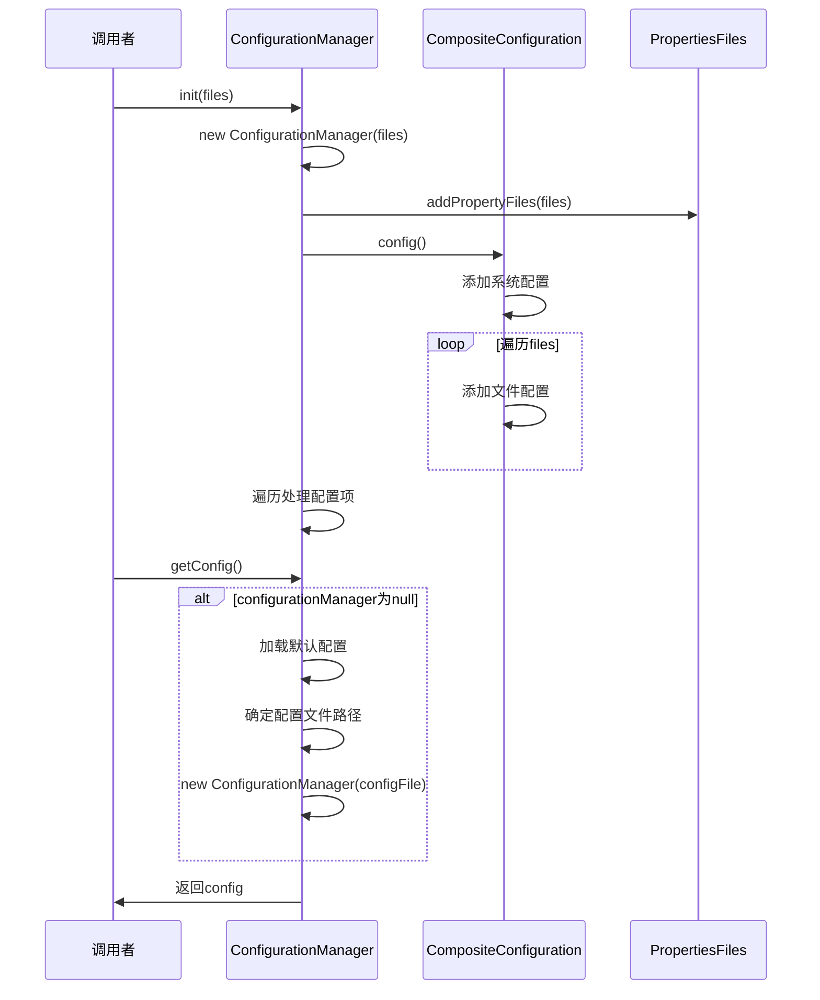

# 基础信息

|      |      |
|------|------|
| 名称 | ConfigurationManager |
| 编码语言 | .java |
| 代码路径 | WeFe/common/java/common-lang/src/main/java/com/welab/wefe/common/configuration/ConfigurationManager.java |
| 包名 | com.welab.wefe.common.configuration |
| 依赖项 | ['com.welab.wefe.common.util.StringUtil', 'org.apache.commons.configuration', 'org.apache.commons.lang3.StringUtils', 'org.slf4j.Logger', 'org.slf4j.LoggerFactory', 'java.io.File', 'java.nio.file.Files', 'java.nio.file.Paths', 'java.util.ArrayList', 'java.util.Arrays', 'java.util.List'] |
| 概述说明 | ConfigurationManager类管理配置，支持文件初始化、系统属性设置和异常处理，默认读取config.properties，支持环境变量配置。 |

# 说明

ConfigurationManager是一个管理配置文件的工具类，提供静态方法初始化配置。它使用CompositeConfiguration存储配置，支持从文件路径或类路径加载属性文件。初始化时读取系统属性或默认配置文件，支持动态环境配置。类中包含日志记录、异常处理及配置项缓存功能，确保配置加载的高效性和灵活性。

# 类列表 Class Summary

| 名称   | 类型  | 说明 |
|-------|------|-------------|
| ConfigurationManager | class | ConfigurationManager类管理配置文件，支持初始化、加载属性文件和获取配置。通过静态方法init和getConfig操作，支持多文件和环境配置，自动处理路径和异常。 |

## 类 ConfigurationManager

|      |      |
|------|------|
| 访问范围 | public |
| 类型 | class |
| 名称 | ConfigurationManager |
| 说明 | ConfigurationManager类管理配置文件，支持初始化、加载属性文件和获取配置。通过静态方法init和getConfig操作，支持多文件和环境配置，自动处理路径和异常。 |

### UML类图

类图描述：
该图展示了配置管理器ConfigurationManager的核心结构及其依赖关系。ConfigurationManager是一个单例类，通过静态方法管理配置加载，内部维护CompositeConfiguration组合配置对象和属性文件列表。它依赖于PropertiesConfiguration和SystemConfiguration来加载不同来源的配置，这些配置类都继承自AbstractConfiguration基类。CompositeConfiguration作为接口定义了配置操作规范，支持多配置源的组合管理。整个设计实现了从文件系统、类路径和系统属性等多渠道加载配置的能力。

### 内部方法调用关系图

这段代码实现了一个线程安全的配置管理器，采用单例模式管理多种来源的配置项。核心流程包括：1) 通过构造方法初始化时加载指定配置文件；2) 通过getConfig()方法实现懒加载，自动处理默认配置路径和系统属性；3) 支持动态添加系统配置和文件配置。特别注意其对配置文件的层级处理逻辑，包括环境变量识别、默认路径回退等边缘情况处理，并通过CompositeConfiguration实现配置项的合并管理。日志系统全程记录关键操作，确保配置加载过程可追溯。

### 字段列表 Field List

| 名称  | 类型  | 说明 |
|-------|-------|------|
| config = new CompositeConfiguration() | CompositeConfiguration | 创建CompositeConfiguration对象实例config用于组合配置管理。 |
| configurationManager | ConfigurationManager | 私有静态配置管理器实例。 |
| propertiesFiles = new ArrayList<>() | List<String> | 声明一个私有列表变量propertiesFiles，用于存储字符串类型的属性文件路径。 |
| throwExceptionOnMissing = true | boolean | 私有静态布尔变量，控制缺失时是否抛出异常，默认值为true。 |
| CONFIG_FILE = "configFile" | String | 定义静态常量字符串CONFIG_FILE，值为"configFile"。 |
| LOG = LoggerFactory.getLogger(ConfigurationManager.class) | Logger | 定义静态常量LOG，用于ConfigurationManager类的日志记录。 |

### 方法列表

| 名称  | 类型  | 说明 |
|-------|-------|------|
| init | void | 静态方法init接收可变参数files，记录日志并用逗号拼接文件列表，随后创建ConfigurationManager实例。 |
| getConfig | CompositeConfiguration | 获取配置方法：优先读取系统属性或application.properties中的环境配置，若无则使用默认config.properties，支持Flink路径回退，最终返回组合配置对象。 |
| init | void | 静态方法init初始化配置管理器，若管理器为空且配置非空则创建实例并记录日志。 |
| config | Configuration | 方法config()配置系统属性，加载指定属性文件，处理缺失文件异常，返回配置对象。 |
| addPropertyFiles | void | 方法`addPropertyFiles`接收可变参数`files`，将其转为列表后添加到`propertiesFiles`集合中。 |

