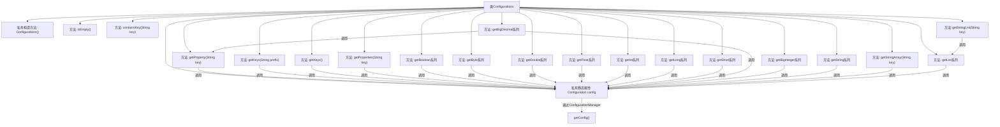

# 基础信息

|      |      |
|------|------|
| 名称 | Configurations |
| 编码语言 | .java |
| 代码路径 | WeFe/common/java/common-lang/src/main/java/com/welab/wefe/common/configuration/Configurations.java |
| 包名 | com.welab.wefe.common.configuration |
| 依赖项 | ['org.apache.commons.configuration.Configuration', 'java.math.BigDecimal', 'java.math.BigInteger', 'java.util.Iterator', 'java.util.List', 'java.util.Properties', 'java.util.stream.Collectors'] |
| 概述说明 | Configurations类提供静态方法访问配置数据，支持多种数据类型获取，包括布尔、数字、字符串、列表等，并允许默认值设置。 |

# 说明

Configurations类是一个工具类，用于管理配置信息。它通过私有构造函数防止实例化，提供静态方法访问配置数据。主要功能包括检查配置是否为空、判断键是否存在、获取各种类型的配置值（如布尔值、字节、双精度浮点数、浮点数、整数、长整数、短整数、大数、字符串等），以及获取键的迭代器和属性列表。支持带默认值的重载方法，确保在键不存在时返回默认值。还提供获取字符串数组和列表的功能，包括将分号分隔的值转换为字符串列表。

# 类列表 Class Summary

| 名称   | 类型  | 说明 |
|-------|------|-------------|
| Configurations | class | Configurations类提供静态方法访问配置数据，支持多种数据类型获取，包括布尔、数值、字符串、列表等，含默认值选项。 |

## 类 Configurations

|      |      |
|------|------|
| 访问范围 | public |
| 类型 | class |
| 名称 | Configurations |
| 说明 | Configurations类提供静态方法访问配置数据，支持多种数据类型获取，包括布尔、数值、字符串、列表等，含默认值选项。 |

### UML类图

```mermaid
classDiagram
    class Configurations {
        -Configuration config
        -Configurations()
        +isEmpty() boolean
        +containsKey(String key) boolean
        +getProperty(String key) Object
        +getKeys(String prefix) Iterator~String~
        +getKeys() Iterator~String~
        +getProperties(String key) Properties
        +getBoolean(String key) boolean
        +getBoolean(String key, boolean defaultValue) boolean
        +getBoolean(String key, Boolean defaultValue) Boolean
        +getByte(String key) byte
        +getByte(String key, byte defaultValue) byte
        +getByte(String key, Byte defaultValue) Byte
        +getDouble(String key) double
        +getDouble(String key, double defaultValue) double
        +getDouble(String key, Double defaultValue) Double
        +getFloat(String key) float
        +getFloat(String key, float defaultValue) float
        +getFloat(String key, Float defaultValue) Float
        +getInt(String key) int
        +getInt(String key, int defaultValue) int
        +getInteger(String key, Integer defaultValue) Integer
        +getLong(String key) long
        +getLong(String key, long defaultValue) long
        +getLong(String key, Long defaultValue) Long
        +getShort(String key) short
        +getShort(String key, short defaultValue) short
        +getShort(String key, Short defaultValue) Short
        +getBigDecimal(String key) BigDecimal
        +getBigDecimal(String key, BigDecimal defaultValue) BigDecimal
        +getBigInteger(String key) BigInteger
        +getBigInteger(String key, BigInteger defaultValue) BigInteger
        +getString(String key) String
        +getString(String key, String defaultValue) String
        +getStringArray(String key) String[]
        +getList(String key) List~Object~
        +getStringList(String key) List~String~
        +getList(String key, List~?~ defaultValue) List~Object~
    }

    class Configuration {
        <<Interface>>
        +isEmpty() boolean
        +containsKey(String key) boolean
        +getProperty(String key) Object
        +getKeys(String prefix) Iterator~String~
        +getKeys() Iterator~String~
        +getProperties(String key) Properties
        +getBoolean(String key) boolean
        +getBoolean(String key, boolean defaultValue) boolean
        +getBoolean(String key, Boolean defaultValue) Boolean
        +getByte(String key) byte
        +getByte(String key, byte defaultValue) byte
        +getByte(String key, Byte defaultValue) Byte
        +getDouble(String key) double
        +getDouble(String key, double defaultValue) double
        +getDouble(String key, Double defaultValue) Double
        +getFloat(String key) float
        +getFloat(String key, float defaultValue) float
        +getFloat(String key, Float defaultValue) Float
        +getInt(String key) int
        +getInt(String key, int defaultValue) int
        +getInteger(String key, Integer defaultValue) Integer
        +getLong(String key) long
        +getLong(String key, long defaultValue) long
        +getLong(String key, Long defaultValue) Long
        +getShort(String key) short
        +getShort(String key, short defaultValue) short
        +getShort(String key, Short defaultValue) Short
        +getBigDecimal(String key) BigDecimal
        +getBigDecimal(String key, BigDecimal defaultValue) BigDecimal
        +getBigInteger(String key) BigInteger
        +getBigInteger(String key, BigInteger defaultValue) BigInteger
        +getString(String key) String
        +getString(String key, String defaultValue) String
        +getStringArray(String key) String[]
        +getList(String key) List~Object~
        +getList(String key, List~?~ defaultValue) List~Object~
    }

    Configurations --> Configuration : 依赖\n(通过静态config成员)
```

该代码展示了一个配置工具类Configurations，它通过静态方法封装了对Configuration接口的所有操作。类图清晰地呈现了Configurations作为外观模式的使用，其私有静态config成员实现了Configuration接口，提供了类型安全的配置值获取方法（如getInt/getBoolean等），包含原始类型和包装类型的重载方法，以及集合类型处理能力。Configuration接口定义了所有配置操作契约，两者构成典型的"静态代理"关系。特别值得注意的是getBigDecimal方法的自定义实现逻辑，这是类图中唯一具有独立逻辑的方法。

### 内部方法调用关系图

这段代码展示了一个配置管理工具类Configurations，它通过静态方法提供对配置数据的各种访问方式。该类采用单例模式（私有构造方法），所有方法都是静态的，通过内部持有的Configuration对象实现功能。主要包含三类方法：1)基础查询方法如isEmpty/containsKey；2)类型转换方法如getBoolean/getInt等；3)集合操作方法如getList/getStringArray。特别值得注意的是getBigDecimal方法的特殊处理逻辑，它会先检查属性值是否为Number类型再决定转换方式。整个类设计为配置数据的统一访问入口，支持多种数据类型和默认值处理。

### 字段列表 Field List

| 名称  | 类型  | 说明 |
|-------|-------|------|
| config = ConfigurationManager.getConfig() | Configuration | 获取静态配置实例。 |

### 方法列表

| 名称  | 类型  | 说明 |
|-------|-------|------|
| getBigInteger | BigInteger | 这是一个静态方法，通过键获取配置中的大整数，若不存在则返回默认值。 |
| getByte | byte | 获取配置中指定键的字节值。 |
| getStringArray | String[] | 从配置获取指定键的字符串数组。 |
| getByte | byte | 获取配置中的字节值，若不存在则返回默认值。 |
| getBigInteger | BigInteger | 获取指定键对应的BigInteger值，调用config的getBigInteger方法实现。 |
| getFloat | float | 这是一个静态方法，通过键获取配置中的浮点数值，若不存在则返回默认值。 |
| getKeys | Iterator<String> | 获取以指定前缀开头的配置键的迭代器。 |
| getProperty | Object | 这是一个静态方法，通过传入的键从配置对象中获取对应的属性值并返回。 |
| getBigDecimal | BigDecimal | 该方法根据键获取属性值，若值为数字类型则转为BigDecimal，否则从配置中获取BigDecimal值。 |
| getString | String | 静态方法getString通过key从config获取对应字符串值。 |
| getFloat | Float | 获取配置中指定键的浮点数值，若无则返回默认值。 |
| getKeys | Iterator<String> | 获取配置键的迭代器。 |
| getLong | long | 这是一个静态方法，通过键名从配置中获取长整型数值。 |
| getDouble | double | 获取配置中指定键的浮点数值，若无则返回默认值。 |
| getBoolean | boolean | 获取布尔配置值的方法，通过键名从配置中返回对应布尔值。 |
| getInteger | Integer | 获取配置中指定键的整数值，若不存在则返回默认值。 |
| getShort | short | 获取配置中的短整型值，参数为键名。 |
| getDouble | double | 这是一个静态方法，通过传入的字符串键名从配置对象中获取对应的双精度浮点数值。 |
| getString | String | 这是一个静态方法，通过键和默认值从配置中获取字符串。若键不存在，返回默认值。 |
| getList | List<Object> | 获取指定键名的配置列表。 |
| getStringList | List<String> | 静态方法getStringList接收字符串key，返回由getList(key)结果转换的字符串列表。 |
| getList | List<Object> | 获取配置列表中指定键的值，若不存在则返回默认列表。 |
| getByte | Byte | 获取配置中的Byte值，若不存在则返回默认值。 |
| getInt | int | 这是一个Java静态方法，通过键获取配置中的整数值，若键不存在则返回默认值。 |
| containsKey | boolean | 检查配置中是否存在指定键，返回布尔值。 |
| getDouble | Double | 获取配置中的双精度数值，若不存在则返回默认值。 |
| getLong | Long | 这是一个静态方法，通过键获取配置中的长整型值，若不存在则返回默认值。 |
| getProperties | Properties | 获取指定键名的配置属性。 |
| getBoolean | boolean | 这是一个静态方法，通过键获取布尔值配置，若键不存在则返回默认值。 |
| getBigDecimal | BigDecimal | 方法根据键获取属性值，若为数字则转为BigDecimal，否则返回默认值或配置值。 |
| isEmpty | boolean | 检查配置是否为空，返回布尔值。 |
| getInt | int | Java静态方法，通过键从配置获取整数值。 |
| getLong | long | 这是一个Java静态方法，通过键获取配置中的长整型值，若不存在则返回默认值。 |
| getFloat | float | 获取配置中指定键的浮点数值。 |
| getBoolean | Boolean | 获取布尔配置值的方法，若指定键不存在则返回默认值。 |
| getShort | Short | 获取配置中的Short值，若不存在则返回默认值。 |
| getShort | short | 获取配置中的短整型值，若不存在则返回默认值。 |

