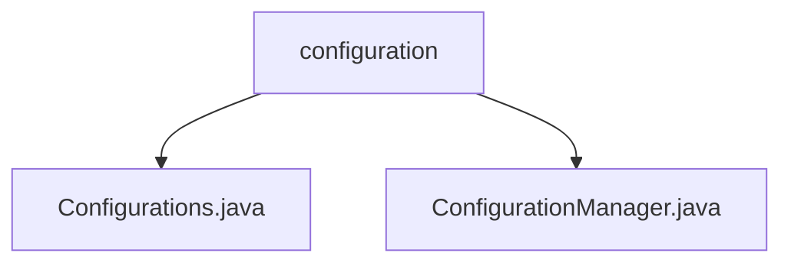

# 基础信息

|      |      |
|------|------|
| 名称 | configuration |
| 编码语言 | .java |
| 代码路径 | WeFe/common/java/common-lang/src/main/java/com/welab/wefe/common/configuration |
| 包名 | docs.common.java.common-lang.src.main.java.com.welab.wefe.common.configuration |
| 概述说明 | Configurations类管理配置信息，提供静态方法检查键、获取各类配置值及列表，支持默认值。ConfigurationManager管理配置文件，支持文件或类路径加载，含缓存和动态环境配置功能。 |

# 说明

## 概述  
该模块是Java配置管理工具集，核心职责是统一管理各类配置信息并提供类型安全的访问接口。Configurations类作为静态工具类，提供多类型配置读取和空值检查；ConfigurationManager负责初始化配置源，支持文件/类路径加载和环境感知。  

关键数据结构包括CompositeConfiguration（组合配置存储）和缓存机制。接口规范涵盖配置检查、类型转换（如布尔/数值/字符串）和集合处理（如分号分隔值转列表）。外部依赖仅为Log4j日志组件。例如支持从system.properties读取JVM参数，或加载classpath:application.conf。  

## 主要业务场景  
典型应用模式包括：1) 服务启动时通过ConfigurationManager加载多环境配置（如dev/test/prod），类似Spring Profile；2) 业务逻辑中通过Configurations获取具体参数，例如数据库连接超时时间getInt("db.timeout", 30)。  

统一交互模式为链式处理：初始化→缓存→类型转换→兜底默认值。完整功能覆盖配置全生命周期，从加载、解析到访问，支持API集成如动态获取字符串数组split("mail.recipients")。例如金融场景下读取风控阈值BigDecimal("risk.threshold")。

### 包内部结构视图

该流程图展示了WeFe项目中common-lang模块下configuration包的层级结构。configuration作为父节点，包含两个子节点：Configurations.java和ConfigurationManager.java两个配置文件类。这反映了配置管理相关的核心类组织方式，符合Java项目典型的分层结构设计。

# 文件列表

| 名称   | 类型  | 说明 |
|-------|------|-------------|
| [Configurations.java](Configurations.md) | file | Configurations类提供静态方法访问配置数据，支持多种数据类型获取，包括布尔、数字、字符串、列表等，并允许默认值设置。 |
| [ConfigurationManager.java](ConfigurationManager.md) | file | ConfigurationManager类管理配置，支持文件初始化、系统属性设置和异常处理，默认读取config.properties，支持环境变量配置。 |

