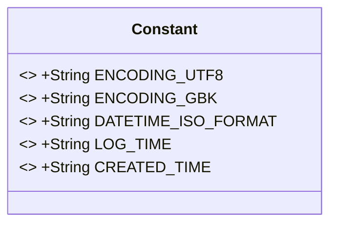
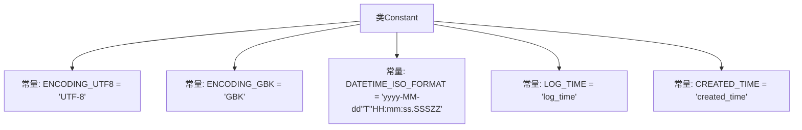

# 基础信息

|      |      |
|------|------|
| 名称 | Constant |
| 编码语言 | .java |
| 代码路径 | WeFe/common/java/common-lang/src/main/java/com/welab/wefe/common/constant/Constant.java |
| 包名 | com.welab.wefe.common.constant |
| 依赖项 | [] |
| 概述说明 | Java常量类，定义常用编码格式（UTF-8、GBK）、日期时间格式及日志时间字段名。 |

# 说明

该代码定义了一个名为Constant的公共类，包含多个静态常量字符串字段。其中ENCODING_UTF8和ENCODING_GBK分别表示UTF-8和GBK编码格式，DATETIME_ISO_FORMAT定义了ISO标准日期时间格式。此外还包含LOG_TIME和CREATED_TIME两个日志相关的时间字段名称常量。所有字段均为public static final修饰，表示全局不可变的常量值。

# 类列表 Class Summary

| 名称   | 类型  | 说明 |
|-------|------|-------------|
| Constant | class | Java常量类定义：包含UTF-8、GBK编码字符串，ISO时间格式及日志时间、创建时间字段名。 |

## 类 Constant

|      |      |
|------|------|
| 访问范围 | public |
| 类型 | class |
| 名称 | Constant |
| 说明 | Java常量类定义：包含UTF-8、GBK编码字符串，ISO时间格式及日志时间、创建时间字段名。 |

### UML类图

这段类图展示了一个名为Constant的工具类，其中定义了5个公共静态常量字段，全部使用final修饰确保不可变性。这些常量包含字符编码类型（UTF-8和GBK）、日期时间格式标准（ISO格式）以及两个时间戳字段名称（log_time和created_time）。该类作为典型的常量容器，不包含任何方法，主要用于集中管理系统中的固定字符串值，确保代码中魔法值的统一管理和类型安全。所有字段均为public访问级别，允许全局直接引用。

### 内部方法调用关系图

该流程图展示了Constant类的结构，包含5个静态常量定义。其中ENCODING_UTF8和ENCODING_GBK定义字符编码格式，DATETIME_ISO_FORMAT定义ISO标准时间格式（注意嵌套引号处理），LOG_TIME和CREATED_TIME为时间字段标识符。所有常量均为public static final类型，符合工具类常量的设计规范。

### 字段列表 Field List

| 名称  | 类型  | 说明 |
|-------|-------|------|
| DATETIME_ISO_FORMAT = "yyyy-MM-dd'T'HH:mm:ss.SSSZZ" | String | 定义ISO标准日期时间格式常量，格式为年-月-日T时:分:秒.毫秒时区。 |
| ENCODING_UTF8 = "UTF-8" | String | 定义UTF-8编码的公共静态常量字符串。 |
| CREATED_TIME = "created_time" | String | 定义常量字符串CREATED_TIME，值为"created_time"。 |
| LOG_TIME = "log_time" | String | 定义静态常量LOG_TIME，值为"log_time"。 |
| ENCODING_GBK = "GBK" | String | 定义静态常量ENCODING_GBK，值为"GBK"，表示GBK编码格式。 |

### 方法列表

| 名称  | 类型  | 说明 |
|-------|-------|------|

