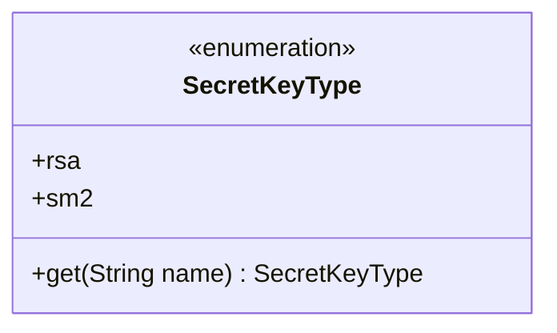
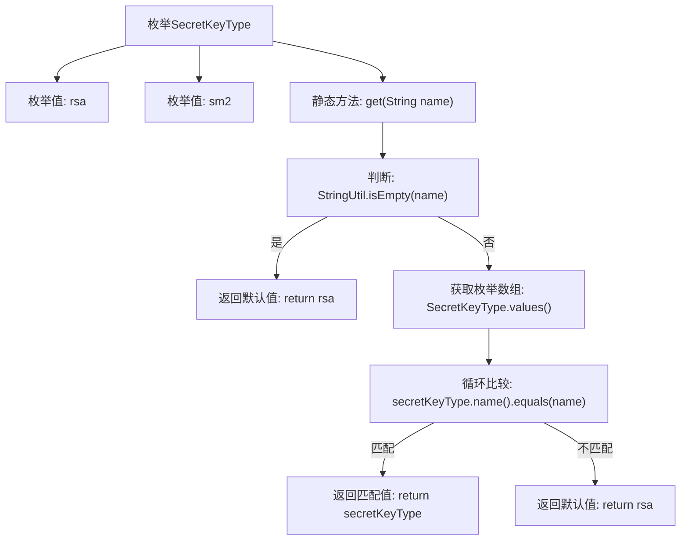

# 基础信息

|      |      |
|------|------|
| 名称 | SecretKeyType |
| 编码语言 | .java |
| 代码路径 | WeFe/common/java/common-lang/src/main/java/com/welab/wefe/common/constant/SecretKeyType.java |
| 包名 | com.welab.wefe.common.constant |
| 依赖项 | ['com.welab.wefe.common.util.StringUtil'] |
| 概述说明 | SecretKeyType枚举定义rsa和sm2两种密钥类型，提供get方法根据名称返回对应类型，默认返回rsa。 |

# 说明

该枚举类型定义了两种密钥类型：RSA和SM2。它包含一个静态方法get，用于根据输入的字符串名称返回对应的枚举值。如果输入为空或无效，默认返回RSA类型。该方法通过遍历枚举值进行匹配，确保返回正确的密钥类型。整个设计简洁明了，提供了灵活的密钥类型选择机制。

# 类列表 Class Summary

| 名称   | 类型  | 说明 |
|-------|------|-------------|
| SecretKeyType | enum | SecretKeyType枚举定义rsa和sm2两种密钥类型，提供根据名称获取对应类型的方法，默认返回rsa。 |

## 类 SecretKeyType

|      |      |
|------|------|
| 访问范围 | public |
| 类型 | enum |
| 名称 | SecretKeyType |
| 说明 | SecretKeyType枚举定义rsa和sm2两种密钥类型，提供根据名称获取对应类型的方法，默认返回rsa。 |

### UML类图

这段代码定义了一个枚举类`SecretKeyType`，包含两种密钥类型：`rsa`和`sm2`。该类提供了静态方法`get()`，用于根据输入的字符串名称返回对应的枚举值，若输入为空或无效则默认返回`rsa`。枚举类通过`values()`方法遍历所有枚举值进行匹配，体现了类型安全的枚举模式。类图清晰地展示了枚举结构及其唯一公开方法，适用于密钥类型的标准化管理场景。

### 内部方法调用关系图

这段代码定义了一个SecretKeyType枚举类，包含rsa和sm2两种密钥类型。核心逻辑是get()方法，该方法根据输入字符串返回对应的枚举值：首先检查输入是否为空（返回默认rsa），然后遍历枚举值进行匹配，若找到匹配项则返回对应枚举值，否则返回默认rsa。流程图清晰展示了空值检查、枚举遍历和结果返回三个关键处理阶段，体现了健壮的默认值处理机制。

### 字段列表 Field List

| 名称  | 类型  | 说明 |
|-------|-------|------|

### 方法列表

| 名称  | 类型  | 说明 |
|-------|-------|------|

