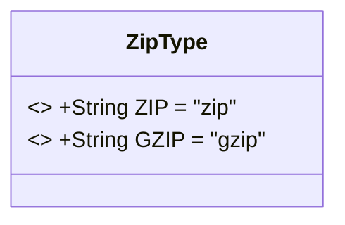
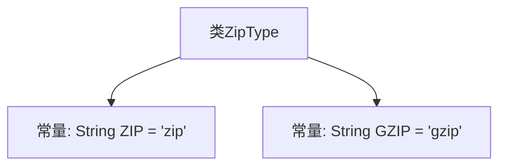

# 基础信息

|      |      |
|------|------|
| 名称 | ZipType |
| 编码语言 | .java |
| 代码路径 | WeFe/common/java/common-lang/src/main/java/com/welab/wefe/common/constant/ZipType.java |
| 包名 | com.welab.wefe.common.constant |
| 依赖项 | [] |
| 概述说明 | ZipType类定义了两个静态常量：ZIP和GZIP，分别表示zip和gzip压缩类型。 |

# 说明

该代码定义了一个名为ZipType的公共类，包含两个静态常量字符串字段：ZIP和GZIP，分别表示两种压缩格式类型。ZIP常量的值为"zip"，GZIP常量的值为"gzip"。这些常量可用于标识或区分不同的压缩格式。

# 类列表 Class Summary

| 名称   | 类型  | 说明 |
|-------|------|-------------|
| ZipType | class | ZipType类定义了两个静态常量：ZIP和GZIP，分别表示zip和gzip压缩类型。 |

## 类 ZipType

|      |      |
|------|------|
| 访问范围 | public |
| 类型 | class |
| 名称 | ZipType |
| 说明 | ZipType类定义了两个静态常量：ZIP和GZIP，分别表示zip和gzip压缩类型。 |

### UML类图

这段代码定义了一个简单的ZipType类，包含两个公共静态常量ZIP和GZIP，分别表示两种压缩类型。该类没有实例方法或变量，仅作为常量容器使用。类图中使用<<final>>标记表示不可变常量，所有成员均为公有静态字段，直接通过类名访问。这种设计模式常用于定义程序中不会改变的全局常量值。

### 内部方法调用关系图

该流程图描述了ZipType类的结构，它是一个仅包含两个静态字符串常量的工具类。ZIP和GZIP常量分别表示两种压缩格式的标识符，常用于文件处理场景中作为类型标记。这种设计模式通常用于避免代码中直接使用魔术字符串，提高可维护性。

### 字段列表 Field List

| 名称  | 类型  | 说明 |
|-------|-------|------|
| ZIP = "zip" | String | 定义静态常量字符串ZIP，值为"zip"。 |
| GZIP = "gzip" | String | 定义了一个公共静态常量字符串GZIP，值为"gzip"。 |

### 方法列表

| 名称  | 类型  | 说明 |
|-------|-------|------|

