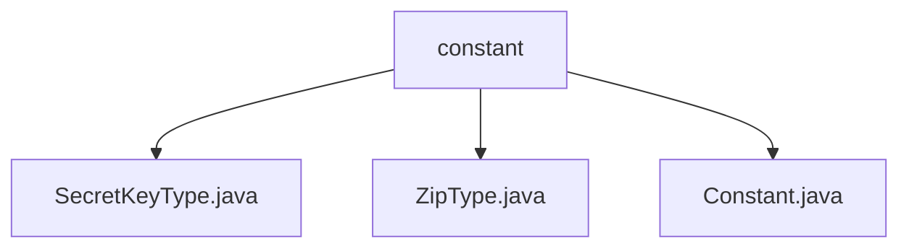

# 基础信息

|      |      |
|------|------|
| 名称 | constant |
| 编码语言 | .java |
| 代码路径 | WeFe/common/java/common-lang/src/main/java/com/welab/wefe/common/constant |
| 包名 | docs.common.java.common-lang.src.main.java.com.welab.wefe.common.constant |
| 概述说明 | 定义了三种常量类：SecretKeyType枚举含RSA和SM2密钥类型及获取方法；ZipType类含ZIP和GZIP压缩格式常量；Constant类含编码、日期时间等全局常量。 |

# 说明

## 概述  
该模块核心职责是提供基础常量和枚举类型定义，支持密钥类型识别、压缩格式区分和通用编码规范。接口规范包括静态方法`get`（根据名称返回枚举值）和直接常量访问（如`ZIP`/`GZIP`）。关键数据结构包含枚举类`SecretKeyType`（RSA/SM2）、常量类`ZipType`（压缩格式）和`Constant`（编码/时间格式）。外部依赖项无。例如`SecretKeyType.get("SM2")`返回SM2枚举，`Constant.ENCODING_UTF8`提供UTF-8编码标识。

## 主要业务场景  
模块用于统一管理基础类型和格式常量，类似配置中心的角色。业务流程包括密钥类型动态解析（如输入"RSA"匹配枚举）、压缩格式标识（如`ZipType.ZIP`）和标准化编码/时间格式调用（如`DATETIME_ISO_FORMAT`）。典型应用模式为通过常量避免硬编码，例如日志模块使用`LOG_TIME`字段名，加解密模块通过`SecretKeyType`选择算法。API类型均为静态方法或常量。

### 包内部结构视图

该流程图展示了WeFe项目中common-lang模块下constant目录的层级结构。constant作为父节点，包含三个Java文件：SecretKeyType.java、ZipType.java和Constant.java。这些文件都属于常量定义相关的类，位于相同的包路径下，体现了常量类型的分类管理。

# 文件列表

| 名称   | 类型  | 说明 |
|-------|------|-------------|
| [SecretKeyType.java](SecretKeyType.md) | file | SecretKeyType枚举定义rsa和sm2两种密钥类型，提供get方法根据名称返回对应类型，默认返回rsa。 |
| [ZipType.java](ZipType.md) | file | ZipType类定义了两个静态常量：ZIP和GZIP，分别表示zip和gzip压缩类型。 |
| [Constant.java](Constant.md) | file | Java常量类，定义常用编码格式（UTF-8、GBK）、日期时间格式及日志时间字段名。 |

