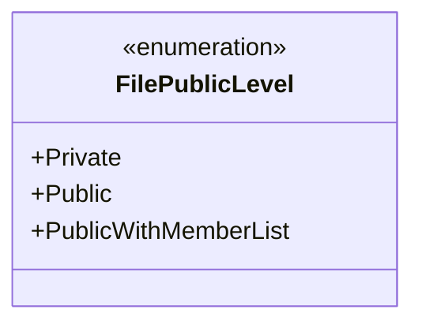
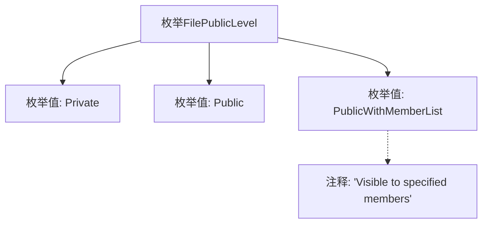

# 基础信息

|      |      |
|------|------|
| 名称 | FilePublicLevel |
| 编码语言 | .java |
| 代码路径 | WeFe/common/java/common-lang/src/main/java/com/welab/wefe/common/enums/FilePublicLevel.java |
| 包名 | com.welab.wefe.common.enums |
| 依赖项 | [] |
| 概述说明 | 文件公开级别枚举：Private（私有）、Public（公开）、PublicWithMemberList（指定成员可见）。 |

# 说明

该代码定义了一个名为FilePublicLevel的枚举类型，包含三个枚举值：Private表示文件私有，Public表示文件公开，PublicWithMemberList表示文件对指定成员可见。枚举通过注释说明了PublicWithMemberList的具体用途。

# 类列表 Class Summary

| 名称   | 类型  | 说明 |
|-------|------|-------------|
| FilePublicLevel | enum | 文件公开级别枚举：私有、公开、指定成员可见。 |

## 类 FilePublicLevel

|      |      |
|------|------|
| 访问范围 | public |
| 类型 | enum |
| 名称 | FilePublicLevel |
| 说明 | 文件公开级别枚举：私有、公开、指定成员可见。 |

### UML类图

这段代码定义了一个名为FilePublicLevel的枚举类型，用于表示文件的公开级别。枚举包含三个值：Private（私有）、Public（公开）和PublicWithMemberList（对指定成员可见）。该枚举简洁地描述了文件的不同访问权限级别，适用于需要控制文件可见性的场景。枚举的注释特别说明了PublicWithMemberList的用途是"对指定成员可见"，增强了代码的可读性。

### 内部方法调用关系图

该流程图展示了FilePublicLevel枚举的结构，包含三个枚举值（Private、Public、PublicWithMemberList）及其关系。其中PublicWithMemberList附带有说明其用途的注释"Visible to specified members"，表示该级别文件对指定成员可见。枚举作为整体封装了文件公开级别的三种状态，适用于权限控制场景。

### 字段列表 Field List

| 名称  | 类型  | 说明 |
|-------|-------|------|

### 方法列表

| 名称  | 类型  | 说明 |
|-------|-------|------|

