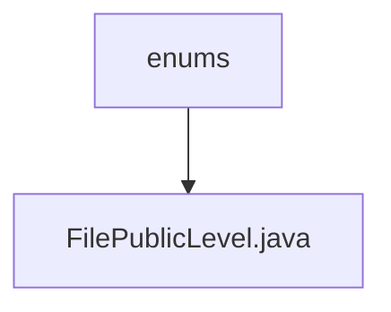

# 基础信息

|      |      |
|------|------|
| 名称 | enums |
| 编码语言 | .java |
| 代码路径 | WeFe/common/java/common-lang/src/main/java/com/welab/wefe/common/enums |
| 包名 | docs.common.java.common-lang.src.main.java.com.welab.wefe.common.enums |
| 概述说明 | 文件公开级别枚举：Private（私有）、Public（公开）、PublicWithMemberList（指定成员可见）。 |

# 说明

该代码定义了一个名为FilePublicLevel的枚举类型，包含三个枚举值：Private表示文件私有，Public表示文件公开，PublicWithMemberList表示文件对指定成员可见。枚举通过注释说明了PublicWithMemberList的具体用途。

### 包内部结构视图

该流程图展示了WeFe项目中common-lang模块的枚举类文件结构。顶层节点为"enums"目录，其下包含一个具体的枚举类文件"FilePublicLevel.java"。这种结构是典型的企业级Java项目中枚举类型的组织方式，将相关枚举类集中存放在enums包中以实现更好的代码管理和可维护性。

# 文件列表

| 名称   | 类型  | 说明 |
|-------|------|-------------|
| [FilePublicLevel.java](FilePublicLevel.md) | file | 文件公开级别枚举：Private（私有）、Public（公开）、PublicWithMemberList（指定成员可见）。 |

