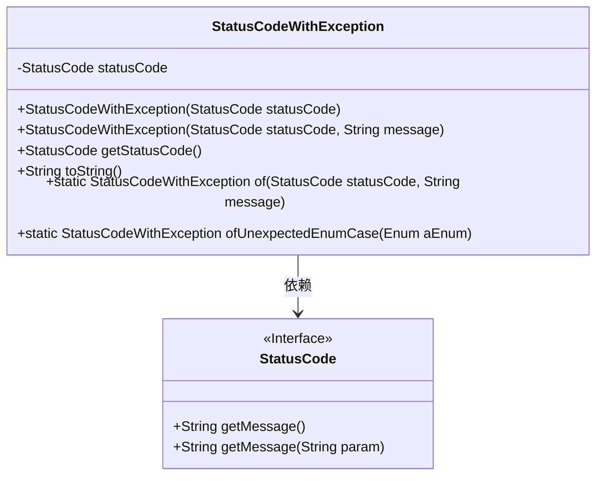
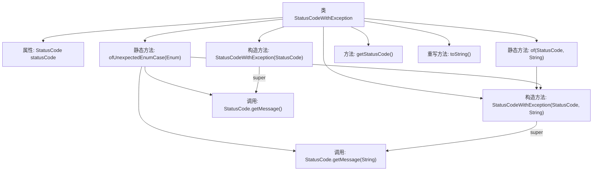

# 基础信息

|      |      |
|------|------|
| 名称 | StatusCodeWithException |
| 编码语言 | .java |
| 代码路径 | WeFe/common/java/common-lang/src/main/java/com/welab/wefe/common/exception/StatusCodeWithException.java |
| 包名 | com.welab.wefe.common.exception |
| 依赖项 | ['com.welab.wefe.common.StatusCode'] |
| 概述说明 | StatusCodeWithException类继承Exception，封装状态码和消息，提供静态工厂方法创建异常实例，支持获取状态码和格式化输出。 |

# 说明

StatusCodeWithException 是一个自定义异常类，继承自 Exception。它封装了状态码和消息，提供两种构造方式：直接传入状态码或同时传入状态码和自定义消息。类中包含获取状态码的方法和重写的 toString 方法。还提供了两个静态工厂方法：of 用于创建带状态码和消息的异常实例，ofUnexpectedEnumCase 专门处理意外枚举项情况，自动生成对应消息。

# 类列表 Class Summary

| 名称   | 类型  | 说明 |
|-------|------|-------------|
| StatusCodeWithException | class | StatusCodeWithException是一个自定义异常类，包含状态码和消息，提供静态工厂方法创建实例，支持未预期枚举项处理。 |

## 类 StatusCodeWithException

|      |      |
|------|------|
| 访问范围 | public |
| 类型 | class |
| 名称 | StatusCodeWithException |
| 说明 | StatusCodeWithException是一个自定义异常类，包含状态码和消息，提供静态工厂方法创建实例，支持未预期枚举项处理。 |

### UML类图

这段代码展示了一个自定义异常类`StatusCodeWithException`，它继承自`Exception`类，主要用于封装状态码和异常信息。该类提供了两种构造方法（直接使用状态码或同时使用状态码和自定义消息），以及两个静态工厂方法（`of`和`ofUnexpectedEnumCase`）来创建异常实例。其中`ofUnexpectedEnumCase`专门处理枚举意外值的情况。该类通过组合方式持有一个`StatusCode`接口实例，该接口定义了获取消息的方法。整体设计便于统一处理带有状态码的异常情况。

### 内部方法调用关系图

流程图展示了StatusCodeWithException类的结构和方法调用关系。该类继承自Exception，包含两个静态工厂方法(of和ofUnexpectedEnumCase)和两个构造方法，核心功能是通过状态码和消息创建异常实例。其中ofUnexpectedEnumCase方法会调用StatusCode的getMessage方法生成错误信息，最终都通过构造方法创建异常对象。toString方法重写用于格式化异常信息输出。

### 字段列表 Field List

| 名称  | 类型  | 说明 |
|-------|-------|------|
| statusCode | StatusCode | 私有状态码变量statusCode。 |

### 方法列表

| 名称  | 类型  | 说明 |
|-------|-------|------|
| of | StatusCodeWithException | 静态方法`of`接收状态码和消息，返回包含两者的StatusCodeWithException对象。 |
| ofUnexpectedEnumCase | StatusCodeWithException | 静态方法`ofUnexpectedEnumCase`接收枚举参数，返回包含错误码和枚举名错误信息的`StatusCodeWithException`对象。错误码固定为`UNEXPECTED_ENUM_CASE`。 |
| getStatusCode | StatusCode | 获取当前状态码的方法，返回StatusCode类型值。 |
| toString | String | 重写toString方法，返回状态码和消息的字符串。 |

