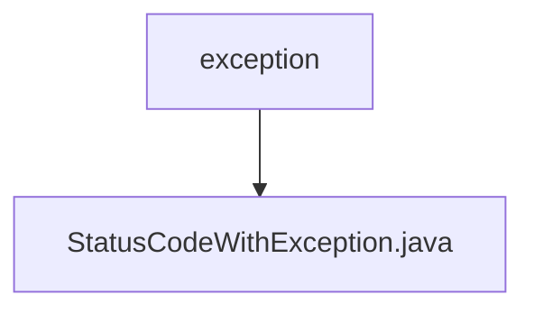

# 基础信息

|      |      |
|------|------|
| 名称 | exception |
| 编码语言 | .java |
| 代码路径 | WeFe/common/java/common-lang/src/main/java/com/welab/wefe/common/exception |
| 包名 | docs.common.java.common-lang.src.main.java.com.welab.wefe.common.exception |
| 概述说明 | StatusCodeWithException类继承Exception，封装状态码和消息，提供静态工厂方法创建异常实例，支持获取状态码和格式化输出。 |

# 说明

StatusCodeWithException 是一个自定义异常类，继承自 Exception。它封装了状态码和消息，提供两种构造方式：直接传入状态码或同时传入状态码和自定义消息。类中包含获取状态码的方法和重写的 toString 方法。还提供了两个静态工厂方法：of 用于创建带状态码和消息的异常实例，ofUnexpectedEnumCase 专门处理意外枚举项情况，自动生成对应消息。

### 包内部结构视图

该流程图展示了WeFe项目中异常处理模块的层级结构。根节点为"exception"目录，其下包含一个具体的异常类文件"StatusCodeWithException.java"。这种简洁的层级关系体现了项目中异常处理模块的基础架构，仅包含一个核心异常类文件，用于统一管理状态码相关的异常情况。

# 文件列表

| 名称   | 类型  | 说明 |
|-------|------|-------------|
| [StatusCodeWithException.java](StatusCodeWithException.md) | file | StatusCodeWithException类继承Exception，封装状态码和消息，提供静态工厂方法创建异常实例，支持获取状态码和格式化输出。 |

