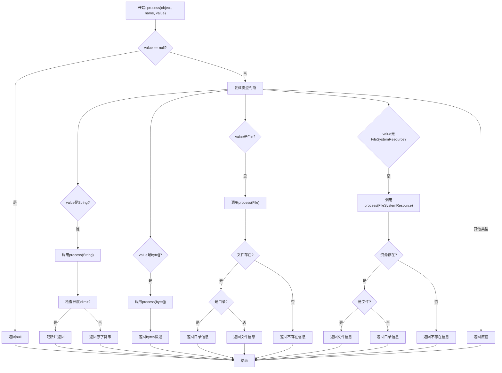
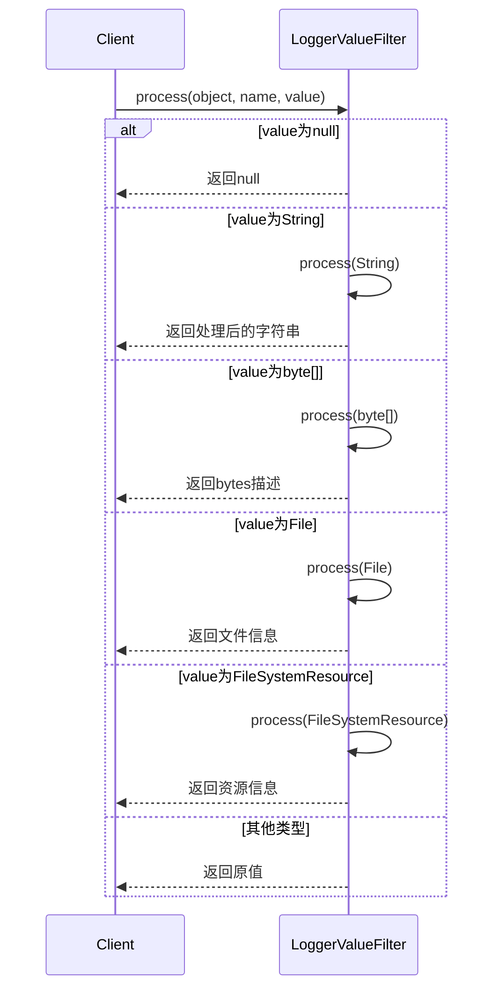
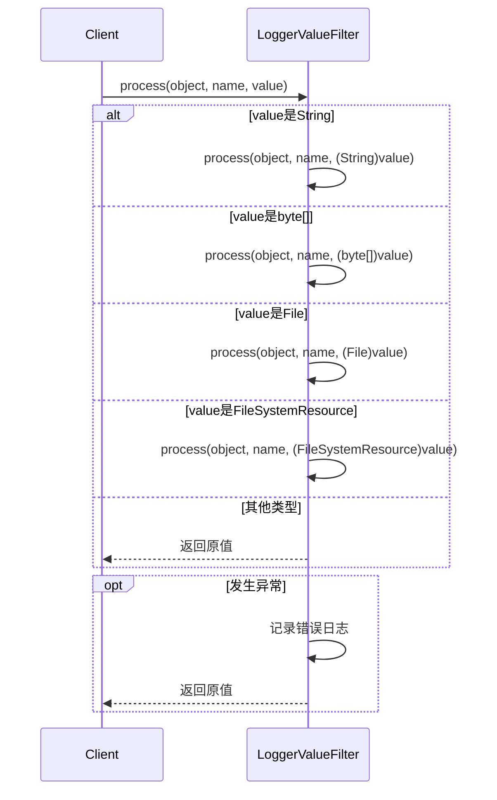

# 基础信息

|      |      |
|------|------|
| 名称 | LoggerValueFilter |
| 编码语言 | .java |
| 代码路径 | WeFe/common/java/common-lang/src/main/java/com/welab/wefe/common/fastjson/LoggerValueFilter.java |
| 包名 | com.welab.wefe.common.fastjson |
| 依赖项 | ['com.alibaba.fastjson.serializer.ValueFilter', 'org.slf4j.Logger', 'org.slf4j.LoggerFactory', 'org.springframework.core.io.FileSystemResource', 'java.io.File', 'java.io.IOException'] |
| 概述说明 | LoggerValueFilter类用于日志中过长的值截断，默认限制1024字符，支持字符串、文件、字节数组等类型处理，避免日志过大和调试不便。 |

# 说明

LoggerValueFilter是一个日志值过滤器，主要用于限制日志中输出的值长度。它默认限制字符串长度为1024字符，避免过长的值（如base64图片或文件）影响调试和消耗磁盘空间。该过滤器支持处理字符串、字节数组、文件和文件系统资源。对于字符串，超过限制时会截断并显示长度；对于字节数组，显示其长度；对于文件和目录，显示路径和大小信息。处理过程中发生异常时会记录错误并返回原始值。

# 类列表 Class Summary

| 名称   | 类型  | 说明 |
|-------|------|-------------|
| LoggerValueFilter | class | LoggerValueFilter类用于日志输出时限制字符串长度，防止过长内容影响调试和磁盘消耗。支持处理字符串、字节数组、文件和文件系统资源，超长字符串会被截断显示。默认限制长度为1024字符。 |


## 类 LoggerValueFilter

|      |      |
|------|------|
| 访问范围 | public |
| 类型 | class |
| 名称 | LoggerValueFilter |
| 说明 | LoggerValueFilter类用于日志输出时限制字符串长度，防止过长内容影响调试和磁盘消耗。支持处理字符串、字节数组、文件和文件系统资源，超长字符串会被截断显示。默认限制长度为1024字符。 |


### UML类图

```mermaid
classDiagram
    class LoggerValueFilter {
        -Logger LOG
        +LoggerValueFilter DEFAULT
        -int limitStringLength
        -LoggerValueFilter(int limitStringLength)
        +Object process(Object object, String name, Object value)
        +Object process(Object object, String name, FileSystemResource file) throws IOException
        +Object process(Object object, String name, File file)
        +Object process(Object object, String name, byte[] value)
        +Object process(Object object, String name, String value)
    }
    <<Interface>> ValueFilter {
        +Object process(Object object, String name, Object value)
    }
    LoggerValueFilter ..|> ValueFilter : 实现
```





类图描述：LoggerValueFilter类实现了ValueFilter接口，主要用于日志输出时的值过滤处理。它包含对字符串、字节数组、文件和文件系统资源等类型的处理逻辑，特别针对过长的字符串进行截断处理，避免日志内容过长。类中定义了默认实例DEFAULT和字符串长度限制limitStringLength，通过多个重载的process方法实现不同类型数据的格式化输出。


### 内部方法调用关系图

```mermaid
graph TD
    A["类LoggerValueFilter"]
    B["静态常量: LOG"]
    C["静态常量: DEFAULT"]
    D["私有属性: limitStringLength"]
    E["私有构造方法: LoggerValueFilter(int)"]
    F["主处理方法: process(Object, String, Object)"]
    G["文件系统资源处理: process(Object, String, FileSystemResource)"]
    H["文件处理: process(Object, String, File)"]
    I["字节数组处理: process(Object, String, byte[])"]
    J["字符串处理: process(Object, String, String)"]

    A --> B
    A --> C
    A --> D
    A --> E
    A --> F
    F -->|String类型| J
    F -->|byte[]类型| I
    F -->|File类型| H
    F -->|FileSystemResource类型| G
    F -->|其他类型| K["返回原值"]
    F -->|异常处理| L["记录错误日志"]
```



这段代码实现了一个日志值过滤器(LoggerValueFilter)，主要用于控制日志输出内容的长度和格式。核心功能包括：1) 对字符串进行长度截断处理；2) 对文件、字节数组等特殊类型进行格式化输出；3) 通过单例模式提供默认实例。流程图展示了类的结构和方法调用关系，时序图则详细描述了处理不同类型输入值的流程。该设计能有效防止日志输出过大内容，同时保持关键信息的可读性，适用于需要控制日志体积的生产环境。

### 字段列表 Field List

| 名称  | 类型  | 说明 |
|-------|-------|------|
| DEFAULT = new LoggerValueFilter(1024) | LoggerValueFilter | 定义了一个名为DEFAULT的静态常量LoggerValueFilter实例，初始值为1024。 |
| limitStringLength = 1024 | int | 变量limitStringLength定义字符串长度限制为1024。 |
| LOG = LoggerFactory.getLogger(LoggerValueFilter.class) | Logger | 声明一个静态不可变日志对象LOG，用于LoggerValueFilter类的日志记录。 |

### 方法列表

| 名称  | 类型  | 说明 |
|-------|-------|------|
| process | Object | 方法处理不同类型输入值，若为null则返回null；支持String、byte[]、File和FileSystemResource类型，异常时记录日志并返回原值。 |
| process | Object | 方法process检查文件是否存在，返回文件或目录信息：存在时显示类型（文件含大小）及路径，不存在时仅显示文件名。返回字符串格式。 |
| process | Object | 方法处理文件对象，返回路径信息：存在则区分目录或文件并附加大小，不存在仅返回路径。 |
| process | Object | 该方法接收对象、字符串和字节数组，返回字节数组长度的字符串描述，格式为"bytes(length X)"，X为数组长度。 |
| process | Object | 方法处理输入对象，若字符串值长度超限则截断前50字符并附加省略号和长度信息，否则返回原值。 |


