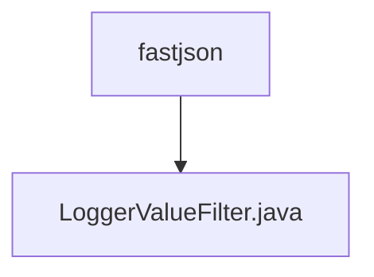

# 基础信息

|      |      |
|------|------|
| 名称 | fastjson |
| 编码语言 | .java |
| 代码路径 | WeFe/common/java/common-lang/src/main/java/com/welab/wefe/common/fastjson |
| 包名 | docs.common.java.common-lang.src.main.java.com.welab.wefe.common.fastjson |
| 概述说明 | LoggerValueFilter类用于日志中过长的值截断，默认限制1024字符，支持字符串、文件、字节数组等类型处理，避免日志过大和调试不便。 |

# 说明

LoggerValueFilter是一个日志值过滤器，主要用于限制日志中输出的值长度。它默认限制字符串长度为1024字符，避免过长的值（如base64图片或文件）影响调试和消耗磁盘空间。该过滤器支持处理字符串、字节数组、文件和文件系统资源。对于字符串，超过限制时会截断并显示长度；对于字节数组，显示其长度；对于文件和目录，显示路径和大小信息。处理过程中发生异常时会记录错误并返回原始值。

### 包内部结构视图

该流程图展示了fastjson目录与LoggerValueFilter.java文件的层级关系。fastjson作为父目录，包含一个子文件LoggerValueFilter.java。这种结构常见于Java项目中，用于组织特定功能的类文件，此处实现了FastJSON的日志过滤器功能。

# 文件列表

| 名称   | 类型  | 说明 |
|-------|------|-------------|
| [LoggerValueFilter.java](LoggerValueFilter.md) | file | LoggerValueFilter类用于日志中过长的值截断，默认限制1024字符，支持字符串、文件、字节数组等类型处理，避免日志过大和调试不便。 |

