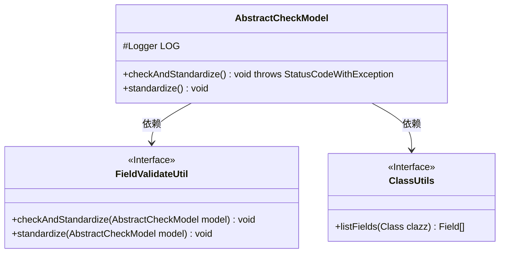
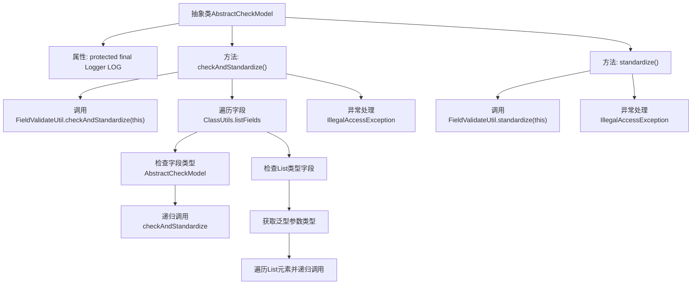

# 基础信息

|      |      |
|------|------|
| 名称 | AbstractCheckModel |
| 编码语言 | .java |
| 代码路径 | WeFe/common/java/common-lang/src/main/java/com/welab/wefe/common/fieldvalidate/AbstractCheckModel.java |
| 包名 | com.welab.wefe.common.fieldvalidate |
| 依赖项 | ['com.welab.wefe.common.exception.StatusCodeWithException', 'com.welab.wefe.common.util.ClassUtils', 'org.slf4j.Logger', 'org.slf4j.LoggerFactory', 'java.lang.reflect.Field', 'java.lang.reflect.ParameterizedType', 'java.lang.reflect.Type', 'java.util.List'] |
| 概述说明 | 抽象类AbstractCheckModel提供字段校验与标准化功能，递归检查嵌套对象和列表，异常时记录日志。 |

# 说明

AbstractCheckModel是一个抽象类，提供模型校验和标准化功能。它包含checkAndStandardize方法，递归检查所有字段：对AbstractCheckModel类型字段递归调用校验；对List类型字段检查元素是否为AbstractCheckModel并递归校验。校验使用FieldValidateUtil工具类。standardize方法仅执行标准化操作。异常处理记录错误日志但不中断流程。

# 类列表 Class Summary

| 名称   | 类型  | 说明 |
|-------|------|-------------|
| AbstractCheckModel | class | 抽象类AbstractCheckModel提供字段校验和标准化方法，递归检查嵌套对象和列表中的AbstractCheckModel实例，异常时记录日志。 |

## 类 AbstractCheckModel

|      |      |
|------|------|
| 访问范围 | public abstract |
| 类型 | class |
| 名称 | AbstractCheckModel |
| 说明 | 抽象类AbstractCheckModel提供字段校验和标准化方法，递归检查嵌套对象和列表中的AbstractCheckModel实例，异常时记录日志。 |

### UML类图

这段代码展示了一个抽象类`AbstractCheckModel`，它提供了字段验证和标准化的功能。该类通过反射检查字段类型，递归处理继承自`AbstractCheckModel`的字段或包含这类元素的List集合。它依赖`FieldValidateUtil`进行具体验证操作，依赖`ClassUtils`获取字段列表。类图清晰地展示了这些关系，其中`FieldValidateUtil`和`ClassUtils`被标记为接口，体现了良好的抽象设计。

### 内部方法调用关系图

这段代码流程图展示了AbstractCheckModel类的核心逻辑。该类是一个抽象校验模型，提供字段验证和标准化功能。主要流程包括：1)通过FieldValidateUtil进行初始校验；2)递归检查所有字段，对AbstractCheckModel类型字段递归调用校验；3)特殊处理List类型字段，检查其泛型参数并遍历校验；4)提供独立的standardize标准化方法。异常处理贯穿整个过程，使用Logger记录错误信息。该设计实现了嵌套对象结构的自动化校验，支持复杂对象图的递归处理。

### 字段列表 Field List

| 名称  | 类型  | 说明 |
|-------|-------|------|
| LOG = LoggerFactory.getLogger(this.getClass()) | Logger | 声明一个受保护的final日志对象，用于当前类的日志记录。 |

### 方法列表

| 名称  | 类型  | 说明 |
|-------|-------|------|
| checkAndStandardize | void | 方法递归检查并标准化对象及其嵌套字段，包括AbstractCheckModel类型及其列表元素，处理异常并记录错误日志。 |
| standardize | void | 该方法调用FieldValidateUtil的standardize方法处理当前对象，捕获IllegalAccessException异常并记录错误日志。 |

