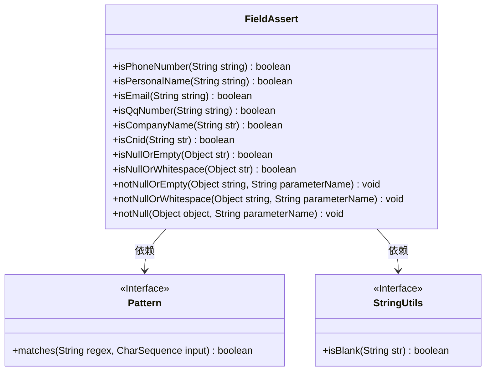

# 基础信息

|      |      |
|------|------|
| 名称 | FieldAssert |
| 编码语言 | .java |
| 代码路径 | WeFe/common/java/common-lang/src/main/java/com/welab/wefe/common/fieldvalidate/FieldAssert.java |
| 包名 | com.welab.wefe.common.fieldvalidate |
| 依赖项 | ['org.apache.commons.lang.StringUtils', 'java.util.regex.Pattern'] |
| 概述说明 | FieldAssert类提供多个静态方法验证字符串格式，包括手机号、姓名、邮箱、QQ号、公司名、身份证号等，并包含非空检查及异常抛出功能。 |

# 说明

FieldAssert类提供了一系列静态方法用于验证字符串格式和对象有效性。包含验证手机号（11位数字）、中文姓名（2-10个汉字或点）、邮箱（标准格式）、QQ号（5-12位数字）、公司名称（50字符内中英文数字及符号组合）和中国身份证（15或18位合规格式）。同时提供空值检查方法：isNullOrEmpty检查空对象或空字符串，isNullOrWhitespace额外检查纯空格；notNullOrEmpty和notNullOrWhitespace会在参数非法时抛出异常，notNull专门检查对象非空。所有验证均通过正则表达式实现。

# 类列表 Class Summary

| 名称   | 类型  | 说明 |
|-------|------|-------------|
| FieldAssert | class | FieldAssert类提供多个静态方法，用于验证字符串格式（如手机号、姓名、邮箱、QQ号、公司名、身份证号）及检查空值或空白字符串，并在无效时抛出异常。 |

## 类 FieldAssert

|      |      |
|------|------|
| 访问范围 | public |
| 类型 | class |
| 名称 | FieldAssert |
| 说明 | FieldAssert类提供多个静态方法，用于验证字符串格式（如手机号、姓名、邮箱、QQ号、公司名、身份证号）及检查空值或空白字符串，并在无效时抛出异常。 |

### UML类图

这段代码展示了一个名为FieldAssert的工具类，主要用于验证各种字符串格式的有效性。该类包含多个静态方法，分别用于验证电话号码、个人姓名、电子邮件、QQ号码、公司名称、中国身份证号等格式，同时提供空值检查功能。类图中显示了FieldAssert与Pattern和StringUtils两个接口的依赖关系，前者用于正则匹配，后者用于空白字符串检查。所有方法均为公有静态方法，体现了工具类的设计特点。

### 内部方法调用关系图

```mermaid
graph TD
    A["类FieldAssert"]
    B["方法: isPhoneNumber(String string)"]
    C["方法: isPersonalName(String string)"]
    D["方法: isEmail(String string)"]
    E["方法: isQqNumber(String string)"]
    F["方法: isCompanyName(String str)"]
    G["方法: isCnid(String str)"]
    H["方法: isNullOrEmpty(Object str)"]
    I["方法: isNullOrWhitespace(Object str)"]
    J["方法: notNullOrEmpty(Object string, String parameterName)"]
    K["方法: notNullOrWhitespace(Object string, String parameterName)"]
    L["方法: notNull(Object object, String parameterName)"]

    A --> B
    A --> C
    A --> D
    A --> E
    A --> F
    A --> G
    A --> H
    A --> I
    A --> J
    A --> K
    A --> L

    B --> B1["检查string是否为null"]
    B --> B2["正则匹配: ^\\d{11}$"]
    C --> C1["检查string是否为null"]
    C --> C2["正则匹配: ^[·\u4e00-\u9fa5]{2,10}$"]
    D --> D1["检查string是否为null"]
    D --> D2["正则匹配: ^[\\w-\\.]+@([\\w-]+\\.)+[a-z]{2,3}$"]
    E --> E1["检查string是否为null"]
    E --> E2["正则匹配: ^\\d{5,12}$"]
    F --> F1["检查str是否为空或长度>50"]
    F --> F2["正则匹配: 公司名称模式"]
    G --> G1["检查str是否为null"]
    G --> G2["检查长度是否为15/18"]
    G --> G3["根据长度选择正则"]
    H --> H1["检查str是否为null或空字符串"]
    I --> I1["检查str是否为null/空/纯空格"]
    J --> J1["检查string是否为null或空"]
    J --> J2["抛出IllegalArgumentException"]
    K --> K1["调用isNullOrWhitespace"]
    K --> K2["抛出IllegalArgumentException"]
    L --> L1["检查object是否为null"]
    L --> L2["抛出IllegalArgumentException"]
```

这段代码是FieldAssert类，包含多个静态方法用于验证不同类型的字符串格式（如电话号码、姓名、邮箱等）和对象非空检查。每个验证方法都先进行空值检查，然后使用正则表达式匹配特定格式。notNull系列方法会在验证失败时抛出异常。流程图展示了类结构和方法间的调用关系，突出显示了空值检查和正则匹配的核心逻辑。

### 字段列表 Field List

| 名称  | 类型  | 说明 |
|-------|-------|------|

### 方法列表

| 名称  | 类型  | 说明 |
|-------|-------|------|
| isPhoneNumber | boolean | 检查字符串是否为11位数字的电话号码，若为空则返回false。 |
| isQqNumber | boolean | 该方法检查字符串是否为5到12位纯数字的QQ号，若为空则返回false。 |
| isPersonalName | boolean | 该方法检查字符串是否为中文人名，要求2-10个汉字或中间点，空值返回false。 |
| isNullOrWhitespace | boolean | 该方法检查输入对象是否为null、空字符串或仅含空格，满足任一条件即返回true。 |
| isCompanyName | boolean | 检查字符串是否为有效公司名：非空且长度≤50，仅含中英文、数字、括号、逗号、点号和&符号。 |
| isNullOrEmpty | boolean | 检查字符串是否为null或空。 |
| notNullOrEmpty | void | 检查字符串非空方法：若输入为null或空字符串，抛出异常提示参数名不可为空。 |
| isEmail | boolean | 该方法检查字符串是否为有效邮箱，先判空再通过正则表达式验证格式，符合返回true，否则false。 |
| isCnid | boolean | 检查字符串是否为中国身份证号：15或18位，非空且符合正则规则。 |
| notNullOrWhitespace | void | 静态方法检查字符串非空非空格，否则抛出异常提示参数名。 |
| notNull | void | 这是一个静态方法，用于检查对象是否为null。若对象为null，则抛出带有参数名的非法参数异常。 |

