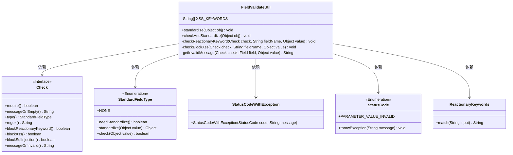
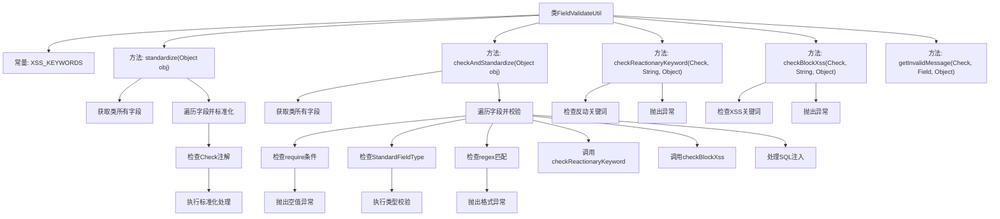

# 基础信息

|      |      |
|------|------|
| 名称 | FieldValidateUtil |
| 编码语言 | .java |
| 代码路径 | WeFe/common/java/common-lang/src/main/java/com/welab/wefe/common/fieldvalidate/FieldValidateUtil.java |
| 包名 | com.welab.wefe.common.fieldvalidate |
| 依赖项 | ['com.alibaba.fastjson.JSON', 'com.welab.wefe.common.StatusCode', 'com.welab.wefe.common.exception.StatusCodeWithException', 'com.welab.wefe.common.fieldvalidate.annotation.Check', 'com.welab.wefe.common.util.ClassUtils', 'com.welab.wefe.common.util.StringUtil', 'org.apache.commons.lang3.StringUtils', 'java.lang.reflect.Field', 'java.util.Map', 'java.util.Set', 'java.util.regex.Pattern'] |
| 概述说明 | FieldValidateUtil类提供字段验证功能，包括标准化、非空检查、正则匹配、防XSS/SQL注入及反动关键词过滤。通过注解配置校验规则，确保输入安全合规。 |

# 说明

FieldValidateUtil是一个用于字段验证和标准化的工具类，主要功能包括标准化字段值、检查字段有效性、防止XSS攻击和SQL注入。它通过注解Check标记需要验证的字段，支持多种验证类型如非空检查、正则匹配、反动关键字过滤等。标准化方法会根据字段类型自动处理值，验证失败时抛出StatusCodeWithException异常。此外，工具类还包含对字符串字段的SQL注入防护处理，替换危险字符如引号和注释符号。整体设计通过反射遍历对象字段，结合注解配置实现灵活的验证逻辑。

# 类列表 Class Summary

| 名称   | 类型  | 说明 |
|-------|------|-------------|
| FieldValidateUtil | class | FieldValidateUtil类提供字段验证功能，包括标准化、非空检查、正则匹配、防XSS/SQL注入及反动关键词过滤。通过Check注解配置规则，验证失败抛出异常。 |

## 类 FieldValidateUtil

|      |      |
|------|------|
| 访问范围 | public |
| 类型 | class |
| 名称 | FieldValidateUtil |
| 说明 | FieldValidateUtil类提供字段验证功能，包括标准化、非空检查、正则匹配、防XSS/SQL注入及反动关键词过滤。通过Check注解配置规则，验证失败抛出异常。 |

### UML类图

类图描述：
FieldValidateUtil是一个工具类，主要用于字段验证和标准化处理。它依赖于Check接口获取字段验证规则，使用StandardFieldType枚举处理字段标准化，通过StatusCode和StatusCodeWithException处理异常情况，并借助ReactionaryKeywords检查反动关键词。该类提供了标准化和验证两大核心功能，支持正则校验、XSS防护、SQL注入防护等多种安全措施。

### 内部方法调用关系图

这段代码是FieldValidateUtil工具类，主要用于字段验证和标准化处理。流程图展示了类结构和主要方法调用关系，包含字段标准化、必填校验、正则匹配、反动关键词检查、XSS防护和SQL注入处理等功能。核心流程通过遍历对象字段，根据Check注解配置执行不同的验证逻辑，对不符合要求的字段抛出异常或进行标准化处理，确保输入数据的安全性和规范性。

### 字段列表 Field List

| 名称  | 类型  | 说明 |
|-------|-------|------|
| XSS_KEYWORDS = {">", "<"} | String[] | 定义静态常量字符串数组XSS_KEYWORDS，包含XSS过滤关键词">"和"<"。 |

### 方法列表

| 名称  | 类型  | 说明 |
|-------|-------|------|
| checkBlockXss | void | 检查输入值是否包含XSS关键词。若开启检查且发现关键词，抛出异常提示不安全输入。支持处理Map类型转换字符串。 |
| checkReactionaryKeyword | void | 检查输入值是否包含反动关键词。若开启检查且匹配到关键词，抛出异常提示字段名和违规关键词。 |
| standardize | void | 静态方法standardize处理对象字段标准化：遍历所有字段，检查Check注解，按类型调用标准化方法并更新字段值。 |
| checkAndStandardize | void | 方法检查对象字段的合法性并标准化：验证非空、类型匹配、正则表达式，防止XSS和SQL注入，自动标准化字段值。 |
| getInvalidMessage | String | 生成无效字段提示信息，优先使用自定义消息，默认格式为"invalid 字段名: 值"。 |

