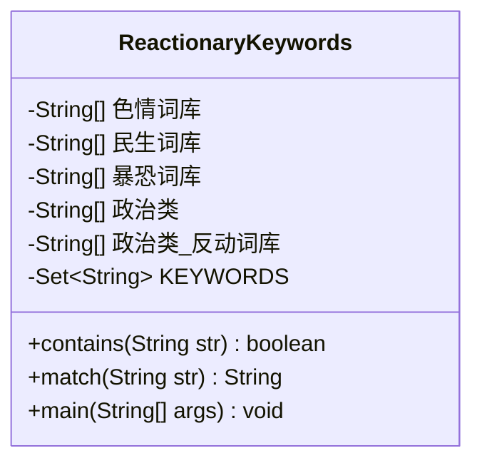
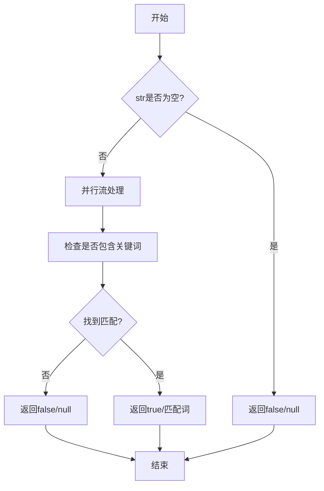
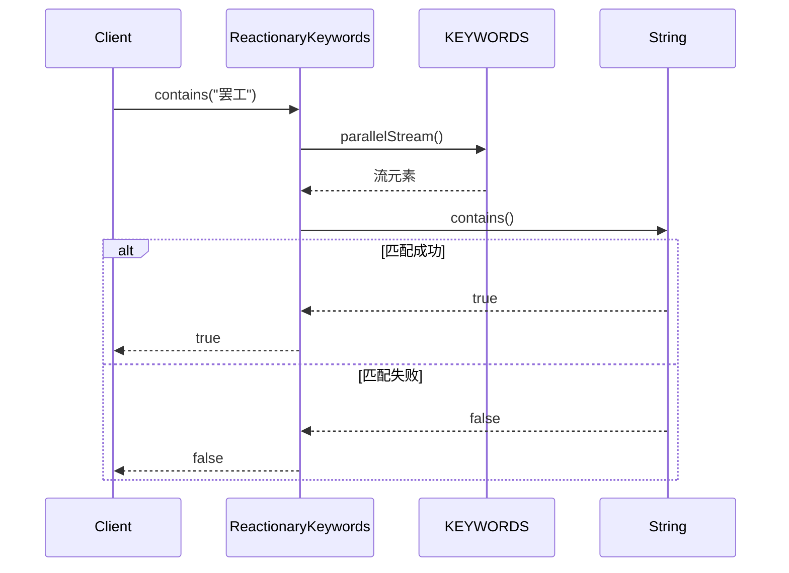
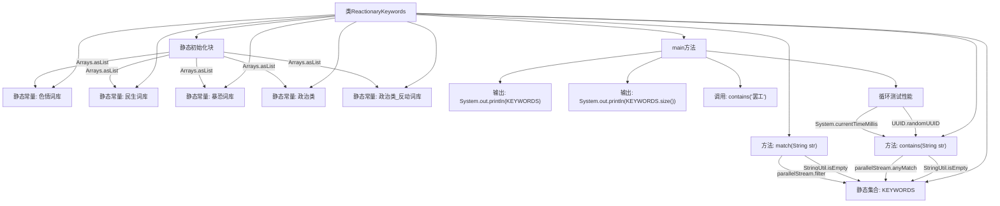

# 基础信息

|      |      |
|------|------|
| 名称 | ReactionaryKeywords |
| 编码语言 | .java |
| 代码路径 | WeFe/common/java/common-lang/src/main/java/com/welab/wefe/common/fieldvalidate/ReactionaryKeywords.java |
| 包名 | com.welab.wefe.common.fieldvalidate |
| 依赖项 | ['com.welab.wefe.common.util.StringUtil', 'java.util.Arrays', 'java.util.HashSet', 'java.util.Set', 'java.util.UUID'] |
| 概述说明 | 反应词库类包含色情、民生、暴恐、政治等关键词，提供检查文本是否含敏感词及匹配首个敏感词的方法。 |

# 说明

该Java类定义了一个舆情关键词检测工具，包含色情、民生、暴恐、政治等分类的词库。通过静态初始化将所有关键词存入HashSet集合，提供两个核心方法：contains()检查文本是否含有关键词，match()返回匹配到的首个关键词。main方法演示了词库初始化、性能测试等操作流程。

# 类列表 Class Summary

| 名称   | 类型  | 说明 |
|-------|------|-------------|
| ReactionaryKeywords | class | 该Java类定义敏感词库（色情、民生、暴恐、政治等），提供检查文本是否含敏感词的方法contains和匹配首个敏感词的方法match，并通过并行流优化性能。主方法测试功能与耗时。 |

## 类 ReactionaryKeywords

|      |      |
|------|------|
| 访问范围 | public |
| 类型 | class |
| 名称 | ReactionaryKeywords |
| 说明 | 该Java类定义敏感词库（色情、民生、暴恐、政治等），提供检查文本是否含敏感词的方法contains和匹配首个敏感词的方法match，并通过并行流优化性能。主方法测试功能与耗时。 |

### UML类图

这段代码实现了一个舆情关键词检测工具类，包含色情、民生、暴恐、政治等多类敏感词库。通过静态初始化将所有关键词合并到HashSet集合中，提供contains()和match()两个核心方法，分别用于判断文本是否包含敏感词及获取首个匹配词。采用并行流处理提升检测效率，并通过main方法进行性能测试。类结构简单但功能明确，适用于内容安全过滤场景。

### 内部方法调用关系图

这段代码实现了一个舆情关键词检测系统，通过静态初始化块将多个分类词库合并到统一的KEYWORDS集合中。主要提供contains()和match()两个核心方法，前者检测文本是否包含敏感词，后者返回匹配到的第一个敏感词。main方法展示了词库初始化、基础检测和性能测试流程，使用并行流提高检测效率，适合处理大规模文本的实时监测需求。

### 字段列表 Field List

| 名称  | 类型  | 说明 |
|-------|-------|------|
| 暴恐词库 = {"枪出售"} | String[] | 暴恐词库包含敏感词"枪出售"。 |
| 政治类 = {"习近平"} | String[] | 政治类关键词：习近平 |
| KEYWORDS = new HashSet<>() | Set<String> | 定义私有静态常量集合KEYWORDS，初始化为空HashSet。 |
| 民生词库 = {"打人"} | String[] | 民生词库包含敏感词"打人"，用于内容过滤。 |
| 政治类_反动词库 = {"共产党"} | String[] | 敏感词库包含政治类违禁词"共产党"。 |
| 色情词库 = {"二奶"} | String[] | 色情词库包含敏感词汇示例"二奶"。 |

### 方法列表

| 名称  | 类型  | 说明 |
|-------|-------|------|
| main | void | Java主方法打印关键词集合大小，检查包含"罢工"，测试20次随机UUID字符串的contains方法耗时并输出。 |
| match | String | 静态方法match检查输入字符串str是否包含预定义关键词KEYWORDS中的任意一个，若str为空则返回null，否则返回首个匹配的关键词或null。 |
| contains | boolean | 检查字符串是否包含关键词，空字符串返回false，使用并行流提高效率。 |

