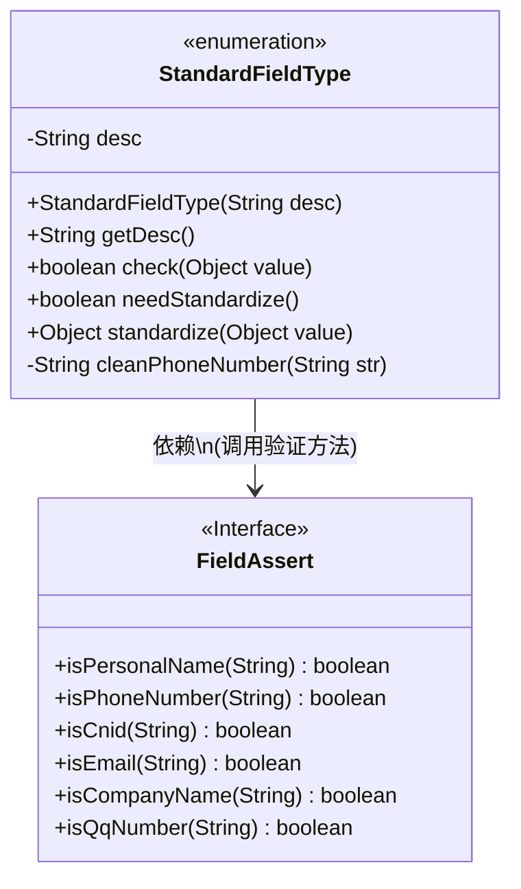
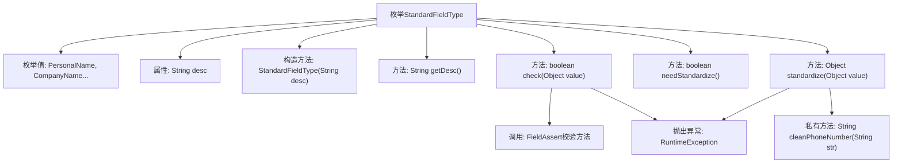
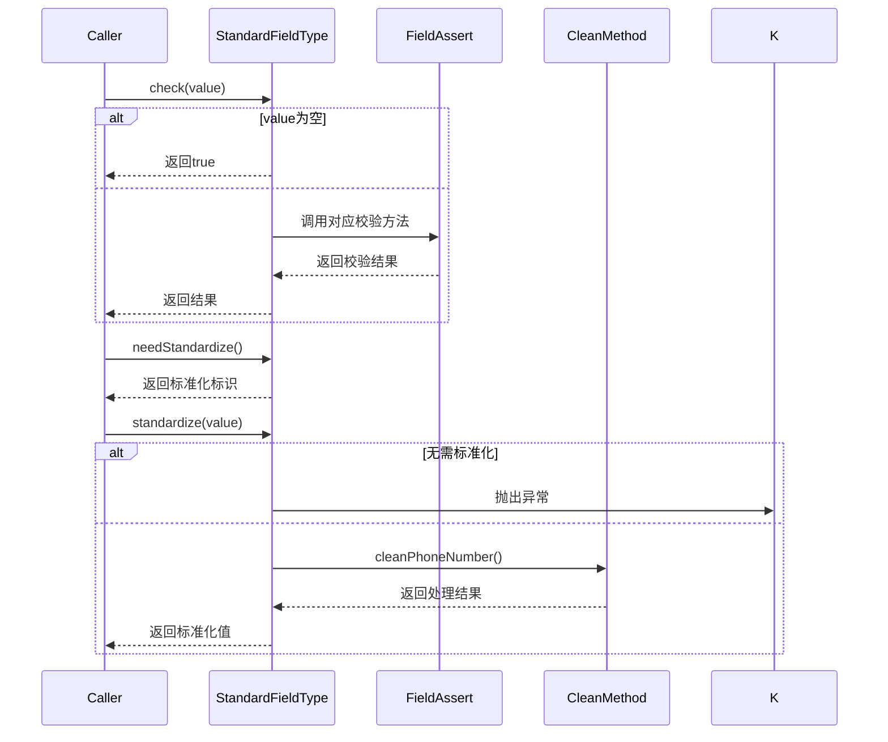

# 基础信息

|      |      |
|------|------|
| 名称 | StandardFieldType |
| 编码语言 | .java |
| 代码路径 | WeFe/common/java/common-lang/src/main/java/com/welab/wefe/common/fieldvalidate/StandardFieldType.java |
| 包名 | com.welab.wefe.common.fieldvalidate |
| 依赖项 | [] |
| 概述说明 | 枚举StandardFieldType定义标准字段类型，包含姓名、单位、邮箱等，提供校验、标准化方法，如手机号去除非数字、邮箱转小写、身份证转大写。 |

# 说明

这是一个枚举类StandardFieldType，定义了多种标准字段类型及其相关操作。包含姓名、单位名称、邮箱、身份证号、手机号、QQ号等字段类型，每个类型有对应的中文描述。提供了三个主要方法：check用于验证字段值是否符合规范，needStandardize判断字段是否需要标准化处理，standardize对字段值进行标准化处理。其中手机号、邮箱和身份证号需要标准化，手机号会去除非数字字符，邮箱转为小写，身份证号转为大写。

# 类列表 Class Summary

| 名称   | 类型  | 说明 |
|-------|------|-------------|
| StandardFieldType | enum | 枚举StandardFieldType定义标准字段类型，包含姓名、单位、邮箱等，提供字段校验、标准化处理功能，如手机号去除非数字、邮箱转小写、身份证转大写。 |

## 类 StandardFieldType

|      |      |
|------|------|
| 访问范围 | public |
| 类型 | enum |
| 名称 | StandardFieldType |
| 说明 | 枚举StandardFieldType定义标准字段类型，包含姓名、单位、邮箱等，提供字段校验、标准化处理功能，如手机号去除非数字、邮箱转小写、身份证转大写。 |

### UML类图

这段代码定义了一个枚举类StandardFieldType，用于表示不同类型的标准字段及其相关操作。每个枚举值对应一种字段类型（如姓名、电话等），包含字段描述、验证逻辑、标准化需求判断和标准化处理方法。该类通过依赖FieldAssert接口来执行具体的字段验证逻辑，实现了字段类型的集中管理和相关操作的可扩展性。枚举类型的设计使得字段类型的定义和使用更加清晰和安全。

### 内部方法调用关系图

该流程图展示了StandardFieldType枚举类的完整结构，包含7个标准字段枚举值、描述属性、构造方法和4个核心方法。时序图重点描述了三个关键方法的调用流程：字段校验(check)会委托给FieldAssert工具类，标准化判断(needStandardize)直接返回布尔值，字段标准化(standardize)会根据类型调用不同的处理逻辑。所有方法都包含完善的空值处理和异常抛出机制，特别是phoneNumber的清洗会移除所有非数字字符。

### 字段列表 Field List

| 名称  | 类型  | 说明 |
|-------|-------|------|

### 方法列表

| 名称  | 类型  | 说明 |
|-------|-------|------|

