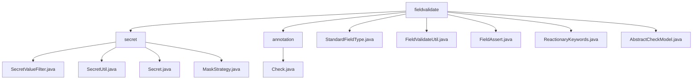

# 基础信息

|      |      |
|------|------|
| 名称 | fieldvalidate |
| 编码语言 | .java |
| 代码路径 | WeFe/common/java/common-lang/src/main/java/com/welab/wefe/common/fieldvalidate |
| 包名 | docs.common.java.common-lang.src.main.java.com.welab.wefe.common.fieldvalidate |
| 概述说明 | 该模块实现数据脱敏与字段校验，包含注解标记、策略执行和反射处理。支持手机号、邮箱等字段的标准化与验证，集成XSS防护、反动词过滤。工具类提供正则校验、非空检查，抽象类实现递归校验。 |

# 说明

## 概述  
该模块是综合性字段验证与数据处理平台，核心职责包括敏感数据脱敏、格式校验和安全防护，类似数据治理中间件。接口规范涵盖Check注解声明、StandardFieldType枚举操作和FieldValidateUtil工具类调用。关键数据结构包含正则表达式规则库、关键词HashSet集合和递归校验模型AbstractCheckModel。外部依赖涉及Java反射机制和正则表达式引擎。例如手机号校验采用11位数字规则，身份证号支持15/18位格式验证。

## 主要业务场景  
完整业务流程分为字段标记（如@Check）、类型校验（StandardFieldType）和防护处理（XSS/SQL过滤）三阶段。交互模式采用注解驱动与策略枚举结合，类似配置中心模式。典型应用包括用户注册信息校验（例如邮箱格式验证）、敏感数据脱敏（如身份证号部分隐藏）和内容安全审查（如反动关键词检测）。API类型包含注解配置（如regex）、工具方法（FieldAssert.notNull）和递归校验（AbstractCheckModel）。例如FieldValidateUtil同时处理手机号标准化（去除非数字字符）和SQL注入防护（转义单引号）。

### 包内部结构视图

该流程图展示了fieldvalidate模块的层级结构，包含secret和annotation两个子目录，以及多个直接位于fieldvalidate下的文件。secret目录下包含4个处理敏感信息的工具类，annotation目录下包含1个校验注解类。整体结构清晰反映了字段校验功能的代码组织方式。

# 文件列表

| 名称   | 类型  | 说明 |
|-------|------|-------------|
| [StandardFieldType.java](StandardFieldType.md) | file | 枚举StandardFieldType定义标准字段类型，包含姓名、单位、邮箱等，提供校验、标准化方法，如手机号去除非数字、邮箱转小写、身份证转大写。 |
| [FieldValidateUtil.java](FieldValidateUtil.md) | file | FieldValidateUtil类提供字段验证功能，包括标准化、非空检查、正则匹配、防XSS/SQL注入及反动关键词过滤。通过注解配置校验规则，确保输入安全合规。 |
| [FieldAssert.java](FieldAssert.md) | file | FieldAssert类提供多个静态方法验证字符串格式，包括手机号、姓名、邮箱、QQ号、公司名、身份证号等，并包含非空检查及异常抛出功能。 |
| [ReactionaryKeywords.java](ReactionaryKeywords.md) | file | 反应词库类包含色情、民生、暴恐、政治等关键词，提供检查文本是否含敏感词及匹配首个敏感词的方法。 |
| [AbstractCheckModel.java](AbstractCheckModel.md) | file | 抽象类AbstractCheckModel提供字段校验与标准化功能，递归检查嵌套对象和列表，异常时记录日志。 |
| [secret](secret/_module.md) | package | SecretValueFilter过滤敏感数据，SecretUtil管理@Secret注解字段，Secret注解定义掩码策略，MaskStrategy枚举实现四种掩码方式。 |
| [annotation](annotation/_module.md) | package | Java注解@Check用于字段验证，包含参数名、描述、必填检查、正则验证、标准数据类型、XSS/SQL注入防护等配置项，支持自定义错误提示和前端隐藏。 |

