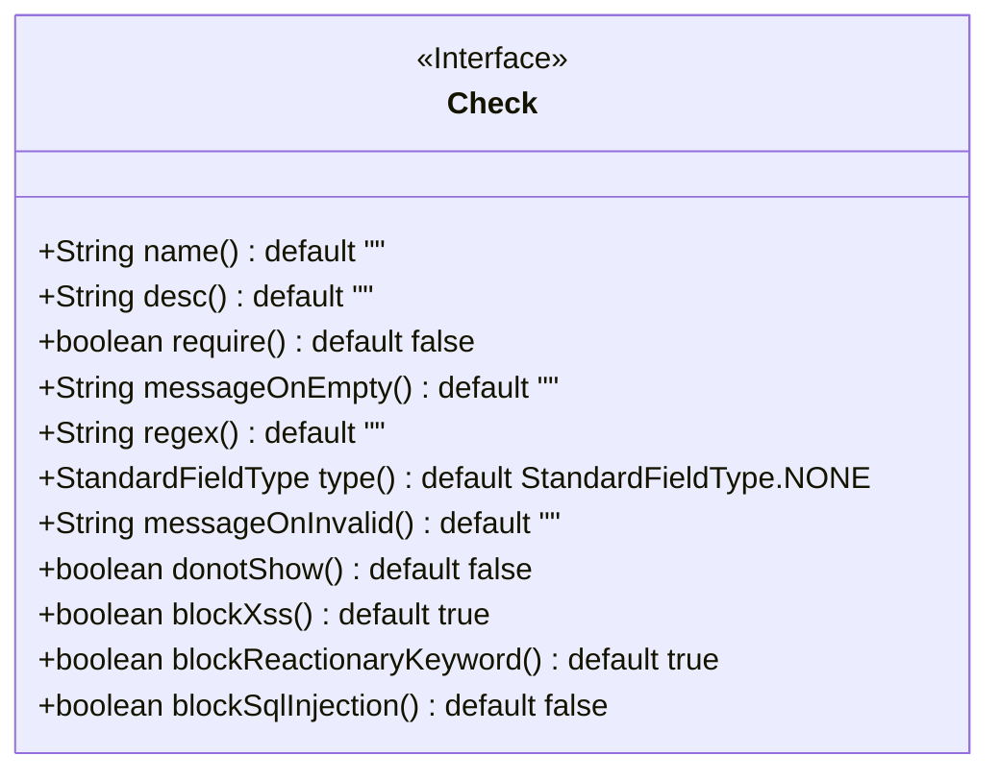

# 基础信息

|      |      |
|------|------|
| 名称 | Check |
| 编码语言 | .java |
| 代码路径 | WeFe/common/java/common-lang/src/main/java/com/welab/wefe/common/fieldvalidate/annotation/Check.java |
| 包名 | com.welab.wefe.common.fieldvalidate.annotation |
| 依赖项 | ['com.welab.wefe.common.fieldvalidate.StandardFieldType', 'java.lang.annotation.ElementType', 'java.lang.annotation.Retention', 'java.lang.annotation.RetentionPolicy', 'java.lang.annotation.Target'] |
| 概述说明 | Java注解@Check用于字段验证，包含参数名、描述、必填检查、正则验证、标准数据类型、XSS/SQL注入防护等配置项，支持自定义错误提示和前端隐藏。 |

# 说明

这是一个名为Check的Java注解，用于字段级别的参数校验。它包含多个配置项：name和desc分别定义参数名称和描述；require控制是否允许空值；messageOnEmpty和messageOnInvalid分别设置空值和无效值的提示信息；regex支持正则验证；type指定标准数据类型校验；donotShow控制前端隐藏。安全方面包含XSS攻击检测、反动关键词过滤和SQL注入防护开关，其中XSS和反动词默认开启，SQL注入防护默认关闭。

# 类列表 Class Summary

| 名称   | 类型  | 说明 |
|-------|------|-------------|
| Check | annotation | Java注解@Check用于字段验证，支持参数名、描述、非空检查、正则验证、标准数据类型、XSS防护、反动关键词过滤及SQL注入防护等配置。 |

## 类 Check

|      |      |
|------|------|
| 访问范围 | @Retention(RetentionPolicy.RUNTIME);@Target(ElementType.FIELD);public |
| 类型 | annotation |
| 名称 | Check |
| 说明 | Java注解@Check用于字段验证，支持参数名、描述、非空检查、正则验证、标准数据类型、XSS防护、反动关键词过滤及SQL注入防护等配置。 |

### UML类图

这段代码定义了一个名为`Check`的Java注解接口，用于字段级别的数据校验配置。该接口包含12个配置项，包括基础属性（name/desc）、空值校验规则（require/messageOnEmpty）、正则校验（regex）、标准字段类型（type）、校验失败提示（messageOnInvalid）、安全防护（blockXss/blockReactionaryKeyword/blockSqlInjection）等。所有属性都设置了默认值，其中安全防护相关配置默认开启XSS和反动关键词拦截，SQL注入防护默认关闭。该注解通过运行时保留策略（RUNTIME）和字段目标（FIELD）实现运行时字段校验。

### 内部方法调用关系图

```mermaid
graph TD
    A["注解@Check"]
    B["属性: String name() default ''"]
    C["属性: String desc() default ''"]
    D["属性: boolean require() default false"]
    E["属性: String messageOnEmpty() default ''"]
    F["属性: String regex() default ''"]
    G["属性: StandardFieldType type() default NONE"]
    H["属性: String messageOnInvalid() default ''"]
    I["属性: boolean donotShow() default false"]
    J["属性: boolean blockXss() default true"]
    K["属性: boolean blockReactionaryKeyword() default true"]
    L["属性: boolean blockSqlInjection() default false"]

    A --> B
    A --> C
    A --> D
    A --> E
    A --> F
    A --> G
    A --> H
    A --> I
    A --> J
    A --> K
    A --> L
```

这段代码定义了一个名为`@Check`的Java注解，主要用于字段验证和安全检查。该注解包含12个可配置属性，涵盖基础验证（如非空检查、正则匹配）、安全防护（如XSS防护、SQL注入防护）和标准化处理等功能。每个属性都有默认值，使用时可以按需覆盖。注解通过`@Retention(RetentionPolicy.RUNTIME)`指定在运行时保留，`@Target(ElementType.FIELD)`限定只能标注在字段上。

### 字段列表 Field List

| 名称  | 类型  | 说明 |
|-------|-------|------|
| donotShow | boolean | 方法参数默认不显示，默认值为false。 |
| desc | String | 方法默认返回空字符串描述。 |
| type | StandardFieldType | 定义字段类型默认为NONE。 |
| blockXss | boolean | 默认启用XSS防护，布尔值为真。 |
| regex | String | 定义字符串类型的正则表达式默认值为空字符串。 |
| name | String | 方法默认返回空字符串的name属性。 |
| require | boolean | 布尔类型参数require默认值为false。 |
| messageOnInvalid | String | 定义无效输入时的默认提示消息字符串。 |
| blockReactionaryKeyword | boolean | 默认启用反动关键词拦截功能。 |
| blockSqlInjection | boolean | 默认关闭SQL注入防护功能。 |
| messageOnEmpty | String | 定义空值时的默认返回字符串，默认为空。 |

### 方法列表

| 名称  | 类型  | 说明 |
|-------|-------|------|

