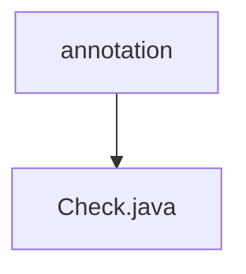

# 基础信息

|      |      |
|------|------|
| 名称 | annotation |
| 编码语言 | .java |
| 代码路径 | WeFe/common/java/common-lang/src/main/java/com/welab/wefe/common/fieldvalidate/annotation |
| 包名 | docs.common.java.common-lang.src.main.java.com.welab.wefe.common.fieldvalidate.annotation |
| 概述说明 | Java注解@Check用于字段验证，包含参数名、描述、必填检查、正则验证、标准数据类型、XSS/SQL注入防护等配置项，支持自定义错误提示和前端隐藏。 |

# 说明

这是一个名为Check的Java注解，用于字段级别的参数校验。它包含多个配置项：name和desc分别定义参数名称和描述；require控制是否允许空值；messageOnEmpty和messageOnInvalid分别设置空值和无效值的提示信息；regex支持正则验证；type指定标准数据类型校验；donotShow控制前端隐藏。安全方面包含XSS攻击检测、反动关键词过滤和SQL注入防护开关，其中XSS和反动词默认开启，SQL注入防护默认关闭。

### 包内部结构视图

该流程图展示了WeFe项目中common-lang模块下的字段验证注解结构。annotation文件夹作为父节点，包含一个Check.java注解文件。这种结构常用于Java项目中组织自定义注解，保持代码整洁和可维护性。

# 文件列表

| 名称   | 类型  | 说明 |
|-------|------|-------------|
| [Check.java](Check.md) | file | Java注解@Check用于字段验证，包含参数名、描述、必填检查、正则验证、标准数据类型、XSS/SQL注入防护等配置项，支持自定义错误提示和前端隐藏。 |

