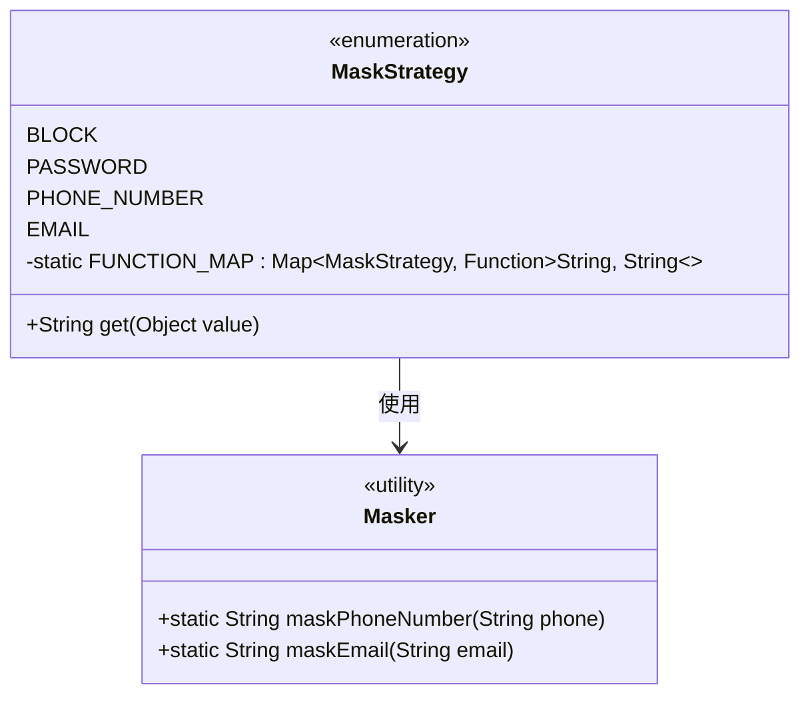
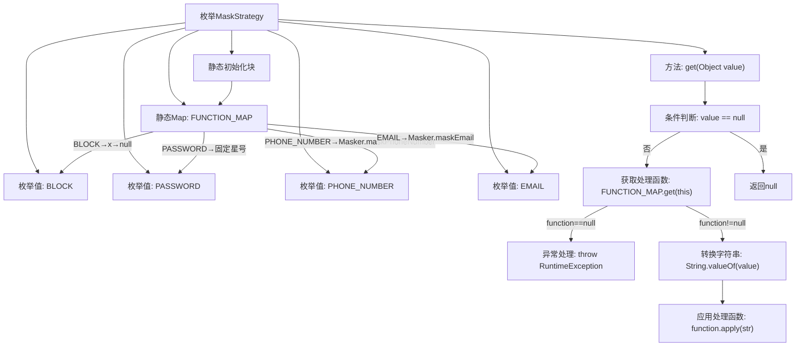

# 基础信息

|      |      |
|------|------|
| 名称 | MaskStrategy |
| 编码语言 | .java |
| 代码路径 | WeFe/common/java/common-lang/src/main/java/com/welab/wefe/common/fieldvalidate/secret/MaskStrategy.java |
| 包名 | com.welab.wefe.common.fieldvalidate.secret |
| 依赖项 | ['com.welab.wefe.common.util.Masker', 'java.util.HashMap', 'java.util.Map', 'java.util.function.Function'] |
| 概述说明 | MaskStrategy枚举定义了四种数据掩码策略：BLOCK（输出null）、PASSWORD（固定星号）、PHONE_NUMBER和EMAIL（调用对应方法处理）。通过静态映射表实现各策略对应的字符串处理逻辑。 |

# 说明

该内容定义了一个枚举类MaskStrategy，用于实现不同字段的掩码策略。枚举包含四种策略：BLOCK阻止字段输出任何字节并返回null；PASSWORD返回固定长度的星号字符串；PHONE_NUMBER和EMAIL分别调用Masker类的对应方法处理。类内部通过静态Map将枚举值与处理函数绑定，在get方法中根据枚举值调用相应函数处理输入值，若输入为null或枚举值未绑定函数则进行相应处理。

# 类列表 Class Summary

| 名称   | 类型  | 说明 |
|-------|------|-------------|
| MaskStrategy | enum | MaskStrategy枚举定义四种数据掩码策略：BLOCK返回null，PASSWORD返回固定星号，PHONE_NUMBER和EMAIL调用对应方法处理。通过FUNCTION_MAP映射策略到具体函数，get方法执行掩码转换。 |

## 类 MaskStrategy

|      |      |
|------|------|
| 访问范围 | public |
| 类型 | enum |
| 名称 | MaskStrategy |
| 说明 | MaskStrategy枚举定义四种数据掩码策略：BLOCK返回null，PASSWORD返回固定星号，PHONE_NUMBER和EMAIL调用对应方法处理。通过FUNCTION_MAP映射策略到具体函数，get方法执行掩码转换。 |

### UML类图

这段代码展示了一个枚举类MaskStrategy，它定义了四种数据脱敏策略(BLOCK, PASSWORD, PHONE_NUMBER, EMAIL)。通过静态映射FUNCTION_MAP将每种策略与对应的处理函数关联，其中PHONE_NUMBER和EMAIL策略使用了Masker工具类的静态方法。get方法根据输入值和当前枚举策略调用相应函数进行脱敏处理，实现了策略模式的灵活应用。

### 内部方法调用关系图

该流程图展示了MaskStrategy枚举的核心逻辑。枚举定义了四种数据脱敏策略(BLOCK/PASSWORD/PHONE_NUMBER/EMAIL)，通过静态Map预置各策略对应的处理函数。get方法根据输入值选择处理流程：空值直接返回null，非空值通过预置函数进行相应脱敏处理，未匹配策略时抛出异常。静态初始化块完成了策略与处理函数的绑定映射关系。

### 字段列表 Field List

| 名称  | 类型  | 说明 |
|-------|-------|------|

### 方法列表

| 名称  | 类型  | 说明 |
|-------|-------|------|

