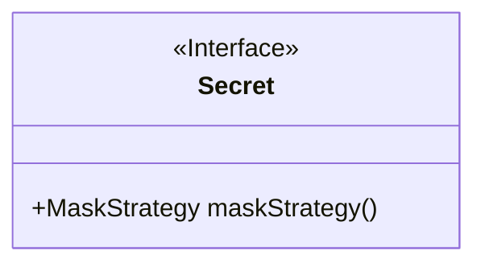
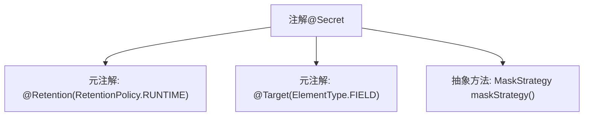

# 基础信息

|      |      |
|------|------|
| 名称 | Secret |
| 编码语言 | .java |
| 代码路径 | WeFe/common/java/common-lang/src/main/java/com/welab/wefe/common/fieldvalidate/secret/Secret.java |
| 包名 | com.welab.wefe.common.fieldvalidate.secret |
| 依赖项 | ['java.lang.annotation.ElementType', 'java.lang.annotation.Retention', 'java.lang.annotation.RetentionPolicy', 'java.lang.annotation.Target'] |
| 概述说明 | Java注解`@Secret`用于字段，运行时保留，需指定`MaskStrategy`掩码策略。 |

# 说明

这是一个名为Secret的Java注解定义，用于字段级别。它使用RUNTIME保留策略，确保注解信息在运行时可通过反射获取。注解包含一个必填属性maskStrategy，用于指定字段值的掩码策略。该注解专为敏感数据处理设计，通过策略模式支持不同掩码方式。

# 类列表 Class Summary

| 名称   | 类型  | 说明 |
|-------|------|-------------|
| Secret | annotation | Java注解@Secret用于字段，运行时保留，需指定掩码策略MaskStrategy。 |

## 类 Secret

|      |      |
|------|------|
| 访问范围 | @Retention(RetentionPolicy.RUNTIME);@Target(ElementType.FIELD);public |
| 类型 | annotation |
| 名称 | Secret |
| 说明 | Java注解@Secret用于字段，运行时保留，需指定掩码策略MaskStrategy。 |

### UML类图

这段类图描述了一个名为`Secret`的Java注解接口，该接口使用`<<Interface>>`标记表示其注解特性。注解包含一个公有方法`maskStrategy()`，返回类型为`MaskStrategy`。该注解通过`@Retention(RetentionPolicy.RUNTIME)`指定在运行时保留，并通过`@Target(ElementType.FIELD)`限定仅能应用于字段声明。其核心功能是为字段提供动态掩码策略配置，常用于敏感数据处理的场景，如日志脱敏或数据序列化保护。

### 内部方法调用关系图

这段流程图描述了Java注解`@Secret`的结构。该注解通过`@Retention`指定在运行时保留，通过`@Target`限定仅能标注在字段上，并声明了一个返回`MaskStrategy`类型的抽象方法`maskStrategy()`。整个结构展示了注解的元数据定义和功能约束，用于实现字段级别的数据掩码策略配置。

### 字段列表 Field List

| 名称  | 类型  | 说明 |
|-------|-------|------|
| maskStrategy | MaskStrategy | 获取掩码策略的方法。 |

### 方法列表

| 名称  | 类型  | 说明 |
|-------|-------|------|

