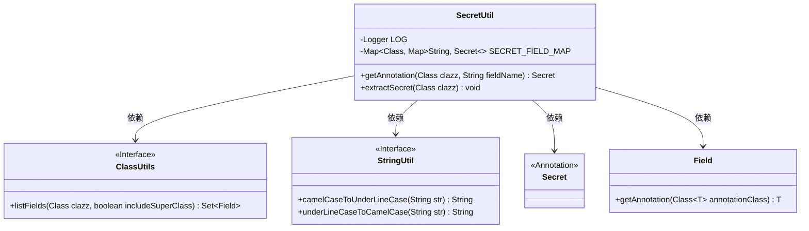

# 基础信息

|      |      |
|------|------|
| 名称 | SecretUtil |
| 编码语言 | .java |
| 代码路径 | WeFe/common/java/common-lang/src/main/java/com/welab/wefe/common/fieldvalidate/secret/SecretUtil.java |
| 包名 | com.welab.wefe.common.fieldvalidate.secret |
| 依赖项 | ['com.welab.wefe.common.util.ClassUtils', 'com.welab.wefe.common.util.StringUtil', 'org.slf4j.Logger', 'org.slf4j.LoggerFactory', 'java.lang.reflect.Field', 'java.security.Security', 'java.util.HashMap', 'java.util.Map', 'java.util.Set'] |
| 概述说明 | SecretUtil类用于管理带@Secret注解的字段，通过缓存提高访问效率，支持反射提取和驼峰/下划线命名兼容。 |

# 说明

SecretUtil类用于管理和缓存带有@Secret注解的字段。它包含一个静态Map SECRET_FIELD_MAP，用于存储类及其字段的注解信息。getAnnotation方法用于获取指定字段的@Secret注解，若类未缓存则调用extractSecret方法。extractSecret方法通过反射检查类的所有字段，缓存带有@Secret注解的字段，并同时支持字段名的驼峰和下划线格式。整个过程是线程安全的，并记录执行时间。

# 类列表 Class Summary

| 名称   | 类型  | 说明 |
|-------|------|-------------|
| SecretUtil | class | SecretUtil类用于管理带@Secret注解的字段，通过缓存提高访问效率，支持反射提取和驼峰/下划线命名兼容。 |

## 类 SecretUtil

|      |      |
|------|------|
| 访问范围 | public |
| 类型 | class |
| 名称 | SecretUtil |
| 说明 | SecretUtil类用于管理带@Secret注解的字段，通过缓存提高访问效率，支持反射提取和驼峰/下划线命名兼容。 |

### UML类图

这段代码展示了一个用于管理带有`@Secret`注解字段的工具类`SecretUtil`。它通过静态缓存`SECRET_FIELD_MAP`存储类与字段注解的映射关系，提供`getAnnotation`方法获取字段注解，并通过`synchronized extractSecret`方法初始化缓存。类依赖`ClassUtils`和`StringUtil`工具接口进行反射和字符串转换操作，同时与`Secret`注解和`Field`类交互。设计上采用懒加载和线程安全机制，支持驼峰与下划线命名字段的双向映射。

### 内部方法调用关系图

这段代码实现了一个带缓存的Secret注解处理器。流程图展示了两个核心方法：getAnnotation用于获取字段注解，若缓存不存在则调用extractSecret方法；extractSecret通过反射扫描类字段，将带有@Secret注解的字段按两种命名格式缓存。全局缓存SECRET_FIELD_MAP采用双重Map结构，外层以Class为key，内层存储字段名到Secret注解的映射，支持驼峰和下划线格式的字段名查询。整个过程采用懒加载和同步机制确保线程安全。

### 字段列表 Field List

| 名称  | 类型  | 说明 |
|-------|-------|------|
| SECRET_FIELD_MAP = new HashMap<>() | Map<Class, Map<String, Secret>> | 定义静态常量SECRET_FIELD_MAP，使用HashMap存储类与字段名到Secret对象的映射。 |
| LOG = LoggerFactory.getLogger(Security.class) | Logger | 定义静态常量LOG，用于Security类的日志记录。 |

### 方法列表

| 名称  | 类型  | 说明 |
|-------|-------|------|
| getAnnotation | Secret | 静态方法`getAnnotation`根据类和字段名获取注解，若类未缓存则先提取注解，最后返回对应字段的注解。 |
| extractSecret | void | 同步静态方法extractSecret检查类字段，缓存带@Secret注解的字段名（支持驼峰和下划线命名），避免重复处理。 |

