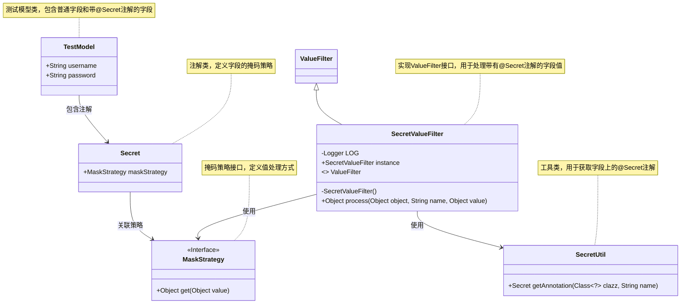
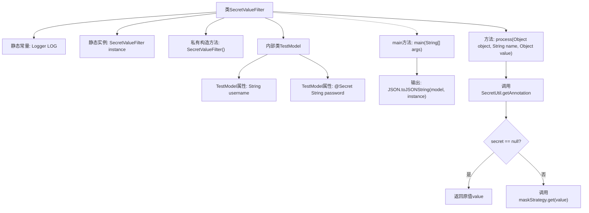

# 基础信息

|      |      |
|------|------|
| 名称 | SecretValueFilter |
| 编码语言 | .java |
| 代码路径 | WeFe/common/java/common-lang/src/main/java/com/welab/wefe/common/fieldvalidate/secret/SecretValueFilter.java |
| 包名 | com.welab.wefe.common.fieldvalidate.secret |
| 依赖项 | ['com.alibaba.fastjson.JSON', 'com.alibaba.fastjson.serializer.ValueFilter', 'org.slf4j.Logger', 'org.slf4j.LoggerFactory'] |
| 概述说明 | SecretValueFilter类实现ValueFilter接口，用于处理带@Secret注解的字段值，按策略掩码。TestModel示例展示密码字段掩码功能。 |

# 说明

SecretValueFilter是一个实现ValueFilter接口的类，用于过滤敏感数据。它通过SecretUtil获取字段上的Secret注解，并根据注解指定的掩码策略处理敏感值。类中包含一个静态内部类TestModel，用于演示功能：username字段正常输出，password字段会被掩码处理。main方法展示了如何用该过滤器序列化TestModel实例。

# 类列表 Class Summary

| 名称   | 类型  | 说明 |
|-------|------|-------------|
| SecretValueFilter | class | SecretValueFilter类实现ValueFilter接口，用于过滤敏感字段。通过@Secret注解标记需脱敏的字段，如密码，并指定脱敏策略。示例TestModel展示了用户名和密码字段，密码字段使用PASSWORD策略脱敏。main方法演示了如何使用该过滤器序列化对象。 |

## 类 SecretValueFilter

|      |      |
|------|------|
| 访问范围 | public |
| 类型 | class |
| 名称 | SecretValueFilter |
| 说明 | SecretValueFilter类实现ValueFilter接口，用于过滤敏感字段。通过@Secret注解标记需脱敏的字段，如密码，并指定脱敏策略。示例TestModel展示了用户名和密码字段，密码字段使用PASSWORD策略脱敏。main方法演示了如何使用该过滤器序列化对象。 |

### UML类图

这段代码实现了一个基于注解的敏感数据过滤机制。SecretValueFilter作为ValueFilter接口的实现类，会检查对象字段上的@Secret注解，并根据注解中指定的掩码策略对字段值进行处理。TestModel是测试类，包含普通字段和带@Secret注解的敏感字段。通过SecretUtil工具类获取注解信息，最终由MaskStrategy接口的具体实现完成实际的值掩码操作。整个设计实现了敏感数据与处理逻辑的解耦，支持灵活扩展不同的掩码策略。

### 内部方法调用关系图

流程图展示了SecretValueFilter类的结构和执行流程。该类实现了ValueFilter接口，通过process方法处理带有@Secret注解的字段值。当检测到字段有@Secret注解时，会根据指定的掩码策略对值进行处理；否则返回原始值。TestModel内部类用于演示功能，main方法展示如何将对象通过该过滤器序列化为JSON。整个过程体现了敏感数据过滤的典型处理模式。

### 字段列表 Field List

| 名称  | 类型  | 说明 |
|-------|-------|------|
| instance = new SecretValueFilter() | SecretValueFilter | 静态常量实例SecretValueFilter，用于过滤敏感值。 |
| LOG = LoggerFactory.getLogger(SecretValueFilter.class) | Logger | 定义SecretValueFilter类的静态日志对象LOG，使用LoggerFactory创建。 |

### 方法列表

| 名称  | 类型  | 说明 |
|-------|-------|------|
| main | void | Java主方法创建TestModel实例，并使用JSON库将其转换为过滤敏感值的JSON字符串后输出。 |
| process | Object | 方法处理对象属性值，若属性无Secret注解则返回原值，否则按注解的掩码策略处理值。 |

