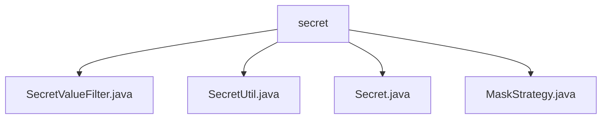

# 基础信息

|      |      |
|------|------|
| 名称 | secret |
| 编码语言 | .java |
| 代码路径 | WeFe/common/java/common-lang/src/main/java/com/welab/wefe/common/fieldvalidate/secret |
| 包名 | docs.common.java.common-lang.src.main.java.com.welab.wefe.common.fieldvalidate.secret |
| 概述说明 | SecretValueFilter过滤敏感数据，SecretUtil管理@Secret注解字段，Secret注解定义掩码策略，MaskStrategy枚举实现四种掩码方式。 |

# 说明

## 概述  
该模块核心职责是实现敏感数据的自动化过滤与掩码处理，类似数据脱敏中间件。接口规范包括ValueFilter接口实现、Secret注解解析和MaskStrategy策略枚举。关键数据结构包含SECRET_FIELD_MAP缓存注解字段、TestModel测试用例和策略函数映射表。外部依赖仅涉及Java反射机制。例如通过SecretValueFilter序列化时，password字段会被替换为星号串。

## 主要业务场景  
主要业务流程分为注解标记（如@Secret）、字段解析（SecretUtil）和策略执行（MaskStrategy）三阶段。交互模式采用策略枚举绑定处理函数，类似事件总线模式。典型应用包括用户信息脱敏（例如手机号中间四位星号）、日志敏感字段过滤等。API类型涵盖注解声明（如maskStrategy）、枚举调用（如PASSWORD策略）和过滤器集成。例如TestModel演示了username明文展示与password掩码的对比处理。

### 包内部结构视图

该流程图展示了WeFe项目中common-lang模块下secret包的层级结构。secret作为父节点，包含4个子文件：SecretValueFilter.java、SecretUtil.java、Secret.java和MaskStrategy.java。这些文件都与字段验证和秘密值处理相关，形成了清晰的包内文件组织结构。

# 文件列表

| 名称   | 类型  | 说明 |
|-------|------|-------------|
| [SecretValueFilter.java](SecretValueFilter.md) | file | SecretValueFilter类实现ValueFilter接口，用于处理带@Secret注解的字段值，按策略掩码。TestModel示例展示密码字段掩码功能。 |
| [SecretUtil.java](SecretUtil.md) | file | SecretUtil类用于管理带@Secret注解的字段，通过缓存提高访问效率，支持反射提取和驼峰/下划线命名兼容。 |
| [Secret.java](Secret.md) | file | Java注解`@Secret`用于字段，运行时保留，需指定`MaskStrategy`掩码策略。 |
| [MaskStrategy.java](MaskStrategy.md) | file | MaskStrategy枚举定义了四种数据掩码策略：BLOCK（输出null）、PASSWORD（固定星号）、PHONE_NUMBER和EMAIL（调用对应方法处理）。通过静态映射表实现各策略对应的字符串处理逻辑。 |

