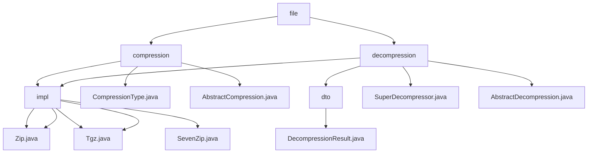

# 基础信息

|      |      |
|------|------|
| 名称 | file |
| 编码语言 | .java |
| 代码路径 | WeFe/common/java/common-lang/src/main/java/com/welab/wefe/common/file |
| 包名 | docs.common.java.common-lang.src.main.java.com.welab.wefe.common.file |
| 概述说明 | 该模块实现多格式文件压缩和解压功能，支持ZIP/TAR.GZ/7z等格式，采用抽象类和工厂模式设计，依赖Apache Commons等库，适用于日志打包、文件传输等场景，提供同步API和命令行工具。 |

# 说明

## 概述  
该模块核心职责是实现多格式文件压缩与解压的统一处理，支持ZIP/TAR.GZ/7z等格式（例如递归处理文件夹、跳过符号链接）。接口规范基于抽象类模式，压缩侧要求实现doCompression方法，解压侧需遵循doDecompression规范。关键数据结构包括流式处理的条目对象（如ZipEntry/TarEntry）和结果容器（如DecompressionResult）。外部依赖Apache Commons Compress、Java原生ZipFile及第三方SevenZFile库，例如TAR.GZ使用双层流组合，7z通过块流处理。压缩类型通过枚举映射后缀名（如.zip/.7z）。

## 主要业务场景  
模块采用类似归档中转站模式，典型应用包括日志打包（压缩）和分布式文件预处理（解压）。压缩流程为初始化→遍历→过滤→写入→关闭，解压采用校验→遍历→创建→释放的流水线。交互模式为同步阻塞式API，例如SuperDecompressor通过扩展名自动调用对应解压器。集成案例可见命令行演示（如main方法处理目录），ZIP适配Windows，TAR.GZ适配Linux，支持递归操作和自动格式识别。

### 包内部结构视图

该流程图展示了WeFe项目中文件压缩与解压模块的层级结构。根节点"file"下分为compression（压缩）和decompression（解压）两个主要分支，每个分支包含具体实现类(impl)、抽象基类(Abstract)和辅助类(dto)。压缩模块实现了Zip/Tgz格式，解压模块额外支持7z格式，体现了模块化设计思想。所有实现类均继承自对应的抽象基类，符合面向对象设计原则。

# 文件列表

| 名称   | 类型  | 说明 |
|-------|------|-------------|
| [decompression](decompression/_module.md) | package | 该模块实现多格式压缩文件解压，支持ZIP/7z/tgz等格式，通过统一接口处理解压任务。核心包括AbstractDecompression基类、解压结果对象和文件条目迭代器。支持批量解压、路径安全校验和资源释放，应用于日志分析和文件预处理等场景。 |
| [compression](compression/_module.md) | package | 该模块提供ZIP和TAR.GZ格式压缩功能，支持递归目录处理和流式操作。核心类包括AbstractCompression抽象类及Zip/Tgz实现类，依赖Apache Commons库。适用于日志打包和文件传输优化场景。 |

