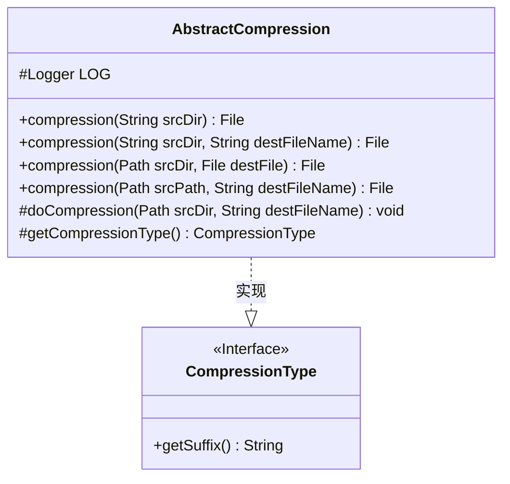
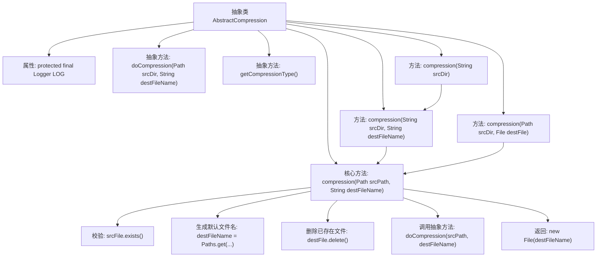

# 基础信息

|      |      |
|------|------|
| 名称 | AbstractCompression |
| 编码语言 | .java |
| 代码路径 | WeFe/common/java/common-lang/src/main/java/com/welab/wefe/common/file/compression/AbstractCompression.java |
| 包名 | com.welab.wefe.common.file.compression |
| 依赖项 | ['com.welab.wefe.common.util.StringUtil', 'org.slf4j.Logger', 'org.slf4j.LoggerFactory', 'java.io.File', 'java.io.IOException', 'java.nio.file.Path', 'java.nio.file.Paths'] |
| 概述说明 | 抽象压缩类提供文件夹压缩功能，支持多种路径输入，自动处理目标文件名，包含存在检查和清理逻辑，需子类实现具体压缩方法。 |

# 说明

这是一个抽象压缩类AbstractCompression，提供文件夹压缩功能。它包含一个抽象方法doCompression用于具体压缩实现，以及获取压缩类型的抽象方法getCompressionType。类提供了多个重载的compression方法，支持不同参数形式的压缩操作，包括处理源路径验证、目标文件名生成和已存在文件删除等逻辑。所有压缩操作最终都委托给doCompression方法执行。

# 类列表 Class Summary

| 名称   | 类型  | 说明 |
|-------|------|-------------|
| AbstractCompression | class | 抽象压缩类提供文件夹压缩功能，支持多种路径输入，自动处理目标文件名，包含存在性检查和清理逻辑，需子类实现具体压缩方法。 |

## 类 AbstractCompression

|      |      |
|------|------|
| 访问范围 | public abstract |
| 类型 | class |
| 名称 | AbstractCompression |
| 说明 | 抽象压缩类提供文件夹压缩功能，支持多种路径输入，自动处理目标文件名，包含存在性检查和清理逻辑，需子类实现具体压缩方法。 |

### UML类图

这段代码展示了一个抽象压缩类`AbstractCompression`及其与`CompressionType`接口的关系。`AbstractCompression`提供了多个重载的`compression`方法用于处理不同参数类型的压缩请求，最终都会调用受保护的抽象方法`doCompression`执行实际压缩操作。类中包含对源文件存在性检查、目标文件名生成和已存在文件删除等预处理逻辑，体现了良好的健壮性设计。`CompressionType`接口定义了获取压缩后缀的方法，由具体子类实现不同压缩类型。整体结构清晰，职责分明，通过抽象方法实现了模板方法模式。

### 内部方法调用关系图

流程图描述：该流程图展示了AbstractCompression抽象类的完整结构和工作流程。从入口方法compression(String)开始，通过方法重载最终汇聚到核心方法compression(Path, String)，该方法依次执行源文件校验、目标文件名生成、已有文件清理等操作后，调用抽象方法doCompression完成实际压缩，最后返回结果文件。所有压缩操作最终都通过这个核心方法统一处理，体现了模板方法设计模式。

### 字段列表 Field List

| 名称  | 类型  | 说明 |
|-------|-------|------|
| LOG = LoggerFactory.getLogger(this.getClass()) | Logger | 类中定义了一个受保护的final日志对象LOG，用于记录当前类的日志信息。 |

### 方法列表

| 名称  | 类型  | 说明 |
|-------|-------|------|
| compression | File | Java方法：压缩指定目录，返回File对象。可传入null参数，调用重载方法。可能抛出IOException。 |
| compression | File | Java方法：压缩指定目录到目标文件，参数为源目录路径和目标文件名，可能抛出IO异常。 |
| getCompressionType | CompressionType | 抽象方法，返回压缩类型。 |
| doCompression | void | 抽象方法，用于压缩指定目录到目标文件，可能抛出IO异常。 |
| compression | File | Java方法：将指定目录压缩为文件，参数为源目录路径和目标文件对象，异常抛出IOException。 |
| compression | File | 该方法将指定路径文件夹压缩为文件，自动处理路径检查、默认命名及覆盖问题，返回压缩后的文件对象。 |

