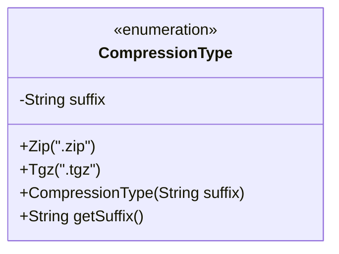
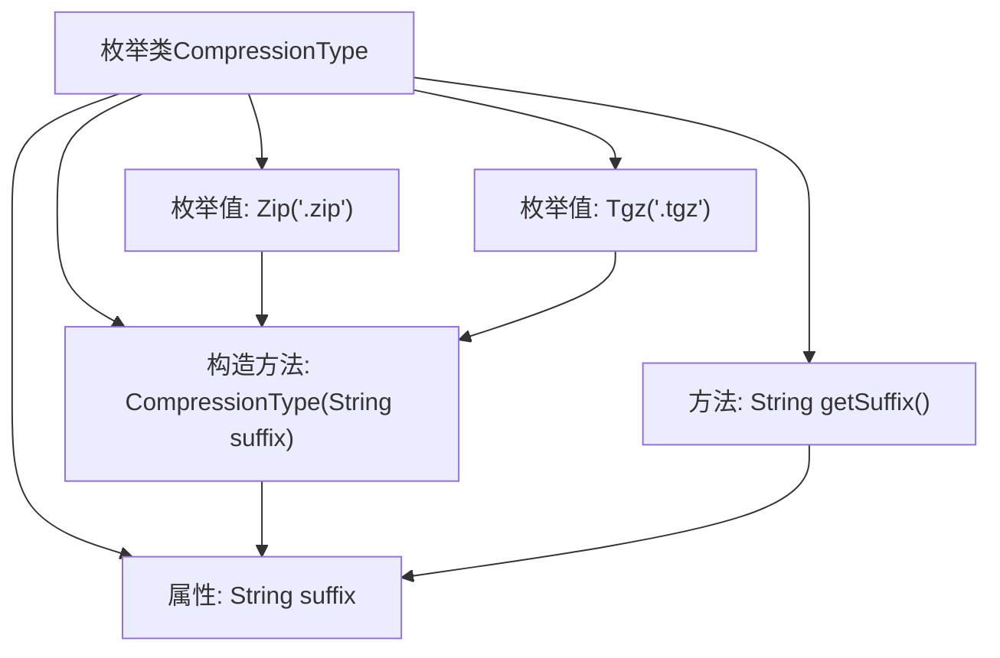

# 基础信息

|      |      |
|------|------|
| 名称 | CompressionType |
| 编码语言 | .java |
| 代码路径 | WeFe/common/java/common-lang/src/main/java/com/welab/wefe/common/file/compression/CompressionType.java |
| 包名 | com.welab.wefe.common.file.compression |
| 依赖项 | [] |
| 概述说明 | 枚举CompressionType定义两种压缩类型：Zip和Tgz，分别对应后缀.zip和.tgz，提供获取后缀的方法getSuffix。 |

# 说明

该代码定义了一个枚举类型CompressionType，包含两个枚举值Zip和Tgz，分别对应文件后缀名.zip和.tgz。枚举类包含一个私有字符串字段suffix用于存储后缀名，通过构造方法初始化。提供了公共方法getSuffix()用于获取后缀名。整个结构简洁地实现了压缩类型与文件后缀的映射关系。

# 类列表 Class Summary

| 名称   | 类型  | 说明 |
|-------|------|-------------|
| CompressionType | enum | 枚举CompressionType定义两种压缩类型：Zip和Tgz，分别对应后缀.zip和.tgz，提供获取后缀的方法getSuffix。 |

## 类 CompressionType

|      |      |
|------|------|
| 访问范围 | public |
| 类型 | enum |
| 名称 | CompressionType |
| 说明 | 枚举CompressionType定义两种压缩类型：Zip和Tgz，分别对应后缀.zip和.tgz，提供获取后缀的方法getSuffix。 |

### UML类图

这段代码定义了一个枚举类`CompressionType`，用于表示不同的压缩类型。枚举包含两个实例：`Zip`和`Tgz`，分别对应".zip"和".tgz"后缀。每个枚举实例都通过构造函数关联一个字符串后缀，并通过`getSuffix()`方法提供访问。该设计常用于文件处理场景，通过类型安全的方式管理不同压缩格式的后缀名，避免硬编码字符串带来的维护问题。枚举的私有字段和公有方法体现了良好的封装性。

### 内部方法调用关系图

该流程图描述了枚举类CompressionType的结构，包含两个枚举值Zip和Tgz，每个枚举值通过构造方法初始化后缀属性suffix，并提供getSuffix方法获取后缀值。箭头表示类成员间的关联关系，清晰展示了从枚举定义到属性操作的完整路径。

### 字段列表 Field List

| 名称  | 类型  | 说明 |
|-------|-------|------|

### 方法列表

| 名称  | 类型  | 说明 |
|-------|-------|------|

