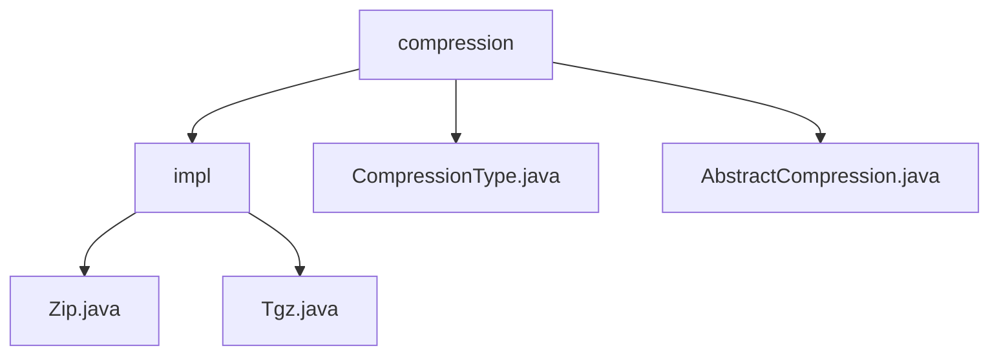

# 基础信息

|      |      |
|------|------|
| 名称 | compression |
| 编码语言 | .java |
| 代码路径 | WeFe/common/java/common-lang/src/main/java/com/welab/wefe/common/file/compression |
| 包名 | docs.common.java.common-lang.src.main.java.com.welab.wefe.common.file.compression |
| 概述说明 | 该模块提供ZIP和TAR.GZ格式压缩功能，支持递归目录处理和流式操作。核心类包括AbstractCompression抽象类及Zip/Tgz实现类，依赖Apache Commons库。适用于日志打包和文件传输优化场景。 |

# 说明

## 概述  
该模块核心职责是实现多格式文件压缩，支持ZIP和TAR.GZ两种格式的目录/文件压缩（例如递归处理文件夹、跳过符号链接）。接口规范基于AbstractCompression抽象类，要求子类实现doCompression核心方法和getCompressionType标识获取。关键数据结构包括流式处理的ZIP条目和TAR归档条目。外部依赖Apache Commons Compress库处理TAR.GZ格式，例如Zip类使用ZipOutputStream，Tgz类组合TarArchiveOutputStream和GzipCompressorOutputStream。压缩类型通过枚举类CompressionType映射后缀名（如.zip/.tgz）。

## 主要业务场景  
典型应用包括日志打包和文件传输前体积优化（类似归档中转站模式）。完整流程为：初始化流→遍历目录→过滤非常规文件→写入条目→关闭资源。支持编程调用和命令行演示（例如main方法压缩目录并输出信息）。作为同步处理器API，集成于数据预处理阶段，ZIP适用于Windows，TAR.GZ适配Linux。抽象类提供多态compression方法，处理路径验证、文件名生成等通用逻辑，最终委托doCompression实现具体压缩。

### 包内部结构视图

该流程图展示了文件压缩模块的层级结构。根节点"compression"包含三个子节点："impl"文件夹、"CompressionType.java"和"AbstractCompression.java"文件。"impl"文件夹下又包含两个具体实现类："Zip.java"和"Tgz.java"。整个结构清晰地反映了压缩模块的抽象与具体实现关系。

# 文件列表

| 名称   | 类型  | 说明 |
|-------|------|-------------|
| [CompressionType.java](CompressionType.md) | file | 枚举CompressionType定义两种压缩类型：Zip和Tgz，分别对应后缀.zip和.tgz，提供获取后缀的方法getSuffix。 |
| [AbstractCompression.java](AbstractCompression.md) | file | 抽象压缩类提供文件夹压缩功能，支持多种路径输入，自动处理目标文件名，包含存在检查和清理逻辑，需子类实现具体压缩方法。 |
| [impl](impl/_module.md) | package | Java类实现ZIP和tar.gz压缩功能，分别递归处理文件夹和文件，生成压缩文件并输出路径和大小。 |

