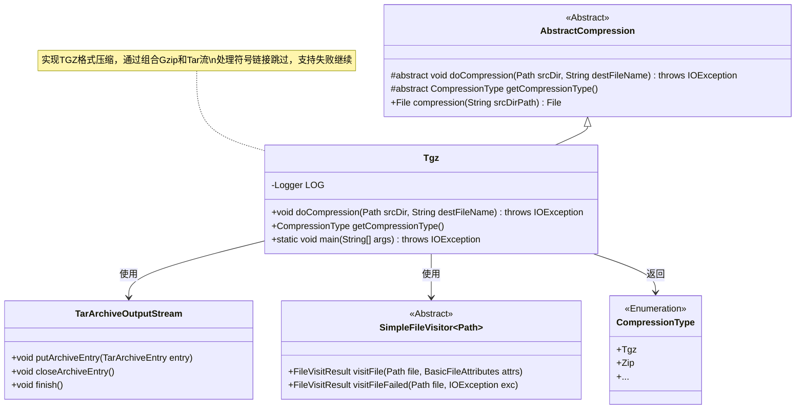
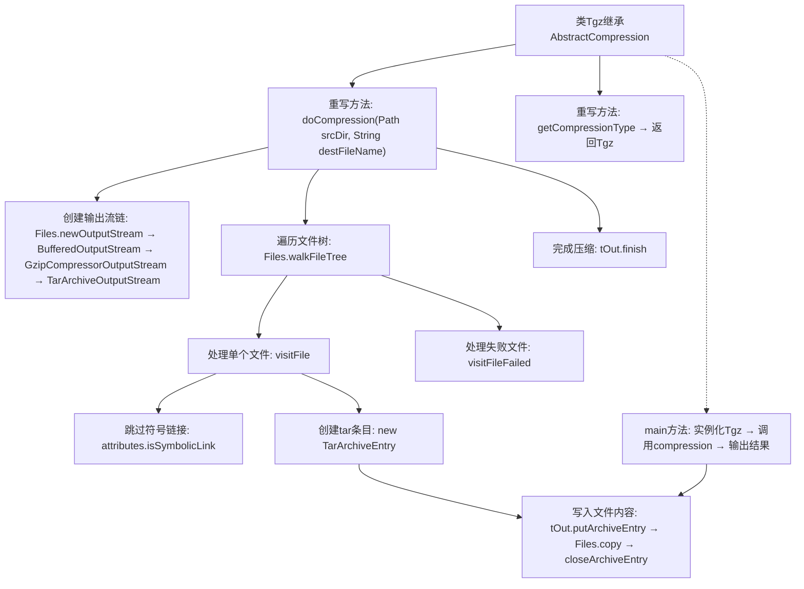

# 基础信息

|      |      |
|------|------|
| 名称 | Tgz |
| 编码语言 | .java |
| 代码路径 | WeFe/common/java/common-lang/src/main/java/com/welab/wefe/common/file/compression/impl/Tgz.java |
| 包名 | com.welab.wefe.common.file.compression.impl |
| 依赖项 | ['com.welab.wefe.common.file.compression.AbstractCompression', 'com.welab.wefe.common.file.compression.CompressionType', 'org.apache.commons.compress.archivers.tar.TarArchiveEntry', 'org.apache.commons.compress.archivers.tar.TarArchiveOutputStream', 'org.apache.commons.compress.compressors.gzip.GzipCompressorOutputStream', 'java.io.BufferedOutputStream', 'java.io.File', 'java.io.IOException', 'java.io.OutputStream', 'java.nio.file', 'java.nio.file.attribute.BasicFileAttributes'] |
| 概述说明 | Tgz类继承AbstractCompression，实现doCompression方法将目录打包为tar.gz文件，跳过符号链接，处理失败时记录日志。主方法测试压缩功能并输出文件路径和大小。 |

# 说明

该代码定义了一个Tgz类，继承自AbstractCompression抽象类，实现了tar.gz格式的压缩功能。主要逻辑是通过遍历源目录下的所有文件，使用TarArchiveOutputStream和GzipCompressorOutputStream将文件打包并压缩为tar.gz格式。处理过程中会跳过符号链接文件，并在遇到访问失败时记录错误日志。最后通过main方法演示了压缩功能的使用，输出压缩后的文件路径和大小。

# 类列表 Class Summary

| 名称   | 类型  | 说明 |
|-------|------|-------------|
| Tgz | class | Tgz类继承AbstractCompression，实现doCompression方法将目录打包为tar.gz文件，跳过符号链接，处理失败时记录日志，支持获取压缩类型。 |

## 类 Tgz

|      |      |
|------|------|
| 访问范围 | public |
| 类型 | class |
| 名称 | Tgz |
| 说明 | Tgz类继承AbstractCompression，实现doCompression方法将目录打包为tar.gz文件，跳过符号链接，处理失败时记录日志，支持获取压缩类型。 |

### UML类图

类图描述：该图展示了一个TGZ压缩实现，Tgz类继承自抽象类AbstractCompression，通过组合TarArchiveOutputStream和SimpleFileVisitor实现目录遍历压缩。核心流程包含文件访问控制、异常处理和流关闭，使用枚举类型区分压缩格式。图中清晰体现了模板方法模式与组合流处理的设计。

### 内部方法调用关系图

流程图描述：该流程图展示了Tgz压缩工具的核心流程，从初始化输出流链开始，通过递归遍历源目录处理每个文件（跳过符号链接），将文件数据打包为tar格式并通过gzip压缩，最后处理异常情况并完成压缩。main方法演示了实际调用过程，包含结果输出。关键点包括流式处理架构和文件树遍历机制。

### 字段列表 Field List

| 名称  | 类型  | 说明 |
|-------|-------|------|

### 方法列表

| 名称  | 类型  | 说明 |
|-------|-------|------|
| getCompressionType | CompressionType | 方法重写，返回压缩类型为Tgz。 |
| doCompression | void | 该方法将指定目录压缩为tar.gz文件，跳过符号链接，遍历文件并逐个打包，异常时记录日志并继续。 |
| main | void | Java主方法使用Tgz类压缩指定目录，输出压缩文件路径和大小（MB）。 |

