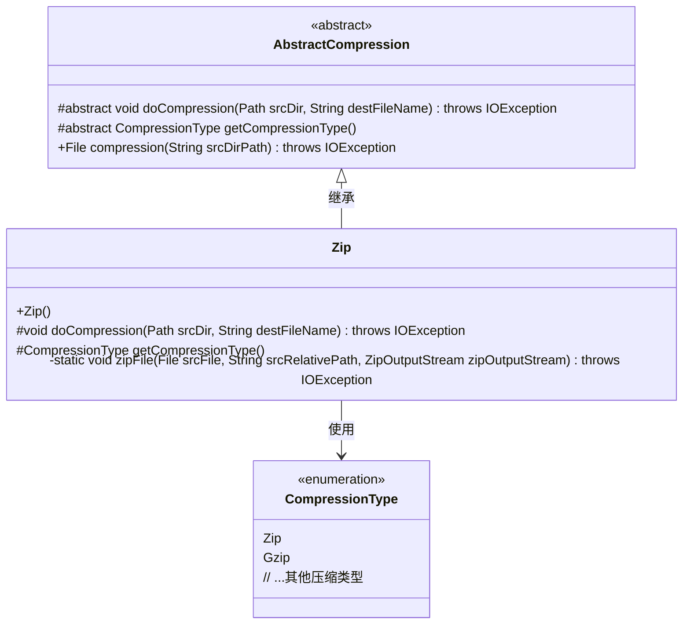
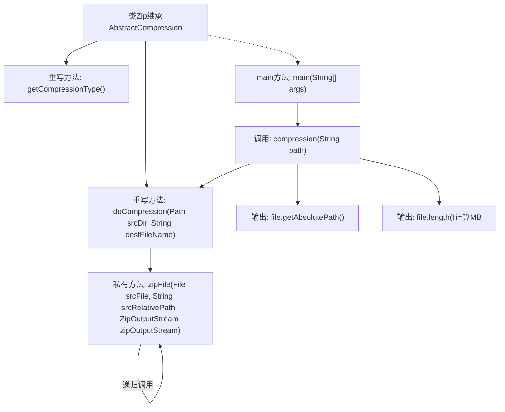

# 基础信息

|      |      |
|------|------|
| 名称 | Zip |
| 编码语言 | .java |
| 代码路径 | WeFe/common/java/common-lang/src/main/java/com/welab/wefe/common/file/compression/impl/Zip.java |
| 包名 | com.welab.wefe.common.file.compression.impl |
| 依赖项 | ['com.welab.wefe.common.file.compression.AbstractCompression', 'com.welab.wefe.common.file.compression.CompressionType', 'java.io.File', 'java.io.FileInputStream', 'java.io.FileOutputStream', 'java.io.IOException', 'java.nio.file.Path', 'java.util.zip.ZipEntry', 'java.util.zip.ZipOutputStream'] |
| 概述说明 | Zip类继承AbstractCompression，实现递归压缩文件夹功能，支持目录遍历和文件压缩，输出ZIP格式文件。 |

# 说明

这是一个实现ZIP压缩功能的Java类，继承自抽象压缩类。主要功能包括递归压缩文件夹和文件到ZIP格式。类中包含两个核心方法：doCompression负责初始化输出流并启动压缩流程；zipFile方法递归处理目录结构，为每个文件创建ZIP条目并写入数据。该类还实现了获取压缩类型的方法，返回ZIP格式标识。最后通过main方法演示了压缩指定目录并输出结果文件路径和大小的功能。

# 类列表 Class Summary

| 名称   | 类型  | 说明 |
|-------|------|-------------|
| Zip | class | Zip类继承AbstractCompression，实现递归压缩文件夹为zip文件的功能，包含压缩类型获取和主方法测试。 |

## 类 Zip

|      |      |
|------|------|
| 访问范围 | public |
| 类型 | class |
| 名称 | Zip |
| 说明 | Zip类继承AbstractCompression，实现递归压缩文件夹为zip文件的功能，包含压缩类型获取和主方法测试。 |

### UML类图

这段代码展示了一个ZIP压缩工具的实现，其中Zip类继承自抽象基类AbstractCompression，实现了具体的压缩逻辑。类图清晰地展示了这种继承关系，以及Zip类与CompressionType枚举的关联。Zip类通过递归方式处理文件和目录的压缩，核心方法是私有的zipFile()，它根据文件类型（目录或普通文件）采取不同的压缩策略。整个设计体现了模板方法模式，抽象基类定义算法框架，具体子类实现特定压缩逻辑。

### 内部方法调用关系图

流程图描述了Zip压缩类的核心逻辑：通过doCompression方法初始化压缩流，递归调用zipFile处理目录/文件，最终输出结果。zipFile方法对目录创建空条目并递归子项，对文件则写入字节流。main方法触发压缩流程并打印结果信息，展现了完整的压缩过程控制流和数据流转路径。

### 字段列表 Field List

| 名称  | 类型  | 说明 |
|-------|-------|------|

### 方法列表

| 名称  | 类型  | 说明 |
|-------|-------|------|
| zipFile | void | 递归压缩文件或目录到ZipOutputStream，处理目录时添加分隔符并递归子文件，文件则读取字节流写入Zip条目。 |
| doCompression | void | 该方法递归压缩指定文件夹到目标ZIP文件，使用ZipOutputStream实现。 |
| getCompressionType | CompressionType | 方法重写，返回压缩类型为Zip。 |
| main | void | Java代码示例：使用Zip类压缩指定路径文件夹，输出压缩文件绝对路径和大小（KB转MB）。 |

