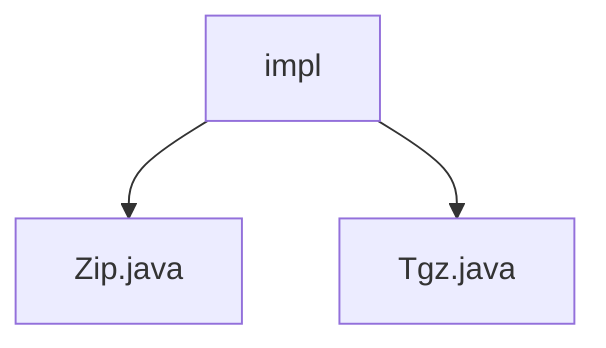

# 基础信息

|      |      |
|------|------|
| 名称 | impl |
| 编码语言 | .java |
| 代码路径 | WeFe/common/java/common-lang/src/main/java/com/welab/wefe/common/file/compression/impl |
| 包名 | docs.common.java.common-lang.src.main.java.com.welab.wefe.common.file.compression.impl |
| 概述说明 | Java类实现ZIP和tar.gz压缩功能，分别递归处理文件夹和文件，生成压缩文件并输出路径和大小。 |

# 说明

## 概述  
该模块实现多格式文件压缩功能，核心职责是提供ZIP和TAR.GZ两种格式的目录/文件压缩能力（例如递归处理文件夹、跳过符号链接）。接口规范统一继承AbstractCompression抽象类，需实现doCompression核心方法和获取压缩类型标识。关键数据结构包括ZIP条目和TAR归档条目，均采用流式处理。外部依赖Apache Commons Compress库进行TAR.GZ格式压缩。例如Zip类通过ZipOutputStream实现压缩，Tgz类组合使用TarArchiveOutputStream和GzipCompressorOutputStream。

## 主要业务场景  
典型场景包括批量日志打包或分布式文件传输前的体积优化（类似归档中转站模式）。完整流程为：初始化输出流→递归遍历目录→跳过非常规文件→写入压缩条目→关闭资源。交互模式支持编程调用和命令行演示，例如main方法展示压缩指定目录并输出文件信息。API类型为同步处理器，集成案例可见于数据预处理阶段的原始文件打包。两种压缩格式分别适用于Windows环境（ZIP）和Linux系统（TAR.GZ）。

### 包内部结构视图

该流程图展示了压缩功能实现目录下的两个具体实现类：Zip.java和Tgz.java。这两个类都位于impl目录下，属于同一层级，分别实现了不同的压缩算法功能。结构清晰地反映了实现类的组织方式，便于理解模块间的从属关系。

# 文件列表

| 名称   | 类型  | 说明 |
|-------|------|-------------|
| [Zip.java](Zip.md) | file | Zip类继承AbstractCompression，实现递归压缩文件夹功能，支持目录遍历和文件压缩，输出ZIP格式文件。 |
| [Tgz.java](Tgz.md) | file | Tgz类继承AbstractCompression，实现doCompression方法将目录打包为tar.gz文件，跳过符号链接，处理失败时记录日志。主方法测试压缩功能并输出文件路径和大小。 |

