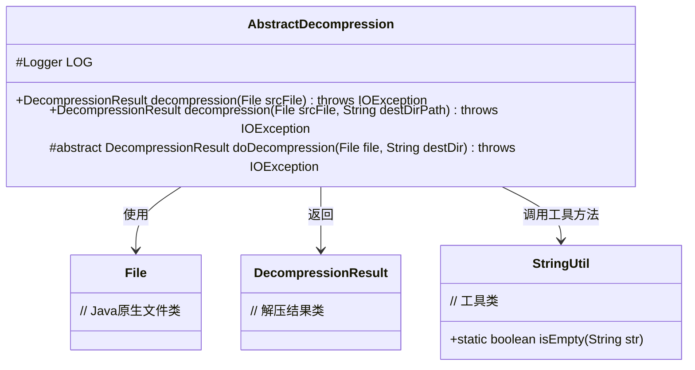
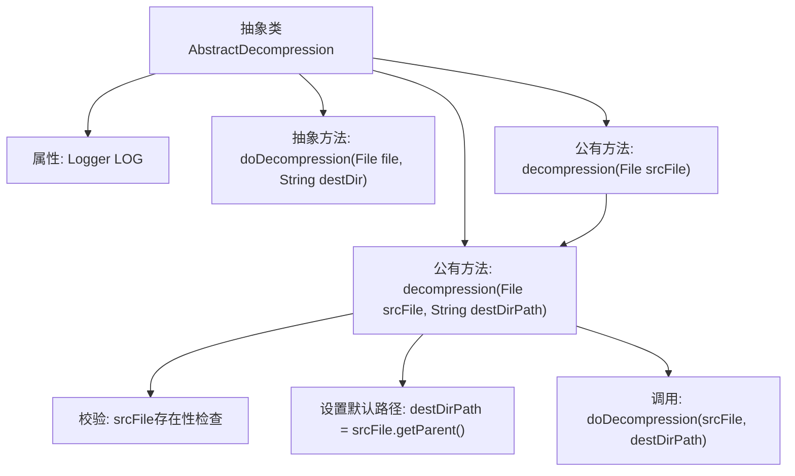

# 基础信息

|      |      |
|------|------|
| 名称 | AbstractDecompression |
| 编码语言 | .java |
| 代码路径 | WeFe/common/java/common-lang/src/main/java/com/welab/wefe/common/file/decompression/AbstractDecompression.java |
| 包名 | com.welab.wefe.common.file.decompression |
| 依赖项 | ['com.welab.wefe.common.file.decompression.dto.DecompressionResult', 'com.welab.wefe.common.util.StringUtil', 'org.slf4j.Logger', 'org.slf4j.LoggerFactory', 'java.io.File', 'java.io.IOException'] |
| 概述说明 | 抽象解压类提供文件解压功能，包含校验文件存在性、默认路径处理及抽象方法供子类实现具体解压逻辑。 |

# 说明

这是一个抽象解压类，提供文件解压功能。类中包含一个抽象方法doDecompression用于具体解压实现，以及两个重载的公开方法decompression处理解压流程。主要功能包括检查源文件是否存在、自动确定目标目录（未指定时使用源文件所在目录）、并将实际解压操作委托给子类实现。所有方法都可能抛出IO异常，解压结果通过DecompressionResult对象返回。类中还包含一个protected的日志记录器。

# 类列表 Class Summary

| 名称   | 类型  | 说明 |
|-------|------|-------------|
| AbstractDecompression | class | 抽象类AbstractDecompression提供文件解压功能，包含校验逻辑和默认路径处理，核心方法doDecompression需子类实现。 |

## 类 AbstractDecompression

|      |      |
|------|------|
| 访问范围 | public abstract |
| 类型 | class |
| 名称 | AbstractDecompression |
| 说明 | 抽象类AbstractDecompression提供文件解压功能，包含校验逻辑和默认路径处理，核心方法doDecompression需子类实现。 |

### UML类图

该类图展示了一个抽象解压类AbstractDecompression的核心结构，包含两个重载的公开解压方法和一个受保护的抽象方法。该类依赖Java的File类处理文件操作，使用StringUtil工具类进行字符串判断，并返回自定义的DecompressionResult结果对象。抽象方法doDecompression强制子类实现具体解压逻辑，体现了模板方法设计模式。

### 内部方法调用关系图

这段代码描述了一个抽象解压类的工作流程。该类包含核心抽象方法doDecompression和两个重载的公有方法decompression，后者实现了文件存在性校验和默认目标路径设置逻辑。流程图展示了从入口方法decompression开始，经过参数校验和路径处理，最终调用抽象方法doDecompression的完整调用链，体现了模板方法设计模式的应用。

### 字段列表 Field List

| 名称  | 类型  | 说明 |
|-------|-------|------|
| LOG = LoggerFactory.getLogger(this.getClass()) | Logger | 定义一个当前类使用的protected final日志记录器实例LOG，通过LoggerFactory获取。 |

### 方法列表

| 名称  | 类型  | 说明 |
|-------|-------|------|
| doDecompression | DecompressionResult | 抽象方法，解压文件到目标目录，返回解压结果，可能抛出IO异常。 |
| decompression | DecompressionResult | Java方法decompression接收File参数，解压文件并返回结果，可抛出IOException。调用重载方法，第二个参数为null。 |
| decompression | DecompressionResult | 该方法解压文件，检查源文件是否存在，若目标路径为空则使用源文件目录，最后执行解压操作。 |

