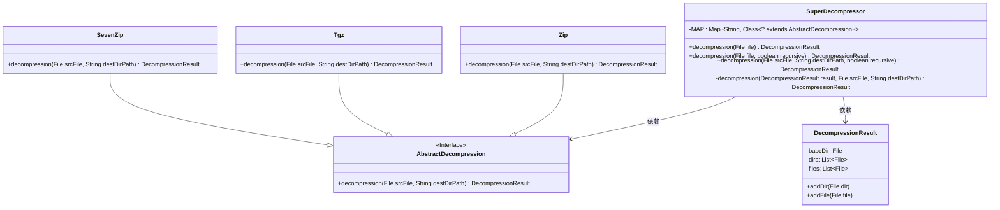
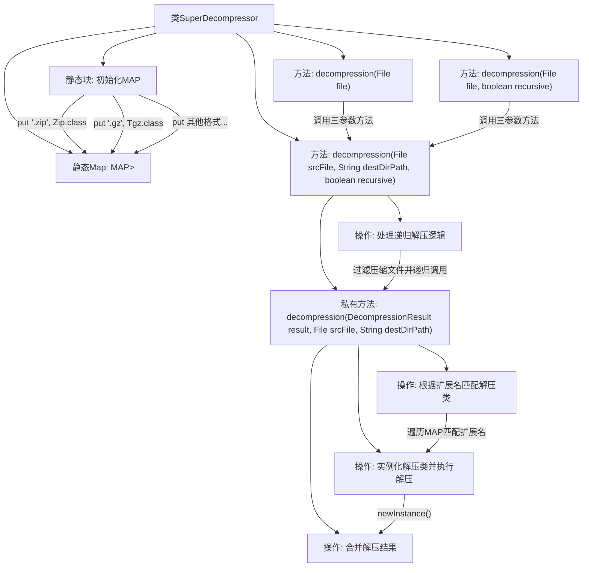

# 基础信息

|      |      |
|------|------|
| 名称 | SuperDecompressor |
| 编码语言 | .java |
| 代码路径 | WeFe/common/java/common-lang/src/main/java/com/welab/wefe/common/file/decompression/SuperDecompressor.java |
| 包名 | com.welab.wefe.common.file.decompression |
| 依赖项 | ['com.welab.wefe.common.file.decompression.dto.DecompressionResult', 'com.welab.wefe.common.file.decompression.impl.SevenZip', 'com.welab.wefe.common.file.decompression.impl.Tgz', 'com.welab.wefe.common.file.decompression.impl.Zip', 'com.welab.wefe.common.util.FileUtil', 'java.io.File', 'java.io.IOException', 'java.util.HashMap', 'java.util.Map'] |
| 概述说明 | SuperDecompressor类支持多种压缩格式解压，包括zip、gz、tar.gz、tgz和7z，可指定输出目录和递归解压功能。 |

# 说明

SuperDecompressor是一个支持多种压缩格式的解压工具类，通过静态映射表关联文件扩展名与对应的解压实现类。提供三种解压方法：默认解压、指定递归解压、自定义输出目录解压。核心逻辑通过私有方法实现递归解压，自动识别压缩格式并调用相应解压器，最终返回包含解压文件和目录的结果对象。支持.zip、.gz、.tar.gz、.tgz和.7z格式，解压过程中可删除原始压缩文件。

# 类列表 Class Summary

| 名称   | 类型  | 说明 |
|-------|------|-------------|
| SuperDecompressor | class | SuperDecompressor类实现多格式文件解压，支持递归解压，自动匹配压缩类型并输出解压结果。 |

## 类 SuperDecompressor

|      |      |
|------|------|
| 访问范围 | public |
| 类型 | class |
| 名称 | SuperDecompressor |
| 说明 | SuperDecompressor类实现多格式文件解压，支持递归解压，自动匹配压缩类型并输出解压结果。 |

### UML类图

类图描述：SuperDecompressor 是一个解压工具类，通过静态映射表 MAP 关联文件扩展名与对应的解压实现类（Zip/Tgz/SevenZip）。它提供多个重载的 decompression 方法，支持递归解压，并返回包含解压结果的 DecompressionResult 对象。AbstractDecompression 是解压算法的抽象接口，具体实现由子类完成。

### 内部方法调用关系图

这段代码实现了一个支持多种压缩格式的智能解压工具类。核心是通过静态Map维护扩展名与解压类的映射关系，提供三种重载的decompression方法，支持常规解压和递归解压功能。主要流程包括：初始化文件类型映射表、根据文件扩展名选择解压器、执行解压操作、处理递归解压逻辑，最后合并解压结果。代码通过DecompressionResult对象收集解压产物，并采用策略模式实现不同压缩格式的解压算法扩展。

### 字段列表 Field List

| 名称  | 类型  | 说明 |
|-------|-------|------|
| MAP = new HashMap<>() | Map<String, Class<? extends AbstractDecompression>> | 定义静态常量MAP，使用HashMap存储字符串与AbstractDecompression子类类型的映射。 |

### 方法列表

| 名称  | 类型  | 说明 |
|-------|-------|------|
| decompression | DecompressionResult | Java静态方法decompression，接收File参数，返回DecompressionResult，可抛出异常，内部调用重载方法。 |
| decompression | DecompressionResult | 该方法根据文件扩展名选择解压类，执行解压操作并返回结果。若找不到匹配类则直接返回原结果。解压后添加目录和文件到结果中。 |
| decompression | DecompressionResult | 这是一个Java静态方法，用于解压文件。方法接收文件对象和递归标志参数，返回解压结果。可能抛出异常。内部调用另一个解压方法并传递空参数。 |
| decompression | DecompressionResult | 静态方法decompression解压文件到目标目录，支持递归解压内部压缩文件，返回解压结果。参数包括源文件、目标路径和递归标志，处理中会删除已解压的压缩文件。 |

