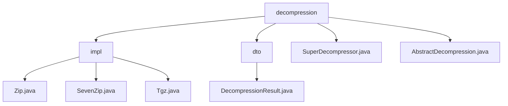

# 基础信息

|      |      |
|------|------|
| 名称 | decompression |
| 编码语言 | .java |
| 代码路径 | WeFe/common/java/common-lang/src/main/java/com/welab/wefe/common/file/decompression |
| 包名 | docs.common.java.common-lang.src.main.java.com.welab.wefe.common.file.decompression |
| 概述说明 | 该模块实现多格式压缩文件解压，支持ZIP/7z/tgz等格式，通过统一接口处理解压任务。核心包括AbstractDecompression基类、解压结果对象和文件条目迭代器。支持批量解压、路径安全校验和资源释放，应用于日志分析和文件预处理等场景。 |

# 说明

## 概述  
该模块实现多格式压缩文件统一解压功能，核心职责是通过抽象工厂模式处理ZIP/7z/tgz等格式的解压任务。接口规范遵循AbstractDecompression基类约束，要求子类实现doDecompression方法，使用DecompressionResult存储解压结果。关键数据结构包括文件条目迭代器（如ZipEntry/TarEntry）、2048字节缓冲区和包含baseDir/dirs/files的解压结果对象。外部依赖涉及Java原生ZipFile、Apache Commons Compress和第三方SevenZFile库。例如Zip类构建目录树，SevenZip类通过流式处理7z压缩块。

## 主要业务场景  
模块采用类似流水线的批量解压流程：校验→遍历→创建→安全检测→释放。交互模式统一为"文件输入-目录输出"的同步阻塞式API，例如Tgz类组合Gzip和Tar流实现双层解压。典型应用包括日志分析和分布式文件预处理，支持递归解压和自动格式识别。集成案例可见各实现类main方法，如SuperDecompressor通过扩展名映射表调用对应解压器，支持删除原始文件等扩展功能。

### 包内部结构视图

该流程图展示了文件解压模块的层级结构。顶层是decompression目录，包含impl实现子目录、dto数据传输对象子目录以及两个核心类文件。impl目录下包含三种压缩格式的解压实现类，dto目录下存放解压结果类。整体结构清晰体现了模块化设计思想。

# 文件列表

| 名称   | 类型  | 说明 |
|-------|------|-------------|
| [SuperDecompressor.java](SuperDecompressor.md) | file | SuperDecompressor类支持多种压缩格式解压，包括zip、gz、tar.gz、tgz和7z，可指定输出目录和递归解压功能。 |
| [AbstractDecompression.java](AbstractDecompression.md) | file | 抽象解压类提供文件解压功能，包含校验文件存在性、默认路径处理及抽象方法供子类实现具体解压逻辑。 |
| [dto](dto/_module.md) | package | DecompressionResult类用于存储解压结果，包含基础目录、解压后的目录和文件集合，提供添加目录/文件的方法，支持删除所有解压资源和格式化输出结果信息。 |
| [impl](impl/_module.md) | package | Zip类实现ZIP解压，处理目录和文件，含异常处理。SevenZip类处理7z文件解压，遍历条目并记录结果。Tgz类解压tgz文件，检测路径遍历，处理目录和文件替换。均继承AbstractDecompression，含资源释放。 |

