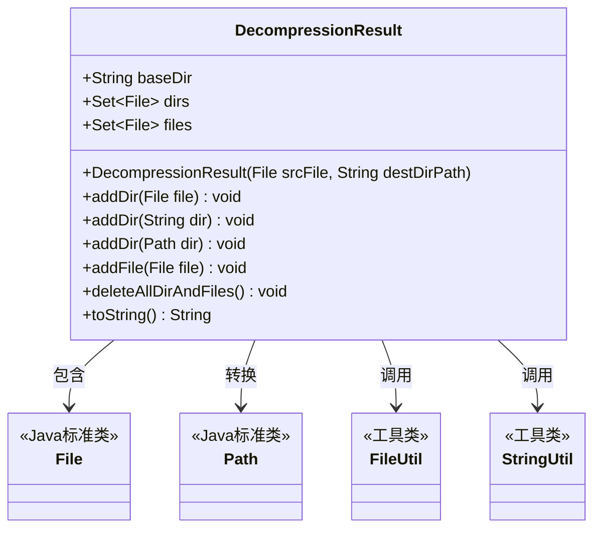
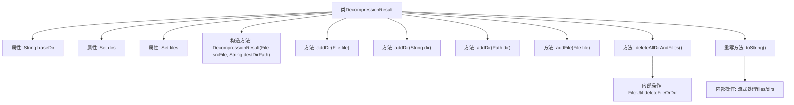

# 基础信息

|      |      |
|------|------|
| 名称 | DecompressionResult |
| 编码语言 | .java |
| 代码路径 | WeFe/common/java/common-lang/src/main/java/com/welab/wefe/common/file/decompression/dto/DecompressionResult.java |
| 包名 | com.welab.wefe.common.file.decompression.dto |
| 依赖项 | ['com.welab.wefe.common.util.FileUtil', 'com.welab.wefe.common.util.StringUtil', 'java.io.File', 'java.nio.file.Path', 'java.nio.file.Paths', 'java.util.HashSet', 'java.util.List', 'java.util.Set', 'java.util.stream.Collectors'] |
| 概述说明 | DecompressionResult类用于存储解压结果，包含基础目录、解压后的目录和文件集合，提供添加目录/文件的方法，支持删除所有解压资源和格式化输出结果信息。 |

# 说明

DecompressionResult类用于存储解压缩操作的结果信息。它包含三个主要成员：baseDir表示解压后的基础目录路径，dirs存储解压后所有目录的集合，files存储解压后所有文件的集合。类提供了添加目录和文件的多种方法，支持File、String和Path类型参数。deleteAllDirAndFiles方法可删除所有解压资源，包括基础目录及其内容。toString方法以格式化字符串返回所有解压结果信息，包括文件列表、目录列表和基础目录路径。

# 类列表 Class Summary

| 名称   | 类型  | 说明 |
|-------|------|-------------|
| DecompressionResult | class | DecompressionResult类用于存储解压结果，包含基础目录、解压后的文件和目录集合，提供添加文件和目录的方法，支持删除所有解压资源，并重写toString方法输出详细信息。 |

## 类 DecompressionResult

|      |      |
|------|------|
| 访问范围 | public |
| 类型 | class |
| 名称 | DecompressionResult |
| 说明 | DecompressionResult类用于存储解压结果，包含基础目录、解压后的文件和目录集合，提供添加文件和目录的方法，支持删除所有解压资源，并重写toString方法输出详细信息。 |

### UML类图

该类图展示了DecompressionResult类的结构及其与外部类的关系。DecompressionResult用于管理解压操作的结果，包含基础目录路径(baseDir)、解压目录集合(dirs)和文件集合(files)。提供添加目录/文件的方法，并能删除所有资源。通过FileUtil和StringUtil工具类完成文件操作和字符串处理，与Java标准类File和Path有交互。该类封装了解压结果的存储和清理功能，toString()方法提供了结构化输出能力。

### 内部方法调用关系图

该流程图展示了DecompressionResult类的完整结构，包含3个核心属性(baseDir/dirs/files)和6个主要方法。构造方法通过Paths和FileUtil计算基础路径，三个addDir重载方法统一管理目录集合，deleteAllDirAndFiles()递归删除所有资源。toString()方法使用流式处理将文件/目录路径格式化为多行字符串，体现了对文件系统操作和集合处理的封装能力。箭头清晰表示了属性与方法、方法内部调用之间的关系。

### 字段列表 Field List

| 名称  | 类型  | 说明 |
|-------|-------|------|
| dirs = new HashSet<>() | Set<File> | 声明一个不可变文件集合变量dirs，初始化为空HashSet。 |
| files = new HashSet<>() | Set<File> | 声明一个不可变文件集合变量files，初始化为空HashSet。 |
| baseDir | String | 声明一个不可变的字符串变量baseDir。 |

### 方法列表

| 名称  | 类型  | 说明 |
|-------|-------|------|
| addDir | void | 方法addDir将Path类型参数dir转换为File对象并加入dirs集合。 |
| toString | String | 重写toString方法，将文件和目录的绝对路径列表格式化输出，包含files、dirs和base_dir信息。 |
| deleteAllDirAndFiles | void | 该方法删除基础目录及其下所有文件和子目录。遍历指定目录数组和文件数组，逐一删除每个目录和文件。 |
| addDir | void | 方法`addDir`接收字符串参数`dir`，将其转换为`File`对象并添加到`dirs`集合中。 |
| addDir | void | 方法addDir将File对象添加到dirs集合中。 |
| addFile | void | 方法`addFile`将文件对象添加到`files`集合中。 |

