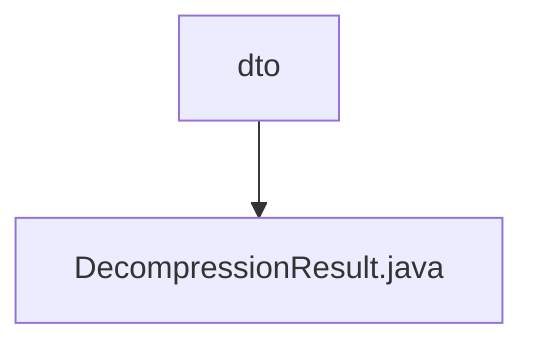

# 基础信息

|      |      |
|------|------|
| 名称 | dto |
| 编码语言 | .java |
| 代码路径 | WeFe/common/java/common-lang/src/main/java/com/welab/wefe/common/file/decompression/dto |
| 包名 | docs.common.java.common-lang.src.main.java.com.welab.wefe.common.file.decompression.dto |
| 概述说明 | DecompressionResult类用于存储解压结果，包含基础目录、解压后的目录和文件集合，提供添加目录/文件的方法，支持删除所有解压资源和格式化输出结果信息。 |

# 说明

DecompressionResult类用于存储解压缩操作的结果信息。它包含三个主要成员：baseDir表示解压后的基础目录路径，dirs存储解压后所有目录的集合，files存储解压后所有文件的集合。类提供了添加目录和文件的多种方法，支持File、String和Path类型参数。deleteAllDirAndFiles方法可删除所有解压资源，包括基础目录及其内容。toString方法以格式化字符串返回所有解压结果信息，包括文件列表、目录列表和基础目录路径。

### 包内部结构视图

该流程图展示了WeFe项目中文件解压模块的DTO层结构，其中dto目录包含一个DecompressionResult.java文件，用于存储解压操作的结果数据。这种简洁的层级关系体现了模块化设计中数据传输对象的典型组织方式。

# 文件列表

| 名称   | 类型  | 说明 |
|-------|------|-------------|
| [DecompressionResult.java](DecompressionResult.md) | file | DecompressionResult类用于存储解压结果，包含基础目录、解压后的目录和文件集合，提供添加目录/文件的方法，支持删除所有解压资源和格式化输出结果信息。 |

