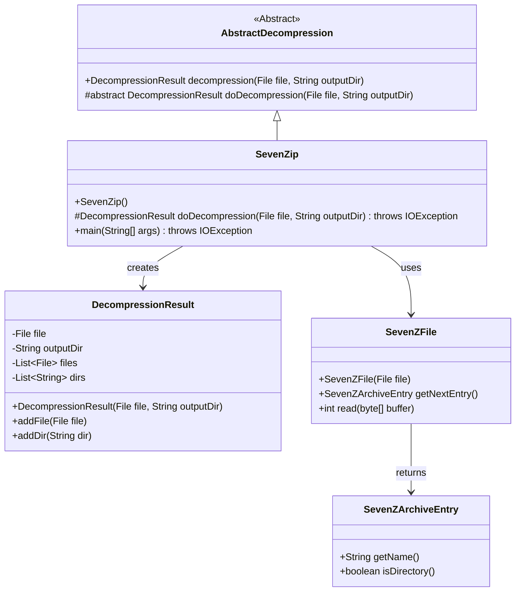
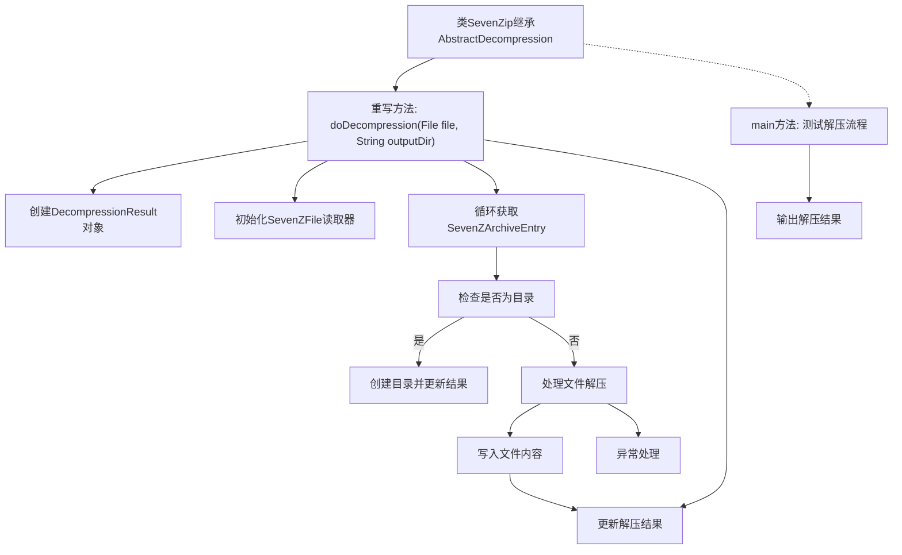

# 基础信息

|      |      |
|------|------|
| 名称 | SevenZip |
| 编码语言 | .java |
| 代码路径 | WeFe/common/java/common-lang/src/main/java/com/welab/wefe/common/file/decompression/impl/SevenZip.java |
| 包名 | com.welab.wefe.common.file.decompression.impl |
| 依赖项 | ['com.welab.wefe.common.file.decompression.AbstractDecompression', 'com.welab.wefe.common.file.decompression.dto.DecompressionResult', 'org.apache.commons.compress.archivers.sevenz.SevenZArchiveEntry', 'org.apache.commons.compress.archivers.sevenz.SevenZFile', 'java.io.File', 'java.io.FileOutputStream', 'java.io.IOException', 'java.io.OutputStream'] |
| 概述说明 | SevenZip类继承AbstractDecompression，实现7z文件解压功能，支持目录创建和文件写入，返回解压结果。 |

# 说明

SevenZip类继承自AbstractDecompression，实现了7z文件的解压功能。主要逻辑在doDecompression方法中，该方法接收待解压文件和输出目录参数，返回解压结果。方法通过SevenZFile读取7z文件条目，循环处理每个条目：若为目录则创建对应目录并记录结果；若为文件则写入输出目录并记录结果。main方法演示了如何使用该类解压指定7z文件到目标目录。整个过程包含异常处理和资源释放。

# 类列表 Class Summary

| 名称   | 类型  | 说明 |
|-------|------|-------------|
| SevenZip | class | SevenZip类继承AbstractDecompression，实现7z文件解压功能，包括目录创建和文件写入，返回解压结果。主方法演示解压过程。 |

## 类 SevenZip

|      |      |
|------|------|
| 访问范围 | public |
| 类型 | class |
| 名称 | SevenZip |
| 说明 | SevenZip类继承AbstractDecompression，实现7z文件解压功能，包括目录创建和文件写入，返回解压结果。主方法演示解压过程。 |

### UML类图

该代码展示了一个7z文件解压的实现类`SevenZip`，继承自抽象类`AbstractDecompression`。核心流程包括：创建解压结果对象、遍历7z文件条目、处理目录创建和文件解压。类图中显示了继承关系、依赖关系和主要方法调用。`SevenZip`通过`SevenZFile`读取压缩包内容，使用`DecompressionResult`记录解压结果，体现了清晰的职责分离。

### 内部方法调用关系图

该流程图展示了SevenZip类的7z文件解压处理流程。从主入口main方法开始，通过doDecompression方法实现核心解压逻辑，包含文件读取、目录创建、内容写入和异常处理等关键步骤。循环处理压缩包内每个条目时，会智能区分目录和文件类型，分别采用mkdirs或文件流写入方式处理，最终汇总解压结果。整个过程严格处理IO异常，确保资源正确释放。

### 字段列表 Field List

| 名称  | 类型  | 说明 |
|-------|-------|------|

### 方法列表

| 名称  | 类型  | 说明 |
|-------|-------|------|
| main | void | Java代码示例：使用SevenZip类解压flower.7z文件到指定目录，并打印解压结果。 |
| doDecompression | DecompressionResult | 该方法解压7z文件到指定目录，处理目录创建和文件写入，返回解压结果。 |

